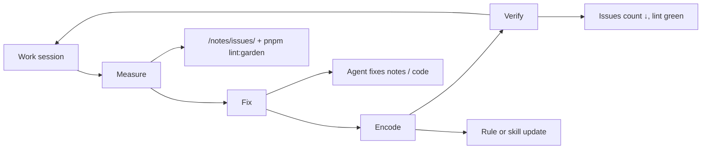

<!-- Generated by SpecStory, Markdown v2.1.0 -->

# 2026-07-25 10:11:25Z

<!-- Cursor IDE Session f1b5c3b7-9170-47d1-aed5-b87189b666b8 (2026-07-25 10:11:25Z) -->

_**User**_

how can i make this self improving?

---

_**Agent (auto-low)**_

<think><details><summary>Thought Process</summary>
I need more context about what "this" refers to before I can suggest how to make it self-improving.

No open files or prior context exist. "This" could mean the entire project, a specific skill like flashcards or ponytail, or something from a previous conversation.
</details></think>

_**Agent (auto-low)**_

I need a bit more context on what “this” refers to - I’ll check recent work in the repo and any prior chat so the advice fits.


_**Agent (auto-low)**_

<tool-use data-tool-type="search" data-tool-name="glob_file_search"><details>
<summary>Tool use: **glob_file_search** • Searched codebase "" • **380** results in **1** directory</summary>

Directory: **`/home/jorap/.cursor/projects/home-jorap-Documents-GitHub-jorap-com/agent-transcripts`** (380 files)

| File |
|------|
| `4993c40d-d45e-43f8-a2fd-753a103aebda/4993c40d-d45e-43f8-a2fd-753a103aebda.jsonl` |
| `ed4ead4b-a9fa-46b6-a215-86d2660e4d37/ed4ead4b-a9fa-46b6-a215-86d2660e4d37.jsonl` |
| `4993c40d-d45e-43f8-a2fd-753a103aebda/subagents/ca65a93b-e9f5-408c-9000-e34c4451de4e.jsonl` |
| `4993c40d-d45e-43f8-a2fd-753a103aebda/subagents/b19d4436-a94a-41af-96c7-fb52f4c6c53a.jsonl` |
| `010317f9-9faa-454a-87bf-ff85472389e0/010317f9-9faa-454a-87bf-ff85472389e0.jsonl` |
| `55fa41b6-fdd1-46b9-bed8-792d239d7a1c/55fa41b6-fdd1-46b9-bed8-792d239d7a1c.jsonl` |
| `d9e2a612-d7ae-4b14-99e7-73f8fdc351fb/d9e2a612-d7ae-4b14-99e7-73f8fdc351fb.jsonl` |
| `e86ae02e-d3e5-4140-9e14-2eebc5dba718/e86ae02e-d3e5-4140-9e14-2eebc5dba718.jsonl` |
| `4e272907-f0a1-4635-ac22-f55736e10235/4e272907-f0a1-4635-ac22-f55736e10235.jsonl` |
| `27ebd9be-28f6-44d9-8139-ef14c1ec9bf6/27ebd9be-28f6-44d9-8139-ef14c1ec9bf6.jsonl` |
| `27ebd9be-28f6-44d9-8139-ef14c1ec9bf6/subagents/dd57a711-f71c-4883-9395-7653ae9ab1cf.jsonl` |
| `27ebd9be-28f6-44d9-8139-ef14c1ec9bf6/subagents/db41973d-35f3-4588-8704-f79584ad60ae.jsonl` |
| `27ebd9be-28f6-44d9-8139-ef14c1ec9bf6/subagents/b9a3dacf-7bf5-434a-9138-bb9592758758.jsonl` |
| `27ebd9be-28f6-44d9-8139-ef14c1ec9bf6/subagents/cc63028a-0c08-4337-9ca7-e7193d98f9dd.jsonl` |
| `27ebd9be-28f6-44d9-8139-ef14c1ec9bf6/subagents/0b5fc13a-7ec2-47a3-a5cb-3107564c973f.jsonl` |
| `27ebd9be-28f6-44d9-8139-ef14c1ec9bf6/subagents/478ccfdf-bd26-4e75-b613-38c31fdaf257.jsonl` |
| `f1be2f73-8d1f-407c-b9a0-b1babe9f5548/f1be2f73-8d1f-407c-b9a0-b1babe9f5548.jsonl` |
| `27ebd9be-28f6-44d9-8139-ef14c1ec9bf6/subagents/3785b86e-613c-4f55-a3e4-f8f3704298fc.jsonl` |
| `27ebd9be-28f6-44d9-8139-ef14c1ec9bf6/subagents/cce9dfb0-0d90-4506-98e8-368686e42edc.jsonl` |
| `27ebd9be-28f6-44d9-8139-ef14c1ec9bf6/subagents/6505cbb7-13eb-483a-adc1-6b5991f33dae.jsonl` |
| `27ebd9be-28f6-44d9-8139-ef14c1ec9bf6/subagents/8517a2dc-96ae-41aa-b7c1-92047d8ab7e8.jsonl` |
| `27ebd9be-28f6-44d9-8139-ef14c1ec9bf6/subagents/cb5a0a0c-8fc0-42d0-82e3-5c25f7495625.jsonl` |
| `27ebd9be-28f6-44d9-8139-ef14c1ec9bf6/subagents/f8405b29-80de-429f-a805-aca72354f047.jsonl` |
| `27ebd9be-28f6-44d9-8139-ef14c1ec9bf6/subagents/a77e37cf-9797-401c-9552-35bedf78ba38.jsonl` |
| `27ebd9be-28f6-44d9-8139-ef14c1ec9bf6/subagents/fb10f04d-ab88-47f8-be33-724bdab5fd77.jsonl` |
| `27ebd9be-28f6-44d9-8139-ef14c1ec9bf6/subagents/99e53e9b-aad2-4dd7-9e5f-0530bb4d08b7.jsonl` |
| `27ebd9be-28f6-44d9-8139-ef14c1ec9bf6/subagents/45faab16-f1b2-444b-ac1b-3fa6df9e3b33.jsonl` |
| `27ebd9be-28f6-44d9-8139-ef14c1ec9bf6/subagents/712da246-7000-48b4-b15b-366055b5ab4f.jsonl` |
| `27ebd9be-28f6-44d9-8139-ef14c1ec9bf6/subagents/20d3b493-0a55-4234-a6c6-768280abab76.jsonl` |
| `07983634-be14-4678-925e-a8ac1d781862/07983634-be14-4678-925e-a8ac1d781862.jsonl` |
| `79895587-30a1-4c1f-8724-1a7229febb1a/79895587-30a1-4c1f-8724-1a7229febb1a.jsonl` |
| `8b5ffd18-054f-46f0-ab23-2fad1f22181e/8b5ffd18-054f-46f0-ab23-2fad1f22181e.jsonl` |
| `eb30b9d8-d0ca-4602-be72-25460cab9421/eb30b9d8-d0ca-4602-be72-25460cab9421.jsonl` |
| `09c18e75-5842-4628-a620-1d773224bfcc/09c18e75-5842-4628-a620-1d773224bfcc.jsonl` |
| `09c18e75-5842-4628-a620-1d773224bfcc/subagents/71221fe2-6f64-485d-aa14-749b1abe00b6.jsonl` |
| `09c18e75-5842-4628-a620-1d773224bfcc/subagents/49603d0a-2402-412b-b9bd-60fed4f2d2f3.jsonl` |
| `9d9a044d-3191-4e72-b3e1-b05561d7e764/9d9a044d-3191-4e72-b3e1-b05561d7e764.jsonl` |
| `9d9a044d-3191-4e72-b3e1-b05561d7e764/subagents/cafe134b-63b7-4bde-9938-e0392b391a53.jsonl` |
| `9d9a044d-3191-4e72-b3e1-b05561d7e764/subagents/78f1075b-f870-408d-b13c-11442ca15329.jsonl` |
| `4a87acec-055d-427e-af32-a29a92c9c0f7/4a87acec-055d-427e-af32-a29a92c9c0f7.jsonl` |
| `fe814ff4-e0a7-4768-a301-3026e846b8a4/fe814ff4-e0a7-4768-a301-3026e846b8a4.jsonl` |
| `19a71101-05a5-45aa-be47-01887ce3e03b/19a71101-05a5-45aa-be47-01887ce3e03b.jsonl` |
| `8b23a0b2-8ecd-4c35-9d18-3ea33517eb2b/8b23a0b2-8ecd-4c35-9d18-3ea33517eb2b.jsonl` |
| `98f5a682-1815-438c-8eb2-fced2b7462cc/98f5a682-1815-438c-8eb2-fced2b7462cc.jsonl` |
| `c106cb54-98f8-48a1-84ae-41e341c69277/c106cb54-98f8-48a1-84ae-41e341c69277.jsonl` |
| `5ad513c5-5094-4a98-af57-c20fd466029f/5ad513c5-5094-4a98-af57-c20fd466029f.jsonl` |
| `c70d545b-1455-49fb-baff-dd0416641167/c70d545b-1455-49fb-baff-dd0416641167.jsonl` |
| `4c1d357f-38dd-4fa1-8b00-b88050bdcee5/4c1d357f-38dd-4fa1-8b00-b88050bdcee5.jsonl` |
| `4c1d357f-38dd-4fa1-8b00-b88050bdcee5/subagents/7fd8267b-7b48-446e-ab22-402244ac6cbf.jsonl` |
| `b9d2b4e9-d5ff-41f3-a1a3-295504033b22/b9d2b4e9-d5ff-41f3-a1a3-295504033b22.jsonl` |
| `294bc83e-502d-4d09-9c73-701fbc16453f/294bc83e-502d-4d09-9c73-701fbc16453f.jsonl` |
| `294bc83e-502d-4d09-9c73-701fbc16453f/subagents/ce389500-f013-495c-87ae-fee40e8b7822.jsonl` |
| `4c269125-e9cc-453f-a12d-f8af73e46626/4c269125-e9cc-453f-a12d-f8af73e46626.jsonl` |
| `63a8a941-dadc-4b70-a6f4-b1ce4726972f/63a8a941-dadc-4b70-a6f4-b1ce4726972f.jsonl` |
| `caf4ccc8-997b-4f30-a461-321bdc6c0207/caf4ccc8-997b-4f30-a461-321bdc6c0207.jsonl` |
| `1a52e3b5-7af2-4077-aec7-c9ae3ace5385/1a52e3b5-7af2-4077-aec7-c9ae3ace5385.jsonl` |
| `622ee44f-e0c3-4390-bcac-9e563a3ae212/622ee44f-e0c3-4390-bcac-9e563a3ae212.jsonl` |
| `90876914-3e84-4635-9f94-431f8ca3d85f/90876914-3e84-4635-9f94-431f8ca3d85f.jsonl` |
| `83a0abdd-e24c-4576-a191-f6ba8c25fc54/83a0abdd-e24c-4576-a191-f6ba8c25fc54.jsonl` |
| `d0f25b8a-59ca-4878-93d4-54ff3ecc9da9/d0f25b8a-59ca-4878-93d4-54ff3ecc9da9.jsonl` |
| `e8c2e78f-9b49-4003-aee8-6b7a89f8af95/e8c2e78f-9b49-4003-aee8-6b7a89f8af95.jsonl` |
| `0dd3956d-8656-4501-8f2d-6b5119ed0d69/0dd3956d-8656-4501-8f2d-6b5119ed0d69.jsonl` |
| `67d81010-f177-47a9-abd0-0eff993ab106/67d81010-f177-47a9-abd0-0eff993ab106.jsonl` |
| `763f8dba-200d-4992-bfb8-97f48680b98a/763f8dba-200d-4992-bfb8-97f48680b98a.jsonl` |
| `e0157445-430a-46b8-b109-a0d2e932b5d3/e0157445-430a-46b8-b109-a0d2e932b5d3.jsonl` |
| `f695817e-72f5-4317-8d78-258806506c13/f695817e-72f5-4317-8d78-258806506c13.jsonl` |
| `7f2c502c-ce58-4895-87ed-830decb6b96c/7f2c502c-ce58-4895-87ed-830decb6b96c.jsonl` |
| `e3c28429-fc81-48b3-a559-95b39a3f5659/e3c28429-fc81-48b3-a559-95b39a3f5659.jsonl` |
| `ca570a56-998c-41dc-a679-da3bd69116a9/ca570a56-998c-41dc-a679-da3bd69116a9.jsonl` |
| `ca570a56-998c-41dc-a679-da3bd69116a9/subagents/70e8df70-c078-4084-a3c3-2f5b5be58681.jsonl` |
| `2efe0d9c-0c84-403f-9dc2-0f1c343fcbbe/2efe0d9c-0c84-403f-9dc2-0f1c343fcbbe.jsonl` |
| `0c5b3222-99e1-417e-87c3-cc0079805b28/0c5b3222-99e1-417e-87c3-cc0079805b28.jsonl` |
| `309cf49b-4b15-4b1b-b221-e366cc903316/309cf49b-4b15-4b1b-b221-e366cc903316.jsonl` |
| `6656341b-87ab-42ca-9857-3c36e145dd92/6656341b-87ab-42ca-9857-3c36e145dd92.jsonl` |
| `a8c414d2-5caf-47f8-9cf3-0b905dc8c629/a8c414d2-5caf-47f8-9cf3-0b905dc8c629.jsonl` |
| `58a38724-357e-4f56-9bc4-2ce9fe31ef42/58a38724-357e-4f56-9bc4-2ce9fe31ef42.jsonl` |
| `fc503dae-bee8-48de-9989-d4365dc7a7f3/fc503dae-bee8-48de-9989-d4365dc7a7f3.jsonl` |
| `edf952d2-16ba-4f11-826e-1236ff132ba5/edf952d2-16ba-4f11-826e-1236ff132ba5.jsonl` |
| `ecbe0b56-3ed7-4ef2-b466-ed0bcb448597/ecbe0b56-3ed7-4ef2-b466-ed0bcb448597.jsonl` |
| `23a9e32d-1aa5-44fa-a06f-3bd5e8d0d9f2/23a9e32d-1aa5-44fa-a06f-3bd5e8d0d9f2.jsonl` |
| `db7adbff-ccce-427a-9852-fd60cd937411/db7adbff-ccce-427a-9852-fd60cd937411.jsonl` |
| `efe1c39d-9f11-48c0-b4f9-9a64003b6bd0/efe1c39d-9f11-48c0-b4f9-9a64003b6bd0.jsonl` |
| `f000d7fb-9e64-4c11-9475-025102db2449/f000d7fb-9e64-4c11-9475-025102db2449.jsonl` |
| `de922c8e-132e-44f1-9f7b-d0743c7bfacf/de922c8e-132e-44f1-9f7b-d0743c7bfacf.jsonl` |
| `d60304ff-05ae-4666-b3e6-37028aa4d815/d60304ff-05ae-4666-b3e6-37028aa4d815.jsonl` |
| `82b4af51-8217-488d-91b5-bc523bf28cee/82b4af51-8217-488d-91b5-bc523bf28cee.jsonl` |
| `6d40a3b0-1dc4-4dbf-9ee8-97d2ea8425bf/6d40a3b0-1dc4-4dbf-9ee8-97d2ea8425bf.jsonl` |
| `19ce5f5a-5606-4779-a23d-6652a4ea33bf/19ce5f5a-5606-4779-a23d-6652a4ea33bf.jsonl` |
| `beefa5ab-565c-440b-a5c2-f7accc6520d7/beefa5ab-565c-440b-a5c2-f7accc6520d7.jsonl` |
| `c3c3b8ce-741f-4eb5-9901-c545d940ab96/c3c3b8ce-741f-4eb5-9901-c545d940ab96.jsonl` |
| `c8510693-414a-4d8a-bcea-4106ded6e185/c8510693-414a-4d8a-bcea-4106ded6e185.jsonl` |
| `1a1152c9-5712-49d6-b737-3ddda2897be5/1a1152c9-5712-49d6-b737-3ddda2897be5.jsonl` |
| `937b20aa-c5fe-415c-9655-88806bd6e42b/937b20aa-c5fe-415c-9655-88806bd6e42b.jsonl` |
| `440ae52f-d055-4dfa-8b0f-89ad2f4c82f4/440ae52f-d055-4dfa-8b0f-89ad2f4c82f4.jsonl` |
| `e531dc90-037f-4f93-8131-8f1d890b9ae7/e531dc90-037f-4f93-8131-8f1d890b9ae7.jsonl` |
| `744c8786-1236-4809-a204-3423b74e1585/744c8786-1236-4809-a204-3423b74e1585.jsonl` |
| `11771aa1-0f26-4ea2-9a53-94e2e5a26734/11771aa1-0f26-4ea2-9a53-94e2e5a26734.jsonl` |
| `2495cbde-ab4f-44e5-ade7-2e275c6fc21e/2495cbde-ab4f-44e5-ade7-2e275c6fc21e.jsonl` |
| `cf255367-800e-4f49-ad2e-2fefbdfb7247/cf255367-800e-4f49-ad2e-2fefbdfb7247.jsonl` |
| `b3573dc1-e057-4b4d-b323-ef8365bc92b7/b3573dc1-e057-4b4d-b323-ef8365bc92b7.jsonl` |
| `9f7f43ca-950b-4a3c-b87a-dd68e6a635a2/9f7f43ca-950b-4a3c-b87a-dd68e6a635a2.jsonl` |
| `705ab7fc-ac7c-4133-b1fb-79b49531e737/705ab7fc-ac7c-4133-b1fb-79b49531e737.jsonl` |
| `e90b1974-ae00-4112-8733-0fdd3603c1bc/e90b1974-ae00-4112-8733-0fdd3603c1bc.jsonl` |
| `fea56481-5333-4513-82eb-9b16aa11b4b5/fea56481-5333-4513-82eb-9b16aa11b4b5.jsonl` |
| `2b6a277e-45cd-47c8-b312-b91ebcf300ba/2b6a277e-45cd-47c8-b312-b91ebcf300ba.jsonl` |
| `79ec067d-f22d-4130-a6ab-950fb875337b/79ec067d-f22d-4130-a6ab-950fb875337b.jsonl` |
| `b831f60f-7ee3-4be3-aa53-6dbc9af54897/b831f60f-7ee3-4be3-aa53-6dbc9af54897.jsonl` |
| `c4f3c106-3ba7-4d04-bc52-0d9de76452c2/c4f3c106-3ba7-4d04-bc52-0d9de76452c2.jsonl` |
| `f171092a-22bc-476f-a93d-ce09cdbd2e57/f171092a-22bc-476f-a93d-ce09cdbd2e57.jsonl` |
| `ded733da-8a64-466f-863c-02de0d91e1f8/ded733da-8a64-466f-863c-02de0d91e1f8.jsonl` |
| `cf652fb6-ab78-4bc4-a442-66f4c7f048c8/cf652fb6-ab78-4bc4-a442-66f4c7f048c8.jsonl` |
| `9b74aacf-304b-4213-ac59-46d8ad01fba6/9b74aacf-304b-4213-ac59-46d8ad01fba6.jsonl` |
| `ffc430b2-e715-4209-bcb5-8d35f96dc1ab/ffc430b2-e715-4209-bcb5-8d35f96dc1ab.jsonl` |
| `d5770a98-199f-42ec-b7fd-dfcf5c6d89a8/d5770a98-199f-42ec-b7fd-dfcf5c6d89a8.jsonl` |
| `ffc430b2-e715-4209-bcb5-8d35f96dc1ab/subagents/c71324da-4aa0-427c-8107-fae2daa03c5d.jsonl` |
| `ffc430b2-e715-4209-bcb5-8d35f96dc1ab/subagents/a0b7811f-d994-4a74-9523-dbc2a99d1711.jsonl` |
| `ffc430b2-e715-4209-bcb5-8d35f96dc1ab/subagents/45b8d339-715c-41b1-9f43-d4fb779bc1d3.jsonl` |
| `ffc430b2-e715-4209-bcb5-8d35f96dc1ab/subagents/72ff30da-df54-4a92-8247-9486095d923b.jsonl` |
| `514d6f5e-e8c1-4121-b7a3-084d6f2bf455/514d6f5e-e8c1-4121-b7a3-084d6f2bf455.jsonl` |
| `2ebcb09d-610f-49be-9e2c-7cbc3cc4fdfe/2ebcb09d-610f-49be-9e2c-7cbc3cc4fdfe.jsonl` |
| `bdfb7254-ce42-442d-b633-d8d5f85ab448/bdfb7254-ce42-442d-b633-d8d5f85ab448.jsonl` |
| `f1792a54-1caa-4dbb-b648-ac0ad6d2a1bd/f1792a54-1caa-4dbb-b648-ac0ad6d2a1bd.jsonl` |
| `2d26485b-e83c-4796-b22e-dbb8bb78fdab/2d26485b-e83c-4796-b22e-dbb8bb78fdab.jsonl` |
| `cff8fbab-b9db-4d38-b5fc-fa6d08bf61bc/cff8fbab-b9db-4d38-b5fc-fa6d08bf61bc.jsonl` |
| `f9f17540-d88a-49e5-afce-d0ce2c5754cb/f9f17540-d88a-49e5-afce-d0ce2c5754cb.jsonl` |
| `4e384b4d-bb55-4d8c-9c31-db15fbabd939/4e384b4d-bb55-4d8c-9c31-db15fbabd939.jsonl` |
| `4e384b4d-bb55-4d8c-9c31-db15fbabd939/subagents/a1ab0918-9f6d-4dfe-89fa-6447dfad7378.jsonl` |
| `ba6a6a0d-e9be-45b9-b2be-c15df81d2266/ba6a6a0d-e9be-45b9-b2be-c15df81d2266.jsonl` |
| `ea2eda89-de97-4059-8178-591f16c5941c/ea2eda89-de97-4059-8178-591f16c5941c.jsonl` |
| `100b3f2e-f3b7-412c-b1b2-1a3df8ac565d/100b3f2e-f3b7-412c-b1b2-1a3df8ac565d.jsonl` |
| `e42423fe-0e12-402b-b536-a2535767282f/e42423fe-0e12-402b-b536-a2535767282f.jsonl` |
| `8d7203ae-c028-43c4-b60c-f4c29bf9dab3/8d7203ae-c028-43c4-b60c-f4c29bf9dab3.jsonl` |
| `4558c680-dc1c-416d-afd8-668cb55c06ca/4558c680-dc1c-416d-afd8-668cb55c06ca.jsonl` |
| `e40ad918-ffa4-4bfa-b2e8-f33e274e5e0c/e40ad918-ffa4-4bfa-b2e8-f33e274e5e0c.jsonl` |
| `00a1f5d9-bcff-4186-896e-819452740f39/00a1f5d9-bcff-4186-896e-819452740f39.jsonl` |
| `6010ba1d-c782-46c4-b511-e99f375bcf79/6010ba1d-c782-46c4-b511-e99f375bcf79.jsonl` |
| `8d7c51c8-5d0e-497c-9e63-a2e635145b4b/8d7c51c8-5d0e-497c-9e63-a2e635145b4b.jsonl` |
| `d3b5f82c-55d5-4290-a04f-74e2a070aa74/d3b5f82c-55d5-4290-a04f-74e2a070aa74.jsonl` |
| `e02c0912-0cd3-4431-aef1-222112bc700a/e02c0912-0cd3-4431-aef1-222112bc700a.jsonl` |
| `d21f515a-1e22-4939-b5c3-7b85d448426e/d21f515a-1e22-4939-b5c3-7b85d448426e.jsonl` |
| `d3b5f82c-55d5-4290-a04f-74e2a070aa74/subagents/043651c8-efae-45ba-a25f-3c1357490db1.jsonl` |
| `d3b5f82c-55d5-4290-a04f-74e2a070aa74/subagents/4a9cf799-fbad-43ae-a93b-9fbbbf8d5851.jsonl` |
| `cc1c2199-caab-4d86-b2b3-a4dcb950b302/cc1c2199-caab-4d86-b2b3-a4dcb950b302.jsonl` |
| `25df1e0d-69e8-42ad-ac88-6160c30d580a/25df1e0d-69e8-42ad-ac88-6160c30d580a.jsonl` |
| `0bce133e-e18b-4ae0-b0d3-baf88d863cf6/0bce133e-e18b-4ae0-b0d3-baf88d863cf6.jsonl` |
| `28f662ba-02a2-417f-b914-bf49ae079807/28f662ba-02a2-417f-b914-bf49ae079807.jsonl` |
| `65e3ce76-800f-4d52-bba0-e999d503f941/65e3ce76-800f-4d52-bba0-e999d503f941.jsonl` |
| `810a025a-6961-4334-8265-f256b0c21cd7/810a025a-6961-4334-8265-f256b0c21cd7.jsonl` |
| `8d17709e-c382-4861-b927-4e5c09eb4496/8d17709e-c382-4861-b927-4e5c09eb4496.jsonl` |
| `fe1d538e-8102-4217-8b00-53d25f8fd2bb/fe1d538e-8102-4217-8b00-53d25f8fd2bb.jsonl` |
| `6e4d2b48-0720-4a3a-9e5b-382bed0e110e/6e4d2b48-0720-4a3a-9e5b-382bed0e110e.jsonl` |
| `5371b1b8-6e41-483e-87d9-3330a40f977c/5371b1b8-6e41-483e-87d9-3330a40f977c.jsonl` |
| `ae383e01-99bd-49c1-bb1f-5a0b2f2bc54f/ae383e01-99bd-49c1-bb1f-5a0b2f2bc54f.jsonl` |
| `2a622e2b-75ba-4c82-8981-779a26568d84/2a622e2b-75ba-4c82-8981-779a26568d84.jsonl` |
| `c84d1317-4da4-4c72-b0c4-a540b1d10b60/c84d1317-4da4-4c72-b0c4-a540b1d10b60.jsonl` |
| `b3bbbf34-aa7d-4df1-a52f-ee5d1290d637/b3bbbf34-aa7d-4df1-a52f-ee5d1290d637.jsonl` |
| `e924fec1-8350-4e6e-9373-837e53a7a0f3/e924fec1-8350-4e6e-9373-837e53a7a0f3.jsonl` |
| `e3544f19-f8a4-422e-8ee0-6e641fb348c3/e3544f19-f8a4-422e-8ee0-6e641fb348c3.jsonl` |
| `62ac7e99-cf99-43c3-9c5e-f2a87d9f4fdb/62ac7e99-cf99-43c3-9c5e-f2a87d9f4fdb.jsonl` |
| `48017628-215e-4ee7-b921-3ae0e1bbf4bb/48017628-215e-4ee7-b921-3ae0e1bbf4bb.jsonl` |
| `70d76bf6-b71e-4ed5-bc55-8232f7aff6f2/70d76bf6-b71e-4ed5-bc55-8232f7aff6f2.jsonl` |
| `e6d63edd-79e0-4ed2-9802-65b3fa54b83d/e6d63edd-79e0-4ed2-9802-65b3fa54b83d.jsonl` |
| `4517f99b-57a8-405e-8d06-2755d8092e7b/4517f99b-57a8-405e-8d06-2755d8092e7b.jsonl` |
| `3f75837c-6943-4cd7-80c4-f7b12944cd9a/3f75837c-6943-4cd7-80c4-f7b12944cd9a.jsonl` |
| `0e90fafa-3fb1-42be-877c-6b3444a9b969/0e90fafa-3fb1-42be-877c-6b3444a9b969.jsonl` |
| `ce7dc9cb-e145-4bbb-a07f-7a7c963da9ac/ce7dc9cb-e145-4bbb-a07f-7a7c963da9ac.jsonl` |
| `98ab625e-0f0d-4a6d-9150-d5a853100581/98ab625e-0f0d-4a6d-9150-d5a853100581.jsonl` |
| `dd181b83-4aba-484d-a585-1aef3e968aee/dd181b83-4aba-484d-a585-1aef3e968aee.jsonl` |
| `7ff1dfc3-517e-4725-9400-dc1087092ca6/7ff1dfc3-517e-4725-9400-dc1087092ca6.jsonl` |
| `d932093a-86bd-40ee-8c62-5ed88591dcac/d932093a-86bd-40ee-8c62-5ed88591dcac.jsonl` |
| `601ba3eb-98a9-44c7-8e80-e8dd26cf2689/601ba3eb-98a9-44c7-8e80-e8dd26cf2689.jsonl` |
| `0a47716d-2701-436a-a8f0-f9c1bd3bbfc8/0a47716d-2701-436a-a8f0-f9c1bd3bbfc8.jsonl` |
| `1c989e55-020d-4d44-850f-e307fb09bef9/1c989e55-020d-4d44-850f-e307fb09bef9.jsonl` |
| `ede35603-e33d-4cdc-8c71-114081ac4008/ede35603-e33d-4cdc-8c71-114081ac4008.jsonl` |
| `e3bac80b-3fa0-4223-8dc0-f92078870b09/e3bac80b-3fa0-4223-8dc0-f92078870b09.jsonl` |
| `478f3897-872d-48c3-861f-f1f8b0606ad8/478f3897-872d-48c3-861f-f1f8b0606ad8.jsonl` |
| `95cfbd88-82a9-4722-acb5-7fe50d0ce184/95cfbd88-82a9-4722-acb5-7fe50d0ce184.jsonl` |
| `36751108-02db-431d-8e4c-1bee9c1e8fb8/36751108-02db-431d-8e4c-1bee9c1e8fb8.jsonl` |
| `43587c8f-eed8-453b-8e7b-c211115e0c61/43587c8f-eed8-453b-8e7b-c211115e0c61.jsonl` |
| `43801291-2a81-46bc-93ea-cc7f1671e916/43801291-2a81-46bc-93ea-cc7f1671e916.jsonl` |
| `355963b7-eb02-4652-ac12-378e85fb7197/355963b7-eb02-4652-ac12-378e85fb7197.jsonl` |
| `e1999be1-abaf-481e-943e-baedd20531e4/e1999be1-abaf-481e-943e-baedd20531e4.jsonl` |
| `e1999be1-abaf-481e-943e-baedd20531e4/subagents/3a3865b9-b95f-44aa-a4ff-a7df1595508c.jsonl` |
| `e1999be1-abaf-481e-943e-baedd20531e4/subagents/1780fa4b-c7b6-4ea1-9c78-09931c465fc8.jsonl` |
| `c7f0cabc-f3f4-40d4-b854-d04ded453372/c7f0cabc-f3f4-40d4-b854-d04ded453372.jsonl` |
| `bd54c7f9-1371-48a3-9db5-2197ffb573a1/bd54c7f9-1371-48a3-9db5-2197ffb573a1.jsonl` |
| `0a976260-c4be-448b-af28-2184657e84fa/0a976260-c4be-448b-af28-2184657e84fa.jsonl` |
| `e90971f4-4bda-4f33-a45d-96776950e68b/e90971f4-4bda-4f33-a45d-96776950e68b.jsonl` |
| `8b0a02f0-6dbb-431e-87d5-aec6ebebb95c/8b0a02f0-6dbb-431e-87d5-aec6ebebb95c.jsonl` |
| `52835174-a02c-46ed-bdf6-df08dbb81338/52835174-a02c-46ed-bdf6-df08dbb81338.jsonl` |
| `f70e4399-f2cb-4fb8-853e-55b64ae5e5bb/f70e4399-f2cb-4fb8-853e-55b64ae5e5bb.jsonl` |
| `b45f87f6-42ad-4bff-adfc-96d81320278b/b45f87f6-42ad-4bff-adfc-96d81320278b.jsonl` |
| `4a638594-aa02-4151-be4f-1688ec005f92/4a638594-aa02-4151-be4f-1688ec005f92.jsonl` |
| `8c38c416-d282-4327-8d09-40d4aea024d9/8c38c416-d282-4327-8d09-40d4aea024d9.jsonl` |
| `99238ef9-15e1-421d-92bd-3ae9250b03a4/99238ef9-15e1-421d-92bd-3ae9250b03a4.jsonl` |
| `dafda658-2c2a-4864-976c-8f95e719bab4/dafda658-2c2a-4864-976c-8f95e719bab4.jsonl` |
| `58d9ac1f-ee57-4abd-8608-d648a02f6dad/58d9ac1f-ee57-4abd-8608-d648a02f6dad.jsonl` |
| `06fd9e49-ab77-4cfb-a5e1-8e5547d155e7/06fd9e49-ab77-4cfb-a5e1-8e5547d155e7.jsonl` |
| `9f035efd-2afb-4ec8-a8a8-dc5035040df7/9f035efd-2afb-4ec8-a8a8-dc5035040df7.jsonl` |
| `199655fd-c74c-47f7-a107-a0b86a9006cb/199655fd-c74c-47f7-a107-a0b86a9006cb.jsonl` |
| `9436a20b-01ba-4d7f-9568-9aa3177b5732/9436a20b-01ba-4d7f-9568-9aa3177b5732.jsonl` |
| `ce2293f4-1d1c-49c5-aa49-3dc0cf68dbf8/ce2293f4-1d1c-49c5-aa49-3dc0cf68dbf8.jsonl` |
| `a1518b5b-c59d-45c0-96f0-de9af130426b/a1518b5b-c59d-45c0-96f0-de9af130426b.jsonl` |
| `75071ccf-ed53-40fb-9fd6-c2fdb1a4264f/75071ccf-ed53-40fb-9fd6-c2fdb1a4264f.jsonl` |
| `8f14459b-bd4a-49cc-80d1-bfb5a93fd2b0/8f14459b-bd4a-49cc-80d1-bfb5a93fd2b0.jsonl` |
| `e5666e21-784f-4c02-9c9d-479213ee01a8/e5666e21-784f-4c02-9c9d-479213ee01a8.jsonl` |
| `8f14459b-bd4a-49cc-80d1-bfb5a93fd2b0/subagents/1b23c736-0896-4691-b983-6a7b2e2f5219.jsonl` |
| `e40a6101-bb46-492b-879d-64213406f0d3/e40a6101-bb46-492b-879d-64213406f0d3.jsonl` |
| `39a7602c-c3f1-485e-9936-d4a2d75f6879/39a7602c-c3f1-485e-9936-d4a2d75f6879.jsonl` |
| `ff7ded9b-730d-4f5e-9189-3210975db7e6/ff7ded9b-730d-4f5e-9189-3210975db7e6.jsonl` |
| `38843bca-27f5-47bb-a391-f701c2dfa686/38843bca-27f5-47bb-a391-f701c2dfa686.jsonl` |
| `54c7af68-991d-4cc2-a759-23ec1369f19b/54c7af68-991d-4cc2-a759-23ec1369f19b.jsonl` |
| `9fc8c259-ad74-4984-a080-8bbddf91efa0/9fc8c259-ad74-4984-a080-8bbddf91efa0.jsonl` |
| `9fc8c259-ad74-4984-a080-8bbddf91efa0/subagents/50b42026-e140-4e9c-a4a1-1d14755c640b.jsonl` |
| `9fc8c259-ad74-4984-a080-8bbddf91efa0/subagents/6751e74c-8793-46dd-8a38-ba68fb9170e4.jsonl` |
| `9fc8c259-ad74-4984-a080-8bbddf91efa0/subagents/510b46dc-14ae-46c7-9c74-a5a043b28afc.jsonl` |
| `e2391db2-a9b4-462d-923c-204f1cf75664/e2391db2-a9b4-462d-923c-204f1cf75664.jsonl` |
| `bb87f430-9252-4c5b-a02c-776ffeb88d0c/bb87f430-9252-4c5b-a02c-776ffeb88d0c.jsonl` |
| `ef66e430-859a-4de2-8016-11d1e1b1a66f/ef66e430-859a-4de2-8016-11d1e1b1a66f.jsonl` |
| `c2bea81e-dbbf-4c31-b564-acf092ec6fed/c2bea81e-dbbf-4c31-b564-acf092ec6fed.jsonl` |
| `c2bea81e-dbbf-4c31-b564-acf092ec6fed/subagents/4b96bccf-7c0b-408f-abd1-697a067e2035.jsonl` |
| `c2bea81e-dbbf-4c31-b564-acf092ec6fed/subagents/0eb1b12a-147c-4a94-bbdf-c8b3a0637b8a.jsonl` |
| `c2bea81e-dbbf-4c31-b564-acf092ec6fed/subagents/b0f75ff4-c2c3-43a9-af72-5276262ad2f8.jsonl` |
| `c2bea81e-dbbf-4c31-b564-acf092ec6fed/subagents/9ca81b83-69a0-44f7-9d86-da67bad5f30b.jsonl` |
| `8aefead8-4d33-4cb7-8691-4eff4ffbb50c/8aefead8-4d33-4cb7-8691-4eff4ffbb50c.jsonl` |
| `8aefead8-4d33-4cb7-8691-4eff4ffbb50c/subagents/a4a6abe6-c40e-4503-9f92-71afd68d694b.jsonl` |
| `5d8a49b9-2797-4261-b8c0-151c131e70e3/5d8a49b9-2797-4261-b8c0-151c131e70e3.jsonl` |
| `8aefead8-4d33-4cb7-8691-4eff4ffbb50c/subagents/4beb3087-0f6d-4feb-8fe1-a16dcdf4745f.jsonl` |
| `8aefead8-4d33-4cb7-8691-4eff4ffbb50c/subagents/f04db186-744a-42d1-be90-02d7f3645c09.jsonl` |
| `8aefead8-4d33-4cb7-8691-4eff4ffbb50c/subagents/7a724156-0de0-4ab1-a45b-10795f9c33ed.jsonl` |
| `39b406e1-5794-47ca-8c08-1b38b73cc8f5/39b406e1-5794-47ca-8c08-1b38b73cc8f5.jsonl` |
| `2c302d9c-4c6a-4a52-9f8d-7b8fa8172572/2c302d9c-4c6a-4a52-9f8d-7b8fa8172572.jsonl` |
| `17dc4a3d-9e9c-4ead-a0c4-1b8e86b80801/17dc4a3d-9e9c-4ead-a0c4-1b8e86b80801.jsonl` |
| `6683ddd1-494e-4b23-9508-ed7816a97fd6/6683ddd1-494e-4b23-9508-ed7816a97fd6.jsonl` |
| `cbaabf64-8444-4bfd-b157-d758c27bb28d/cbaabf64-8444-4bfd-b157-d758c27bb28d.jsonl` |
| `b7ae600a-84b1-49fa-a53f-a4f0bdcc7504/b7ae600a-84b1-49fa-a53f-a4f0bdcc7504.jsonl` |
| `7c84727d-e3d2-4774-92b2-fc291013bcef/7c84727d-e3d2-4774-92b2-fc291013bcef.jsonl` |
| `819a26f5-6d1d-406f-b695-2fee493bb280/819a26f5-6d1d-406f-b695-2fee493bb280.jsonl` |
| `5e70dbc9-8cf4-4ef6-98bb-60da0af38478/5e70dbc9-8cf4-4ef6-98bb-60da0af38478.jsonl` |
| `b9185bf6-0d4e-4ebf-9911-b212d767b384/b9185bf6-0d4e-4ebf-9911-b212d767b384.jsonl` |
| `c4a19a8d-bb3c-4a60-a073-80d5b40dcf1b/c4a19a8d-bb3c-4a60-a073-80d5b40dcf1b.jsonl` |
| `82aba035-a862-45ab-a2ae-0ce7b01fe844/82aba035-a862-45ab-a2ae-0ce7b01fe844.jsonl` |
| `97410256-f44f-4091-be11-9dc2252e4397/97410256-f44f-4091-be11-9dc2252e4397.jsonl` |
| `8b203272-eb46-49d7-8db1-63237c27435b/8b203272-eb46-49d7-8db1-63237c27435b.jsonl` |
| `af36c4cf-3d44-453c-8e2a-32a4d6b6ac08/af36c4cf-3d44-453c-8e2a-32a4d6b6ac08.jsonl` |
| `9f140a95-eb5f-4221-aeec-bd8e8d8a3f26/9f140a95-eb5f-4221-aeec-bd8e8d8a3f26.jsonl` |
| `68aa8521-7f0e-48ab-9be1-a310b2c565ea/68aa8521-7f0e-48ab-9be1-a310b2c565ea.jsonl` |
| `1cb0f607-b572-4ebc-8d2e-ef9b8e4997c6/1cb0f607-b572-4ebc-8d2e-ef9b8e4997c6.jsonl` |
| `3023176f-3b68-49bb-bb40-0bd9244dd0b2/3023176f-3b68-49bb-bb40-0bd9244dd0b2.jsonl` |
| `3a692142-7368-4094-aca0-c85ca2fcb99c/3a692142-7368-4094-aca0-c85ca2fcb99c.jsonl` |
| `65b61098-7ea3-46b5-bb84-e96f12f6389e/65b61098-7ea3-46b5-bb84-e96f12f6389e.jsonl` |
| `75e87868-78c6-469f-bfb0-ce0cb3ea3b43/75e87868-78c6-469f-bfb0-ce0cb3ea3b43.jsonl` |
| `f8ad9944-1088-447b-b36c-6d35ac74f6e9/f8ad9944-1088-447b-b36c-6d35ac74f6e9.jsonl` |
| `28b9ddc9-6da1-4351-a446-5c8f9946af4b/28b9ddc9-6da1-4351-a446-5c8f9946af4b.jsonl` |
| `44809722-1f26-4662-96db-74a25896c6bc/44809722-1f26-4662-96db-74a25896c6bc.jsonl` |
| `0ce3911f-97f3-4661-9f56-b6e2b9a1c0a7/0ce3911f-97f3-4661-9f56-b6e2b9a1c0a7.jsonl` |
| `d539b302-ecd4-434e-b951-b1cfa801daab/d539b302-ecd4-434e-b951-b1cfa801daab.jsonl` |
| `ad6e6eb4-7267-439d-b64c-2c186e750550/ad6e6eb4-7267-439d-b64c-2c186e750550.jsonl` |
| `15269c55-20cc-49be-b380-468abee49fba/15269c55-20cc-49be-b380-468abee49fba.jsonl` |
| `3fb96325-47b2-40b5-b5d0-ec217e63f010/3fb96325-47b2-40b5-b5d0-ec217e63f010.jsonl` |
| `2e60c622-1576-4b74-a02f-92a901ad4412/2e60c622-1576-4b74-a02f-92a901ad4412.jsonl` |
| `cdab3e6b-a884-4c15-af82-a0011278d02d/cdab3e6b-a884-4c15-af82-a0011278d02d.jsonl` |
| `bf4169e7-f7d7-4d4d-92f6-1281b370caee/bf4169e7-f7d7-4d4d-92f6-1281b370caee.jsonl` |
| `bf4169e7-f7d7-4d4d-92f6-1281b370caee/subagents/201887bd-8679-44f9-8b25-48645d509af2.jsonl` |
| `bf4169e7-f7d7-4d4d-92f6-1281b370caee/subagents/c95048e4-4c05-4d57-a92e-a743928ba7fe.jsonl` |
| `d185ec7a-d6c4-4f28-a017-7405b6f65a94/d185ec7a-d6c4-4f28-a017-7405b6f65a94.jsonl` |
| `b633eee0-3807-48cc-b882-98332d21cf0e/b633eee0-3807-48cc-b882-98332d21cf0e.jsonl` |
| `4636117f-ab17-463e-a26b-8de4f0cae5a7/4636117f-ab17-463e-a26b-8de4f0cae5a7.jsonl` |
| `a9a6b8b3-7189-4780-8532-2ac1b50f9546/a9a6b8b3-7189-4780-8532-2ac1b50f9546.jsonl` |
| `a9a6b8b3-7189-4780-8532-2ac1b50f9546/subagents/25f52012-729e-4ec0-9602-c38ca37c796f.jsonl` |
| `a9a6b8b3-7189-4780-8532-2ac1b50f9546/subagents/5c485dac-732c-48d9-ac3b-e0774d0ce641.jsonl` |
| `a9a6b8b3-7189-4780-8532-2ac1b50f9546/subagents/843c3633-ee5d-40b0-8522-6bff9a4ca3a4.jsonl` |
| `a9a6b8b3-7189-4780-8532-2ac1b50f9546/subagents/220ab959-5c90-47d0-979a-f2dc446dd9e3.jsonl` |
| `08a9e1e5-612f-497e-8e91-6b07b8e9face/08a9e1e5-612f-497e-8e91-6b07b8e9face.jsonl` |
| `5ead7529-660f-46fb-893e-c0e3b1d37108/5ead7529-660f-46fb-893e-c0e3b1d37108.jsonl` |
| `5ead7529-660f-46fb-893e-c0e3b1d37108/subagents/8d34bc59-7593-4d8e-b874-d7f28d4eb627.jsonl` |
| `5ead7529-660f-46fb-893e-c0e3b1d37108/subagents/3d9563b6-1087-4d00-81b9-83216b2568a7.jsonl` |
| `5ead7529-660f-46fb-893e-c0e3b1d37108/subagents/91d517e8-90ff-4c38-b06e-ded4992adf38.jsonl` |
| `5ead7529-660f-46fb-893e-c0e3b1d37108/subagents/1dc7c3e9-491c-4eea-9d93-960fbd3714ff.jsonl` |
| `4b88bf6b-558b-4c4c-a6ce-cf15f46c8bf3/4b88bf6b-558b-4c4c-a6ce-cf15f46c8bf3.jsonl` |
| `7566ec36-db2b-40b6-a663-9c9b9d08b6e3/7566ec36-db2b-40b6-a663-9c9b9d08b6e3.jsonl` |
| `af8551a8-63d8-4507-a797-dc69e32bc652/af8551a8-63d8-4507-a797-dc69e32bc652.jsonl` |
| `70de72be-8b2d-48fc-abbf-4972d14286a7/70de72be-8b2d-48fc-abbf-4972d14286a7.jsonl` |
| `048a4244-7ce4-41e1-815b-3c3711cb0d5c/048a4244-7ce4-41e1-815b-3c3711cb0d5c.jsonl` |
| `91518f82-6091-4569-99e1-dcabe559f5c6/91518f82-6091-4569-99e1-dcabe559f5c6.jsonl` |
| `980e0332-88af-45d2-9ab9-2564093bd598/980e0332-88af-45d2-9ab9-2564093bd598.jsonl` |
| `9f51f028-ea9c-4b6f-8188-8ee9d46430ca/9f51f028-ea9c-4b6f-8188-8ee9d46430ca.jsonl` |
| `bf351298-c7e9-48ca-8de0-e759ab2a0e15/bf351298-c7e9-48ca-8de0-e759ab2a0e15.jsonl` |
| `34ce6413-fd9f-4a7c-bb75-f4a9b6da5140/34ce6413-fd9f-4a7c-bb75-f4a9b6da5140.jsonl` |
| `3e52393c-815a-4feb-8f06-c434c5582ae7/3e52393c-815a-4feb-8f06-c434c5582ae7.jsonl` |
| `2a49d88b-d203-4708-9f2a-1a46918737ce/2a49d88b-d203-4708-9f2a-1a46918737ce.jsonl` |
| `e98f1783-44e4-450f-a6f6-1633a30c7a8c/e98f1783-44e4-450f-a6f6-1633a30c7a8c.jsonl` |
| `2f31c335-99ee-452c-88cd-00b8c9a9e04f/2f31c335-99ee-452c-88cd-00b8c9a9e04f.jsonl` |
| `c7470d04-c0ee-4136-9702-f8c30cb834f4/c7470d04-c0ee-4136-9702-f8c30cb834f4.jsonl` |
| `b022b029-e69e-4dd9-b94d-04b1ce6ddfff/b022b029-e69e-4dd9-b94d-04b1ce6ddfff.jsonl` |
| `15bf0a22-5bcb-4f54-8df1-92e923620c9a/15bf0a22-5bcb-4f54-8df1-92e923620c9a.jsonl` |
| `10b53a2a-5c09-4634-889d-a4be5a720744/10b53a2a-5c09-4634-889d-a4be5a720744.jsonl` |
| `6cb6351c-80a9-4cc3-9ef5-0e607d43b3f1/6cb6351c-80a9-4cc3-9ef5-0e607d43b3f1.jsonl` |
| `f01997fe-8754-4c22-84f5-7cc5cbab0c1d/f01997fe-8754-4c22-84f5-7cc5cbab0c1d.jsonl` |
| `61f1c765-6fc3-4f9f-991a-1738b0229277/61f1c765-6fc3-4f9f-991a-1738b0229277.jsonl` |
| `ce056ba3-4f01-42dc-bb7d-27b43ee81891/ce056ba3-4f01-42dc-bb7d-27b43ee81891.jsonl` |
| `2e0f4e3b-f32b-4049-afd8-a6c9b1da86f3/2e0f4e3b-f32b-4049-afd8-a6c9b1da86f3.jsonl` |
| `ab7ce356-02c5-484a-9396-c4d7a3eef401/ab7ce356-02c5-484a-9396-c4d7a3eef401.jsonl` |
| `ab7ce356-02c5-484a-9396-c4d7a3eef401/subagents/188d4644-b6ca-42d0-9ba9-d47e75bdadf9.jsonl` |
| `95947853-58f9-4ef6-af9c-1d3a329a8dc8/95947853-58f9-4ef6-af9c-1d3a329a8dc8.jsonl` |
| `5a0d8079-82e0-45d9-9010-0ba17f8bdf51/5a0d8079-82e0-45d9-9010-0ba17f8bdf51.jsonl` |
| `a006a36f-2d42-4862-ac14-549f515a5435/a006a36f-2d42-4862-ac14-549f515a5435.jsonl` |
| `b253c05d-f81b-4f3f-a297-c5f67dad4f97/b253c05d-f81b-4f3f-a297-c5f67dad4f97.jsonl` |
| `d8842e4d-a756-435a-8558-e82329c3d8fb/d8842e4d-a756-435a-8558-e82329c3d8fb.jsonl` |
| `cdf859b5-d63a-403d-9649-9757c6fb091c/cdf859b5-d63a-403d-9649-9757c6fb091c.jsonl` |
| `60b2d2a2-d0a9-48e4-b8c8-d3fa29751ea7/60b2d2a2-d0a9-48e4-b8c8-d3fa29751ea7.jsonl` |
| `00294b3a-71cf-42d7-9fa7-8734a62643da/00294b3a-71cf-42d7-9fa7-8734a62643da.jsonl` |
| `73abcfd7-4507-48a3-a59c-dd6085a9ac2e/73abcfd7-4507-48a3-a59c-dd6085a9ac2e.jsonl` |
| `fe3f997d-4c23-4a9e-b926-f85cf90ac21d/fe3f997d-4c23-4a9e-b926-f85cf90ac21d.jsonl` |
| `c1ff3c71-840d-4041-9b20-de2e2f7d7307/c1ff3c71-840d-4041-9b20-de2e2f7d7307.jsonl` |
| `e87bdb18-671a-48a6-9732-d8a928cd8069/e87bdb18-671a-48a6-9732-d8a928cd8069.jsonl` |
| `eee41322-da90-4b74-ae67-5aa5df605d97/eee41322-da90-4b74-ae67-5aa5df605d97.jsonl` |
| `52f792d6-49e0-40ad-b2bb-86a74c1400a3/52f792d6-49e0-40ad-b2bb-86a74c1400a3.jsonl` |
| `a62d89cf-1c06-402b-99bb-56d6f4d53948/a62d89cf-1c06-402b-99bb-56d6f4d53948.jsonl` |
| `33510c50-289b-4e90-a983-c3baa20ae627/33510c50-289b-4e90-a983-c3baa20ae627.jsonl` |
| `a62d89cf-1c06-402b-99bb-56d6f4d53948/subagents/d921629c-1597-44f0-9528-53539dc0f1c9.jsonl` |
| `cbae3139-b198-48ea-bfae-3a40bb292860/cbae3139-b198-48ea-bfae-3a40bb292860.jsonl` |
| `0787e04c-a889-4845-b7e3-c3801c9e268b/0787e04c-a889-4845-b7e3-c3801c9e268b.jsonl` |
| `0ac39462-1dcc-4940-9df4-cb93d345b4b2/0ac39462-1dcc-4940-9df4-cb93d345b4b2.jsonl` |
| `2e18a2f7-b37c-407a-a201-9a26da8eb7af/2e18a2f7-b37c-407a-a201-9a26da8eb7af.jsonl` |
| `d69f4a0a-532f-4d42-91bd-ad2dc45c59cc/d69f4a0a-532f-4d42-91bd-ad2dc45c59cc.jsonl` |
| `51ead8a9-9d45-4042-9e14-bbe95f6367a7/51ead8a9-9d45-4042-9e14-bbe95f6367a7.jsonl` |
| `320cab65-3b17-415d-bbeb-330532f3c8bc/320cab65-3b17-415d-bbeb-330532f3c8bc.jsonl` |
| `44ba3a1f-2832-494d-9273-1568f4459173/44ba3a1f-2832-494d-9273-1568f4459173.jsonl` |
| `5f7f5696-7ba7-457b-8bb1-a73f1afab381/5f7f5696-7ba7-457b-8bb1-a73f1afab381.jsonl` |
| `16c95025-307d-4051-b25a-54aedefc82af/16c95025-307d-4051-b25a-54aedefc82af.jsonl` |
| `949ede93-bc35-424b-a826-83c142344e05/949ede93-bc35-424b-a826-83c142344e05.jsonl` |
| `01e4be9c-901d-4d42-ae78-098ad796a403/01e4be9c-901d-4d42-ae78-098ad796a403.jsonl` |
| `d182d8ce-4d06-4a2b-a01d-aafb26b15384/d182d8ce-4d06-4a2b-a01d-aafb26b15384.jsonl` |
| `c86b636a-05ed-4601-a224-85c38ee6244b/c86b636a-05ed-4601-a224-85c38ee6244b.jsonl` |
| `ff71447a-8f2e-471c-b6f7-27f1f1f65572/ff71447a-8f2e-471c-b6f7-27f1f1f65572.jsonl` |
| `85845df6-4087-44d0-8a1f-8f4e042470b2/85845df6-4087-44d0-8a1f-8f4e042470b2.jsonl` |
| `1a887e5c-ad07-4a00-8c4f-ab31cb98ef41/1a887e5c-ad07-4a00-8c4f-ab31cb98ef41.jsonl` |
| `cd35eb98-f69e-4a84-8c99-30ddde9fae30/cd35eb98-f69e-4a84-8c99-30ddde9fae30.jsonl` |
| `5aab0048-8a5a-4ca8-8dfb-1cdef029798f/5aab0048-8a5a-4ca8-8dfb-1cdef029798f.jsonl` |
| `5aab0048-8a5a-4ca8-8dfb-1cdef029798f/subagents/87073d5f-513a-43a7-80e0-d987f1fbe02f.jsonl` |
| `f163387c-6187-4cac-9b65-372874717f15/f163387c-6187-4cac-9b65-372874717f15.jsonl` |
| `02e6579c-5af6-4021-921f-a45e4be9199d/02e6579c-5af6-4021-921f-a45e4be9199d.jsonl` |
| `be076e47-8603-4221-994e-ba92a8f8a868/be076e47-8603-4221-994e-ba92a8f8a868.jsonl` |
| `02e6579c-5af6-4021-921f-a45e4be9199d/subagents/8eed5409-f528-48e9-91ff-2a18a96b242d.jsonl` |
| `74ca04f2-5dd1-49f7-966d-536fd9c84647/74ca04f2-5dd1-49f7-966d-536fd9c84647.jsonl` |
| `1846fd6a-556b-4942-8012-103b5a06e739/1846fd6a-556b-4942-8012-103b5a06e739.jsonl` |
| `b30e5c81-6904-4fb2-bdda-c8a417e685e5/b30e5c81-6904-4fb2-bdda-c8a417e685e5.jsonl` |
| `712d3ded-56c8-4ae8-abfa-1ad2adc0ae62/712d3ded-56c8-4ae8-abfa-1ad2adc0ae62.jsonl` |
| `8f7e3b65-1666-4984-8ac0-a4a5b203b5e1/8f7e3b65-1666-4984-8ac0-a4a5b203b5e1.jsonl` |
| `3df7f859-8bf5-4ba9-925e-9bcdcc7d260e/3df7f859-8bf5-4ba9-925e-9bcdcc7d260e.jsonl` |
| `66f35295-1c92-4eb5-90a2-b242ef7ac565/66f35295-1c92-4eb5-90a2-b242ef7ac565.jsonl` |
| `01d453a6-6916-4b4d-b224-d0d5970a0c98/01d453a6-6916-4b4d-b224-d0d5970a0c98.jsonl` |
| `b8c11e7a-b35b-4576-a2df-6c0d24c0acaf/b8c11e7a-b35b-4576-a2df-6c0d24c0acaf.jsonl` |
| `8d96b8c6-55e2-4d15-8c36-db5d234cec8d/8d96b8c6-55e2-4d15-8c36-db5d234cec8d.jsonl` |
| `b8ba36f4-9d03-4e70-8ee0-bd7a01c3123f/b8ba36f4-9d03-4e70-8ee0-bd7a01c3123f.jsonl` |
| `6c75f44f-99cb-4268-a0ff-4e5aeeaccc9c/6c75f44f-99cb-4268-a0ff-4e5aeeaccc9c.jsonl` |
| `56025e28-57f6-4bba-83ea-d8b874e1805e/56025e28-57f6-4bba-83ea-d8b874e1805e.jsonl` |
| `ae88af59-2dfc-4c8f-b985-98218028b94f/ae88af59-2dfc-4c8f-b985-98218028b94f.jsonl` |
| `a95b2700-f88b-42aa-8e33-c52b4f940e1e/a95b2700-f88b-42aa-8e33-c52b4f940e1e.jsonl` |
| `d28d41f3-7837-4e11-ab01-acc9ccc2cc00/d28d41f3-7837-4e11-ab01-acc9ccc2cc00.jsonl` |
| `907502b4-2123-41ea-bf6e-c70a919f397b/907502b4-2123-41ea-bf6e-c70a919f397b.jsonl` |
| `e9e8c288-0b40-4b8e-b14a-bcd889670601/e9e8c288-0b40-4b8e-b14a-bcd889670601.jsonl` |
| `d310b698-c862-4170-b8d9-e8a16a2127ef/d310b698-c862-4170-b8d9-e8a16a2127ef.jsonl` |
| `442ac059-de78-4aff-93f2-adcf0d4871ca/442ac059-de78-4aff-93f2-adcf0d4871ca.jsonl` |
| `c1e81b1b-bb3d-4992-972d-8729eec0de18/c1e81b1b-bb3d-4992-972d-8729eec0de18.jsonl` |
| `8db29e22-77e8-499b-a71a-880fd7672e2d/8db29e22-77e8-499b-a71a-880fd7672e2d.jsonl` |
| `fde68c22-a2d9-43b3-bc05-008f17e4f72c/fde68c22-a2d9-43b3-bc05-008f17e4f72c.jsonl` |
| `82a4ac81-002d-44d5-abff-de138d7c9b95/82a4ac81-002d-44d5-abff-de138d7c9b95.jsonl` |
| `10de3768-bdd3-4228-bd21-4e79b3604d0c/10de3768-bdd3-4228-bd21-4e79b3604d0c.jsonl` |
| `e3eed36c-5aa2-414a-a047-b2c60e0f73d7/e3eed36c-5aa2-414a-a047-b2c60e0f73d7.jsonl` |
| `3a2d7b1a-a577-47f0-b165-ada9cb42eccb/3a2d7b1a-a577-47f0-b165-ada9cb42eccb.jsonl` |
| `3a2d7b1a-a577-47f0-b165-ada9cb42eccb/subagents/d482345d-e30f-4e41-8dba-e7a73f8dc1f7.jsonl` |
| `cb01f7b8-ae6a-4003-b666-1808a79a4308/cb01f7b8-ae6a-4003-b666-1808a79a4308.jsonl` |
| `ae39fab1-8e56-446e-aba3-7a5f0a69ca8a/ae39fab1-8e56-446e-aba3-7a5f0a69ca8a.jsonl` |
| `81716a0b-2956-4e6c-aeab-868b42a0f164/81716a0b-2956-4e6c-aeab-868b42a0f164.jsonl` |
| `28783568-ee8b-4257-9570-253c8dcd4c6c/28783568-ee8b-4257-9570-253c8dcd4c6c.jsonl` |
| `20243a5e-3533-4ee2-b359-36babf080ebc/20243a5e-3533-4ee2-b359-36babf080ebc.jsonl` |
| `61866636-60ae-4646-8d63-14c3fbb28f22/61866636-60ae-4646-8d63-14c3fbb28f22.jsonl` |
| `bacc1f9b-d6cc-4bd7-816a-03d1dd2378ea/bacc1f9b-d6cc-4bd7-816a-03d1dd2378ea.jsonl` |
</details></tool-use>

_**Agent (auto-low)**_

<tool-use data-tool-type="unknown" data-tool-name="ripgrep_raw_search"><details>
<summary>Tool use: **ripgrep_raw_search**</summary>

Parameters:

```json
{
  "caseInsensitive": true,
  "path": "/home/jorap/Documents/GitHub/jorap.com",
  "pattern": "self.?improv"
}
```
Additional data:

```json
{
  "isPruned": true,
  "outputMode": "content",
  "path": "/home/jorap/Documents/GitHub/jorap.com",
  "pattern": "self.?improv",
  "topFiles": [
    {
      "matchCount": 1,
      "uri": "./content/english/notes/pray-for-his-own.md"
    },
    {
      "matchCount": 1,
      "uri": "./content/english/notes/process-over-outcomes.md"
    },
    {
      "matchCount": 5,
      "uri": "./.specstory/history/2026-06-19_07-09-22Z-automated-related-notes-section.md"
    },
    {
      "matchCount": 2,
      "uri": "./.specstory/history/2026-06-27_11-19-04Z-chatgpt-code-and-notes.md"
    },
    {
      "matchCount": 2,
      "uri": "./.specstory/history/2026-06-27_11-19-04Z-chatgpt-code-and-notes-integration.md"
    },
    {
      "matchCount": 1,
      "uri": "./.specstory/history/2026-06-19_04-46-28Z-notes-formatting-for-jorap-voice.md"
    },
    {
      "matchCount": 1,
      "uri": "./.specstory/history/2026-06-19_03-23-09Z-blog-and-notes-structure-consistency.md"
    },
    {
      "matchCount": 7,
      "uri": "./.specstory/history/2026-05-30_14-34-04Z-creating-reusable-acf-block-generation.md"
    }
  ],
  "totalFiles": 8,
  "totalMatches": 20
}
```
Status: **completed**

</details></tool-use>

_**Agent (auto-low)**_

<tool-use data-tool-type="unknown" data-tool-name="ripgrep_raw_search"><details>
<summary>Tool use: **ripgrep_raw_search**</summary>

Parameters:

```json
{
  "caseInsensitive": true,
  "path": "/home/jorap/.cursor",
  "pattern": "self.?improv"
}
```
Additional data:

```json
{
  "isPruned": true,
  "outputMode": "content",
  "path": "/home/jorap/.cursor",
  "pattern": "self.?improv",
  "topFiles": [
    {
      "matchCount": 4,
      "uri": "../../../.cursor/projects/home-jorap-Documents-AI-KOS/agent-transcripts/384a7aa8-a4dc-4350-8b67-cb361eb03631/384a7aa8-a4dc-4350-8b67-cb361eb03631.jsonl"
    },
    {
      "matchCount": 1,
      "uri": "../../../.cursor/projects/home-jorap-Documents-AI-KOS/agent-tools/4121b16c-2fa3-4523-9682-7826764d6839.txt"
    },
    {
      "matchCount": 4,
      "uri": "../../../.cursor/projects/home-jorap-Documents-AI-KOS/agent-tools/4463e9a1-ef83-4c05-9779-3975f722e9f3.txt"
    },
    {
      "matchCount": 2,
      "uri": "../../../.cursor/projects/home-jorap-Documents-AI-KOS/agent-tools/6201f837-c2d8-421b-963a-4e84bfe23579.txt"
    },
    {
      "matchCount": 1,
      "uri": "../../../.cursor/projects/home-jorap-Documents-AI-KOS/agent-tools/ac7de92f-bca9-4b80-80a6-8f9d8618a2a7.txt"
    },
    {
      "matchCount": 1,
      "uri": "../../../.cursor/projects/home-jorap-Documents-AI-KOS/agent-transcripts/07065c1c-2bd0-4b28-b144-e6748b2b68e6/07065c1c-2bd0-4b28-b144-e6748b2b68e6.jsonl"
    },
    {
      "matchCount": 4,
      "uri": "../../../.cursor/projects/home-jorap-Documents-AI-KOS/agent-tools/0bba43f6-0522-4ff1-a6cc-db86858ddf0a.txt"
    },
    {
      "matchCount": 2,
      "uri": "../../../.cursor/projects/home-jorap-Documents-AI-KOS/agent-tools/9117fe67-be7b-4df6-ab55-ad348b7e31f6.txt"
    },
    {
      "matchCount": 2,
      "uri": "../../../.cursor/projects/home-jorap-Documents-GitHub-jorap-com/agent-transcripts/79895587-30a1-4c1f-8724-1a7229febb1a/79895587-30a1-4c1f-8724-1a7229febb1a.jsonl"
    },
    {
      "matchCount": 1,
      "uri": "../../../.cursor/projects/home-jorap-Documents-GitHub-jorap-com/agent-tools/484df158-3acb-44de-9091-69326dd63ead.txt"
    },
    {
      "matchCount": 1,
      "uri": "../../../.cursor/projects/home-jorap-Documents-GitHub-jorap-com/agent-tools/ad0d8cba-decb-4bea-9a7b-08de30922f5b.txt"
    },
    {
      "matchCount": 2,
      "uri": "../../../.cursor/projects/home-jorap-Documents-GitHub-jorap-com/agent-tools/85ad9919-4b73-4ff3-9e49-166572f3c73b.txt"
    },
    {
      "matchCount": 2,
      "uri": "../../../.cursor/projects/home-jorap-Documents-GitHub-jorap-com/uploads/notes-0.md"
    },
    {
      "matchCount": 2,
      "uri": "../../../.cursor/projects/home-jorap-Documents-GitHub-jorap-com/agent-transcripts/15269c55-20cc-49be-b380-468abee49fba/15269c55-20cc-49be-b380-468abee49fba.jsonl"
    },
    {
      "matchCount": 1,
      "uri": "../../../.cursor/projects/home-jorap-Documents-GitHub-jorap-com/agent-tools/031d4c9f-b339-48ce-aa54-f62aae6eb390.txt"
    }
  ],
  "totalFiles": 15,
  "totalMatches": 31
}
```
Status: **completed**

</details></tool-use>

_**Agent (auto-low)**_

<think><details><summary>Thought Process</summary>
Checking the most recent agent transcript to identify the specific project or system the user wants to make self-improving.
</details></think>

_**Agent (auto-low)**_

<tool-use data-tool-type="read" data-tool-name="read_file_v2"><details>
<summary>Tool use: **read_file_v2** • Read file: /home/jorap/.cursor/projects/home-jorap-Documents-GitHub-jorap-com/agent-transcripts/4993c40d-d45e-43f8-a2fd-753a103aebda/4993c40d-d45e-43f8-a2fd-753a103aebda.jsonl</summary>

</details></tool-use>

_**Agent (auto-low)**_

<tool-use data-tool-type="read" data-tool-name="read_file_v2"><details>
<summary>Tool use: **read_file_v2** • Read file: /home/jorap/.cursor/projects/home-jorap-Documents-GitHub-jorap-com/agent-transcripts/ed4ead4b-a9fa-46b6-a215-86d2660e4d37/ed4ead4b-a9fa-46b6-a215-86d2660e4d37.jsonl</summary>

</details></tool-use>

_**Agent (auto-low)**_

<tool-use data-tool-type="unknown" data-tool-name="ripgrep_raw_search"><details>
<summary>Tool use: **ripgrep_raw_search**</summary>
Glob pattern "**/*" matches every file and is not allowed. Use a more specific glob or no glob.
</details></tool-use>

_**Agent (auto-low)**_

<think><details><summary>Thought Process</summary>
The user's question lacks clear context from recent transcripts.

Checking recent transcripts to identify the specific project or system being discussed.

Searching the repository for existing self-improvement rules and automation infrastructure.
</details></think>

_**Agent (auto-low)**_

<tool-use data-tool-type="search" data-tool-name="glob_file_search"><details>
<summary>Tool use: **glob_file_search** • Searched codebase "" • **0** results in **1** directory</summary>

Directory: **`/home/jorap/Documents/GitHub/jorap.com`** (0 files)
</details></tool-use>

_**Agent (auto-low)**_

<tool-use data-tool-type="search" data-tool-name="glob_file_search"><details>
<summary>Tool use: **glob_file_search** • Searched codebase "" • **0** results in **1** directory</summary>

Directory: **`/home/jorap/.cursor`** (0 files)
</details></tool-use>

_**Agent (auto-low)**_

<tool-use data-tool-type="read" data-tool-name="read_file_v2"><details>
<summary>Tool use: **read_file_v2** • Read file: /home/jorap/.cursor/projects/home-jorap-Documents-GitHub-jorap-com/agent-transcripts/010317f9-9faa-454a-87bf-ff85472389e0/010317f9-9faa-454a-87bf-ff85472389e0.jsonl</summary>

</details></tool-use>

_**Agent (auto-low)**_

<tool-use data-tool-type="read" data-tool-name="read_file_v2"><details>
<summary>Tool use: **read_file_v2** • Read file: /home/jorap/.cursor/projects/home-jorap-Documents-GitHub-jorap-com/agent-transcripts/55fa41b6-fdd1-46b9-bed8-792d239d7a1c/55fa41b6-fdd1-46b9-bed8-792d239d7a1c.jsonl</summary>

</details></tool-use>

_**Agent (auto-low)**_

<think><details><summary>Thought Process</summary>
The question is too open-ended without explicit context.

Checking recent transcripts and existing infrastructure like automations, loop skills, and OKF workflows to understand the current setup.
</details></think>

_**Agent (auto-low)**_

<tool-use data-tool-type="read" data-tool-name="read_file_v2"><details>
<summary>Tool use: **read_file_v2** • Read file: /home/jorap/.cursor/projects/home-jorap-Documents-GitHub-jorap-com/agent-transcripts/d9e2a612-d7ae-4b14-99e7-73f8fdc351fb/d9e2a612-d7ae-4b14-99e7-73f8fdc351fb.jsonl</summary>

</details></tool-use>

_**Agent (auto-low)**_

<tool-use data-tool-type="read" data-tool-name="read_file_v2"><details>
<summary>Tool use: **read_file_v2** • Read file: /home/jorap/.cursor/projects/home-jorap-Documents-GitHub-jorap-com/agent-transcripts/e86ae02e-d3e5-4140-9e14-2eebc5dba718/e86ae02e-d3e5-4140-9e14-2eebc5dba718.jsonl</summary>

</details></tool-use>

_**Agent (auto-low)**_

<tool-use data-tool-type="read" data-tool-name="read_file_v2"><details>
<summary>Tool use: **read_file_v2** • Read file: /home/jorap/Documents/GitHub/jorap.com/content/english/notes/okf-export.md</summary>

</details></tool-use>

_**Agent (auto-low)**_

<tool-use data-tool-type="read" data-tool-name="read_file_v2"><details>
<summary>Tool use: **read_file_v2** • Read file: /home/jorap/.cursor/skills-cursor/automate/SKILL.md</summary>

</details></tool-use>

_**Agent (auto-low)**_

<think><details><summary>Thought Process</summary>
The user asks how to make "this" self-improving, but the subject is undefined.

Recent work includes OKF export, garden maintenance, and audit workflows. The question likely refers to the digital garden, agent workflow, ponytail audits, or Cursor setup.

Existing self-improving infrastructure includes issues collection, OKF exports, lint scripts, ponytail debt tracking, changelog updates, and specstory history. A concrete plan will be built around these components.
</details></think>

_**Agent (auto-low)**_

<tool-use data-tool-type="unknown" data-tool-name="ripgrep_raw_search"><details>
<summary>Tool use: **ripgrep_raw_search**</summary>

Parameters:

```json
{
  "caseInsensitive": false,
  "glob": "*.{md,py,html,json}",
  "path": "/home/jorap/Documents/GitHub/jorap.com",
  "pattern": "self-improv|compounding|health check|update log|issues"
}
```
Additional data:

```json
{
  "isPruned": true,
  "outputMode": "content",
  "path": "/home/jorap/Documents/GitHub/jorap.com",
  "pattern": "self-improv|compounding|health check|update log|issues",
  "topFiles": [
    {
      "matchCount": 10,
      "uri": ".specstory/history/2026-06-18_07-59-09Z-published-posts-voice-consistency.md"
    },
    {
      "matchCount": 22,
      "uri": ".specstory/history/2026-06-20_14-06-30Z-last-commit-comparison.md"
    },
    {
      "matchCount": 3,
      "uri": ".specstory/history/2026-06-20_11-46-55Z-jorap-voice-skill-vocabulary.md"
    },
    {
      "matchCount": 1,
      "uri": ".specstory/history/2026-06-19_10-25-51Z-file-path-reference.md"
    },
    {
      "matchCount": 4,
      "uri": ".specstory/history/2026-05-04_00-44-55Z-impeccable-critique-discussion.md"
    }
  ],
  "totalFiles": 5,
  "totalMatches": 2001
}
```
Status: **completed**

</details></tool-use>

_**Agent (auto-low)**_

<tool-use data-tool-type="read" data-tool-name="read_file_v2"><details>
<summary>Tool use: **read_file_v2** • Read file: /home/jorap/.cursor/skills/ponytail-debt/SKILL.md</summary>

</details></tool-use>

_**Agent (auto-low)**_

<tool-use data-tool-type="read" data-tool-name="read_file_v2"><details>
<summary>Tool use: **read_file_v2** • Read file: /home/jorap/Documents/GitHub/jorap.com/.cursor/skills/changelog-update/SKILL.md</summary>

</details></tool-use>

_**Agent (auto-low)**_

<think><details><summary>Thought Process</summary>
Checking the issues page, OKF log, and personal API notes for relevant context.

Clarifying the user wants to make their gar/agent system self-improving. Reading the personal API note and issues collection to understand the current loop.den setup.
</details></think>

_**Agent (auto-low)**_

<tool-use data-tool-type="read" data-tool-name="read_file_v2"><details>
<summary>Tool use: **read_file_v2** • Read file: /home/jorap/Documents/GitHub/jorap.com/content/english/notes/building-a-personal-api.md</summary>

</details></tool-use>

_**Agent (auto-low)**_

<tool-use data-tool-type="unknown" data-tool-name="ripgrep_raw_search"><details>
<summary>Tool use: **ripgrep_raw_search**</summary>

Parameters:

```json
{
  "caseInsensitive": false,
  "path": "/home/jorap/Documents/GitHub/jorap.com/scripts",
  "pattern": "log\\.md|update.log|export.*log"
}
```
Additional data:

```json
{
  "isPruned": true,
  "outputMode": "content",
  "path": "/home/jorap/Documents/GitHub/jorap.com/scripts",
  "pattern": "log\\.md|update.log|export.*log",
  "topFiles": [
    {
      "matchCount": 3,
      "uri": "scripts/okf_bundle.py"
    },
    {
      "matchCount": 2,
      "uri": "scripts/okf-viz/generate.py"
    },
    {
      "matchCount": 2,
      "uri": "scripts/export-okf-bundle.py"
    },
    {
      "matchCount": 5,
      "uri": "scripts/export-okf-blog-bundle.py"
    },
    {
      "matchCount": 1,
      "uri": "scripts/deployBuild.mjs"
    }
  ],
  "totalFiles": 5,
  "totalMatches": 13
}
```
Status: **completed**

</details></tool-use>

_**Agent (auto-low)**_

<tool-use data-tool-type="read" data-tool-name="read_file_v2"><details>
<summary>Tool use: **read_file_v2** • Read file: /home/jorap/Documents/GitHub/jorap.com/content/english/notes/maintenance-window.md</summary>

</details></tool-use>

_**Agent (auto-low)**_

<think><details><summary>Thought Process</summary>
The user wants to make their JoRap notes garden or agent workflow self-improving.

The current setup includes OKF exports, lint scripts, audits, and changelogs. The Karpathy self-improving KB pattern uses raw/ wiki/ and outputs/ directories with a health check loop. For jorap.com, Hugo should serve as the source of truth while OKF remains an agent-readable export. Issues could function as the health check mechanism.

A minimal self-improving loop would measure garden problems through the Issues page, lint checks, and debt audits. Agent fixes then feed back into git commits that regenerate the OKF export. The approach follows the Ponytail principle of reusing existing infrastructure rather than building new abstractions.

The remaining gaps are automation and feedback wiring. No system currently learns from repeated mistakes. Rules do not self-update when tasks fail. SpecStory transcripts never feed back into skills automatically. The fix loop still requires manual paste from issues. A ranked, minimal-code plan would close these gaps.
</details></think>

_**Agent (auto-low)**_

“Self-improving” here means a loop that **measures → fixes → encodes the lesson** so the next session starts ahead, not at zero. You already have most of the pieces in jorap.com - what’s missing is closing the loop.

## What you already have

| Layer | What it does |
|-------|----------------|
| **Hugo garden** | Source of truth |
| **OKF export** | Agent-readable handoff (`/exports/okf/`) |
| **Issues page** | Health check (broken links, unlinked mentions, etc.) |
| **Lint scripts** | Voice, slop, cards, garden shape |
| **OKF update log** | Git-derived “what changed” |
| **Skills/rules** | Librarian instructions (garden-voice, flashcards, ponytail) |
| **SpecStory** | Raw session history |

That’s the Karpathy pattern: **author in one place, export for agents, audit periodically**. The gap is that fixes and lessons don’t reliably flow back into durable instructions.

## The smallest self-improving loop



### 1. Measure (automated)
Run on a schedule or before deploy:

```bash
pnpm lint:garden    # voice + slop + shape
# Issues page rebuilds on hugo build
pnpm export:okf     # refresh bundle + graph + log.md
```

The Issues page is your health check. OKF `log.md` is your changelog for agents.

### 2. Act (semi-automated)
Your [OKF Export workflow combos](https://www.jorap.com/notes/okf-export/) already define this:

- **Copy issues** → paste to agent → “fix broken links, keep voice plain”
- **Copy catalog** once as standing ChatGPT/Cursor project context
- **Copy MD** on affected notes for local detail

That’s the compounding step: every Q&A session should end with **files changed in git**, not just chat.

### 3. Encode (the part that makes it “self-improving”)
After any session where the agent had to be corrected twice on the same thing, write the lesson once:

| If the mistake was… | Encode it in… |
|---------------------|---------------|
| Garden voice / wikilink shape | `.cursor/skills/garden-voice/SKILL.md` or `anti-slop.mdc` |
| Repo/tooling convention | `.cursor/rules/*.mdc` |
| Intentional shortcut | `ponytail:` comment → `/ponytail-debt` |
| Shipped site behavior | `CHANGELOG.md` via changelog-update skill |

**Rule of thumb:** if you explained it twice, it belongs in a skill or rule - not in your head.

### 4. Verify (automated gate)
Don’t call a session “done” until:

- Issues count went down (or you explicitly dismissed false positives)
- `pnpm lint:garden` passes
- OKF regenerated if garden content changed

---

## Three upgrades, ranked by payoff

### A. Weekly maintenance automation (highest ROI, lowest code)
A Cursor Automation (or `/loop 7d`) that:

1. Runs `pnpm lint:garden`
2. Opens `/notes/issues/` summary
3. If issues > 0 → “Copy issues, fix top N, encode any repeat mistakes”

This turns [Maintenance Window](https://www.jorap.com/notes/maintenance-window/) from a note into a calendar event that actually runs.

### B. Session close ritual (free, no new files)
End every agent session with three lines:

```
What broke / what we fixed:
What rule/skill should remember this:
Open debt (ponytail: or issues left):
```

You paste that into SpecStory or a `docs/session-log.md` if you want history. The encode step is what matters.

### C. “Second occurrence → skill patch” rule (one `.mdc` file)
Add a workspace rule like:

> After completing a task, if the user corrected the same class of mistake twice, propose a one-line addition to the relevant skill or rule before ending.

That’s the `self-improvement.mdc` pattern from your older setup - every task ends with “should this become a rule?”

---

## What *not* to build (ponytail says no)

- A second wiki outside Hugo (OKF already is the export)
- Vector DB / RAG for 254 notes
- Auto-editing skills from every chat (too noisy - encode only on repeat failures)
- A big orchestration framework

Your garden is small enough that **git + OKF + Issues + lint + skills** is the right stack.

---

## If you meant something else

“This” could mean:

1. **The notes garden** → loop above
2. **Ponytail audit** → run quarterly, `/ponytail-debt` for deferred cuts, delete when trigger hits
3. **Cursor agent setup overall** → standing OKF catalog + encode-into-skills ritual
4. **Flashcards/review** → spaced repetition already self-improves at the human layer; automation would be “weak cards → flag in Issues”

Tell me which one you meant and I can wire the smallest version - e.g. a maintenance Cursor Automation, a `self-improvement.mdc` rule, or a scripted weekly health report.

---

_**User**_

implement Three upgrades, ranked by payoff


---

_**Agent (auto-low)**_

<think><details><summary>Thought Process</summary>
Implementing the three upgrades ranked by payoff.

Reading the automate, loop, and create-hook skills to build the weekly maintenance automation. The session close ritual will be a free rule. The second-occurrence patch needs only one .mdc file.

The session close ritual will be a minimal rule added to an existing file rather than a new one. The second-occurrence patch will live in `.cursor/rules/` as `self-improvement.mdc`. Now exploring the current workspace to implement all three upgrades.
</details></think>

_**Agent (auto-low)**_

Implementing all three upgrades: checking existing automation, hooks, and rules so we can add the smallest useful pieces.


_**Agent (auto-low)**_

<tool-use data-tool-type="read" data-tool-name="read_file_v2"><details>
<summary>Tool use: **read_file_v2** • Read file: /home/jorap/.cursor/skills-cursor/create-rule/SKILL.md</summary>

</details></tool-use>

_**Agent (auto-low)**_

<tool-use data-tool-type="read" data-tool-name="read_file_v2"><details>
<summary>Tool use: **read_file_v2** • Read file: /home/jorap/.cursor/skills-cursor/loop/SKILL.md</summary>

</details></tool-use>

_**Agent (auto-low)**_

<tool-use data-tool-type="search" data-tool-name="glob_file_search"><details>
<summary>Tool use: **glob_file_search** • Searched codebase "" • **35** results in **1** directory</summary>

Directory: **`/home/jorap/Documents/GitHub/jorap.com/.cursor`** (35 files)

| File |
|------|
| `skills/ponytail-help/SKILL.md` |
| `skills/hugo-template-guidance/references/component-usage.md` |
| `skills/ponytail-debt/SKILL.md` |
| `skills/alex-eala-tracker-update/reference.md` |
| `skills/jorap-voice/SKILL.md` |
| `skills/changelog-update/SKILL.md` |
| `skills/ponytail-audit/SKILL.md` |
| `skills/garden-voice/SKILL.md` |
| `skills/sync-upstreams/preserve-lists.md` |
| `skills/sync-upstreams/SKILL.md` |
| `skills/hugo-template-guidance/references/preflight-checks.md` |
| `rules/ponytail.mdc` |
| `skills/ponytail-review/SKILL.md` |
| `rules/anti-slop.mdc` |
| `skills/hugo-template-guidance/references/script-usage.md` |
| `skills/jorap-voice/examples.md` |
| `skills/hugo-template-guidance/SKILL.md` |
| `skills/ponytail/SKILL.md` |
| `skills/ponytail-gain/SKILL.md` |
| `skills/hugo-template-guidance/references/page-configuration.md` |
| `skills/find-skills/SKILL.md` |
| `rules/deploy-commits.mdc` |
| `skills/flashcards/examples.md` |
| `skills/hugo-template-guidance/references/hugo-modules.md` |
| `skills/hugo-template-guidance/references/project-architecture.md` |
| `skills/hugo-template-guidance/references/i18n-guidance.md` |
| `skills/hugo-template-guidance/references/styling-and-theming.md` |
| `skills/garden-voice/examples.md` |
| `skills/hugo-template-guidance/references/detect-mode.md` |
| `skills/hugo-template-guidance/references/adding-new-pages.md` |
| `skills/sync-upstreams/triage-hugoplate.sh` |
| `skills/hugo-template-guidance/references/content-management.md` |
| `skills/flashcards/SKILL.md` |
| `skills/alex-eala-tracker-update/SKILL.md` |
| `skills/sync-upstreams/hugoplate-rsync-excludes.txt` |
</details></tool-use>

_**Agent (auto-low)**_

<tool-use data-tool-type="unknown" data-tool-name="ripgrep_raw_search"><details>
<summary>Tool use: **ripgrep_raw_search**</summary>

Parameters:

```json
{
  "caseInsensitive": false,
  "path": "/home/jorap/Documents/GitHub/jorap.com/package.json",
  "pattern": "lint:garden|lint:"
}
```
Additional data:

```json
{
  "isPruned": true,
  "outputMode": "content",
  "path": "/home/jorap/Documents/GitHub/jorap.com/package.json",
  "pattern": "lint:garden|lint:",
  "topFiles": [
    {
      "matchCount": 10,
      "uri": "package.json"
    }
  ],
  "totalFiles": 1,
  "totalMatches": 10
}
```
Status: **completed**

</details></tool-use>

_**Agent (auto-low)**_

<think><details><summary>Thought Process</summary>
Planning a garden maintenance script that generates a health report.

Evaluating three approaches for weekly garden maintenance automation. Considering a standalone script with a weekly skill, an npm script paired with a skill, or Cursor Automation. Also checking existing hooks and CLI issue collection options.

Settled on a Python or JS script for the garden health report and a SKILL.md for the weekly ritual. Now weighing a session-end hook against a compact wrap-up rule. Also planning a self-improvement.mdc rule. Will check the create-hook skill next.
</details></think>

_**Agent (auto-low)**_

<tool-use data-tool-type="read" data-tool-name="read_file_v2"><details>
<summary>Tool use: **read_file_v2** • Read file: /home/jorap/.cursor/skills-cursor/create-hook/SKILL.md</summary>

</details></tool-use>

_**Agent (auto-low)**_

<tool-use data-tool-type="unknown" data-tool-name="ripgrep_raw_search"><details>
<summary>Tool use: **ripgrep_raw_search**</summary>

Parameters:

```json
{
  "caseInsensitive": false,
  "path": "/home/jorap/Documents/GitHub/jorap.com/scripts",
  "pattern": "collect-note-issues|garden-health|issues"
}
```
Additional data:

```json
{
  "isPruned": true,
  "outputMode": "content",
  "path": "/home/jorap/Documents/GitHub/jorap.com/scripts",
  "pattern": "collect-note-issues|garden-health|issues",
  "topFiles": [
    {
      "matchCount": 21,
      "uri": "scripts/garden-voice-lint.py"
    },
    {
      "matchCount": 1,
      "uri": "scripts/fix-tailwind-bin.js"
    },
    {
      "matchCount": 1,
      "uri": "scripts/lint-utility-wikilinks.py"
    },
    {
      "matchCount": 1,
      "uri": "scripts/export-okf-bundle.py"
    },
    {
      "matchCount": 8,
      "uri": "scripts/test-search.mjs"
    },
    {
      "matchCount": 2,
      "uri": "scripts/lint-flashcard-frontmatter.py"
    },
    {
      "matchCount": 2,
      "uri": "scripts/sync-note-flashcards.py"
    },
    {
      "matchCount": 10,
      "uri": "scripts/audit-flashcard-north-star.py"
    }
  ],
  "totalFiles": 8,
  "totalMatches": 46
}
```
Status: **completed**

</details></tool-use>

_**Agent (auto-low)**_

<tool-use data-tool-type="read" data-tool-name="read_file_v2"><details>
<summary>Tool use: **read_file_v2** • Read file: /home/jorap/Documents/GitHub/jorap.com/layouts/_partials/notes/collect-note-issues.html</summary>

</details></tool-use>

_**Agent (auto-low)**_

<tool-use data-tool-type="search" data-tool-name="glob_file_search"><details>
<summary>Tool use: **glob_file_search** • Searched codebase "" • **1** result in **1** directory</summary>

Directory: **`/home/jorap/Documents/GitHub/jorap.com/.githooks`** (1 file)

| File |
|------|
| `prepare-commit-msg` |
</details></tool-use>

_**Agent (auto-low)**_

<think><details><summary>Thought Process</summary>
The first upgrade is weekly maintenance. This covers a script, a skill, and possibly an automation template.

The weekly maintenance script will run lint checks and mirror the issues page. A `pnpm garden:health` command could capture failures and detect wiki-link issues. Existing Python logic for link issues needs to be checked first.
</details></think>

_**Agent (auto-low)**_

<tool-use data-tool-type="unknown" data-tool-name="ripgrep_raw_search"><details>
<summary>Tool use: **ripgrep_raw_search**</summary>

Parameters:

```json
{
  "caseInsensitive": false,
  "path": "/home/jorap/Documents/GitHub/jorap.com/scripts",
  "pattern": "broken wikilink|unlinked mention|collect.*issues"
}
```
Additional data:

```json
{
  "isPruned": true,
  "outputMode": "content",
  "path": "/home/jorap/Documents/GitHub/jorap.com/scripts",
  "pattern": "broken wikilink|unlinked mention|collect.*issues",
  "topFiles": [],
  "totalFiles": 0,
  "totalMatches": 0
}
```
Status: **completed**

</details></tool-use>

_**Agent (auto-low)**_

<tool-use data-tool-type="read" data-tool-name="read_file_v2"><details>
<summary>Tool use: **read_file_v2** • Read file: /home/jorap/Documents/GitHub/jorap.com/scripts/notes_content.py</summary>

</details></tool-use>

_**Agent (auto-low)**_

<tool-use data-tool-type="search" data-tool-name="glob_file_search"><details>
<summary>Tool use: **glob_file_search** • Searched codebase "" • **0** results in **1** directory</summary>

Directory: **`/home/jorap/Documents/GitHub/jorap.com`** (0 files)
</details></tool-use>

_**Agent (auto-low)**_

<tool-use data-tool-type="read" data-tool-name="read_file_v2"><details>
<summary>Tool use: **read_file_v2** • Read file: /home/jorap/Documents/GitHub/jorap.com/.cursor/rules/ponytail.mdc</summary>

</details></tool-use>

_**Agent (auto-low)**_

<think><details><summary>Thought Process</summary>
One garden-health upgrade would run `hugo --gc` and use `lint:notes` to catch broken wikilinks and unlinked mentions.

A second upgrade is a Python health script that runs `hugo` commands and reports garden issues. A third upgrade is a weekly maintenance skill file at `.cursor/skills/garden-maintenance/SKILL.md`.

The script will run `lint:frontmatter` and other checks, then scan `hugo --gc` output for broken wikilinks and unlinked mentions. I need to verify whether Hugo emits those strings natively or via a custom hook.
</details></think>

_**Agent (auto-low)**_

<tool-use data-tool-type="unknown" data-tool-name="ripgrep_raw_search"><details>
<summary>Tool use: **ripgrep_raw_search**</summary>

Parameters:

```json
{
  "caseInsensitive": false,
  "glob": "*.{html,py,go}",
  "path": "/home/jorap/Documents/GitHub/jorap.com",
  "pattern": "broken wikilink|unlinked mention"
}
```
Additional data:

```json
{
  "isPruned": true,
  "outputMode": "content",
  "path": "/home/jorap/Documents/GitHub/jorap.com",
  "pattern": "broken wikilink|unlinked mention",
  "topFiles": [
    {
      "matchCount": 2,
      "uri": "layouts/notes/issues.html"
    },
    {
      "matchCount": 2,
      "uri": "layouts/_partials/notes/build-issues-report.html"
    }
  ],
  "totalFiles": 2,
  "totalMatches": 4
}
```
Status: **completed**

</details></tool-use>

_**Agent (auto-low)**_

<tool-use data-tool-type="read" data-tool-name="read_file_v2"><details>
<summary>Tool use: **read_file_v2** • Read file: /home/jorap/Documents/GitHub/jorap.com/package.json</summary>

</details></tool-use>

_**Agent (auto-low)**_

<think><details><summary>Thought Process</summary>
Checking build-issues-report.html for Hugo-rendered issue text.
</details></think>

_**Agent (auto-low)**_

<tool-use data-tool-type="read" data-tool-name="read_file_v2"><details>
<summary>Tool use: **read_file_v2** • Read file: /home/jorap/Documents/GitHub/jorap.com/layouts/_partials/notes/build-issues-report.html</summary>

</details></tool-use>

_**Agent (auto-low)**_

<tool-use data-tool-type="unknown" data-tool-name="ripgrep_raw_search"><details>
<summary>Tool use: **ripgrep_raw_search**</summary>

Parameters:

```json
{
  "caseInsensitive": false,
  "path": "/home/jorap/Documents/GitHub/jorap.com",
  "pattern": "build-issues-report"
}
```
Status: **loading**

</details></tool-use>

_**Agent (auto-low)**_

<tool-use data-tool-type="read" data-tool-name="read_file_v2"><details>
<summary>Tool use: **read_file_v2** • Read file: /home/jorap/Documents/GitHub/jorap.com/layouts/notes/issues.html</summary>

</details></tool-use>
