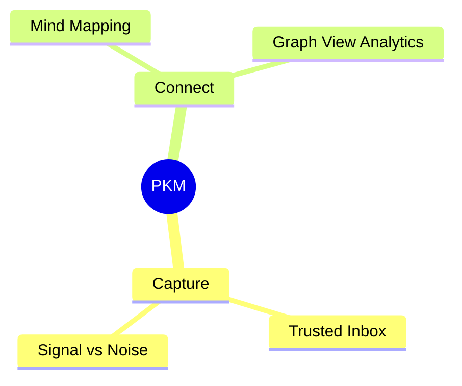

<!-- Generated by SpecStory, Markdown v2.1.0 -->

# 2026-08-01 22:58:04Z

<!-- Cursor IDE Session e8a92c86-f787-4baa-ac87-46c138adb20e (2026-08-01 22:58:04Z) -->

_**User**_

how do i incorporate mind mapping in the notes?

---

_**Agent (auto-smart)**_

> Auto routed to grok-4.5


_**Agent (auto-smart)**_

<think><details><summary>Thought Process</summary>
The user wants to know how to incorporate mind mapping into their notes.

Checking the codebase and relevant skills to see what note features already exist and whether mind mapping is supported.
</details></think>

_**Agent (auto-smart)**_

I'll check how notes are set up in this repo and whether mind maps are already supported or documented.

_**Agent (auto-smart)**_

<tool-use data-tool-type="read" data-tool-name="read_file_v2"><details>
<summary>Tool use: **read_file_v2** • Read file: /home/jorap/Documents/GitHub/jorap.com/.cursor/skills/garden-voice/SKILL.md</summary>

</details></tool-use>

_**Agent (auto-smart)**_

<tool-use data-tool-type="unknown" data-tool-name="ripgrep_raw_search"><details>
<summary>Tool use: **ripgrep_raw_search**</summary>

Parameters:

```json
{
  "caseInsensitive": true,
  "glob": "*.{md,mdc,toml,html,js,ts,css}",
  "path": "/home/jorap/Documents/GitHub/jorap.com",
  "pattern": "mind.?map|mindmap|mermaid|graph|canvas"
}
```
Additional data:

```json
{
  "isPruned": true,
  "outputMode": "content",
  "path": "/home/jorap/Documents/GitHub/jorap.com",
  "pattern": "mind.?map|mindmap|mermaid|graph|canvas",
  "topFiles": [
    {
      "matchCount": 60,
      "uri": ".specstory/history/2026-06-19_03-07-38Z-notes-section-with-obsidian-functionality.md"
    }
  ],
  "totalFiles": 1,
  "totalMatches": 2003
}
```
Status: **completed**

</details></tool-use>

_**Agent (auto-smart)**_

<tool-use data-tool-type="unknown" data-tool-name="ripgrep_raw_search"><details>
<summary>Tool use: **ripgrep_raw_search**</summary>

Parameters:

```json
{
  "caseInsensitive": true,
  "path": "/home/jorap/Documents/GitHub/jorap.com/.cursor",
  "pattern": "mind.?map|mindmap|mermaid"
}
```
Additional data:

```json
{
  "isPruned": true,
  "outputMode": "content",
  "path": "/home/jorap/Documents/GitHub/jorap.com/.cursor",
  "pattern": "mind.?map|mindmap|mermaid",
  "topFiles": [
    {
      "matchCount": 2,
      "uri": ".cursor/skills/hugo-template-guidance/references/component-usage.md"
    }
  ],
  "totalFiles": 1,
  "totalMatches": 2
}
```
Status: **completed**

</details></tool-use>

_**Agent (auto-smart)**_

<think><details><summary>Thought Process</summary>
A draft blog post covers mind mapping, Mermaid support, and a notes graph.

Checking Mermaid shortcodes, existing mind map examples, and the graph view.
</details></think>

_**Agent (auto-smart)**_

<tool-use data-tool-type="search" data-tool-name="glob_file_search"><details>
<summary>Tool use: **glob_file_search** • Searched codebase "" • **6** results in **1** directory</summary>

Directory: **`/home/jorap/Documents/GitHub/jorap.com`** (6 files)

| File |
|------|
| `content/english/notes/renewed-mind.md` |
| `content/english/notes/growth-mindset.md` |
| `content/english/notes/mind-mapping.md` |
| `.specstory/history/2026-07-05_14-21-16Z-renewed-mind-connections.md` |
| `.specstory/history/2026-07-29_23-16-40Z-optimized-mindset-after-bs.md` |
| `content/english/blog/__optimized-mindset-applied-math-or.md` |
</details></tool-use>

_**Agent (auto-smart)**_

<tool-use data-tool-type="unknown" data-tool-name="ripgrep_raw_search"><details>
<summary>Tool use: **ripgrep_raw_search**</summary>

Parameters:

````json
{
  "caseInsensitive": false,
  "glob": "*.{md,html}",
  "path": "/home/jorap/Documents/GitHub/jorap.com/content",
  "pattern": "mermaid|mindmap|```mermaid"
}
````
Additional data:

````json
{
  "isPruned": true,
  "outputMode": "content",
  "path": "/home/jorap/Documents/GitHub/jorap.com/content",
  "pattern": "mermaid|mindmap|```mermaid",
  "topFiles": [
    {
      "matchCount": 4,
      "uri": "content/english/blog/hugoplate-theme-review.md"
    },
    {
      "matchCount": 2,
      "uri": "content/english/blog/__blog-template.md"
    },
    {
      "matchCount": 1,
      "uri": "content/english/pages/elements.md"
    }
  ],
  "totalFiles": 3,
  "totalMatches": 7
}
````
Status: **completed**

</details></tool-use>

_**Agent (auto-smart)**_

<tool-use data-tool-type="unknown" data-tool-name="ripgrep_raw_search"><details>
<summary>Tool use: **ripgrep_raw_search**</summary>

Parameters:

```json
{
  "caseInsensitive": false,
  "path": "/home/jorap/Documents/GitHub/jorap.com/hugo.toml",
  "pattern": "mermaid|mindmap"
}
```
Additional data:

```json
{
  "isPruned": true,
  "outputMode": "content",
  "path": "/home/jorap/Documents/GitHub/jorap.com/hugo.toml",
  "pattern": "mermaid|mindmap",
  "topFiles": [],
  "totalFiles": 0,
  "totalMatches": 0
}
```
Status: **completed**

</details></tool-use>

_**Agent (auto-smart)**_

<tool-use data-tool-type="search" data-tool-name="glob_file_search"><details>
<summary>Tool use: **glob_file_search** • Searched codebase "" • **3** results in **1** directory</summary>

Directory: **`/home/jorap/Documents/GitHub/jorap.com`** (3 files)

| File |
|------|
| `_vendor/github.com/gethugothemes/hugo-modules/shortcodes/mermaid/layouts/partials/mermaid-js.html` |
| `_vendor/github.com/gethugothemes/hugo-modules/shortcodes/mermaid/layouts/_markup/render-codeblock-mermaid.html` |
| `_vendor/github.com/gethugothemes/hugo-modules/shortcodes/mermaid/layouts/shortcodes/mermaid.html` |
</details></tool-use>

_**Agent (auto-smart)**_

<tool-use data-tool-type="read" data-tool-name="read_file_v2"><details>
<summary>Tool use: **read_file_v2**</summary>
File not found
</details></tool-use>

_**Agent (auto-smart)**_

<think><details><summary>Thought Process</summary>
A note about mind-mapping already exists.

Checking how Mermaid mindmaps work in the theme and what the notes structure expects.
</details></think>

_**Agent (auto-smart)**_

<tool-use data-tool-type="read" data-tool-name="read_file_v2"><details>
<summary>Tool use: **read_file_v2** • Read file: /home/jorap/Documents/GitHub/jorap.com/content/english/notes/mind-mapping.md</summary>

</details></tool-use>

_**Agent (auto-smart)**_

<tool-use data-tool-type="read" data-tool-name="read_file_v2"><details>
<summary>Tool use: **read_file_v2** • Read file: /home/jorap/Documents/GitHub/jorap.com/content/english/blog/hugoplate-theme-review.md</summary>

</details></tool-use>

_**Agent (auto-smart)**_

<tool-use data-tool-type="read" data-tool-name="read_file_v2"><details>
<summary>Tool use: **read_file_v2** • Read file: /home/jorap/Documents/GitHub/jorap.com/content/english/pages/elements.md</summary>

</details></tool-use>

_**Agent (auto-smart)**_

<tool-use data-tool-type="unknown" data-tool-name="ripgrep_raw_search"><details>
<summary>Tool use: **ripgrep_raw_search**</summary>

Parameters:

```json
{
  "caseInsensitive": false,
  "path": "/home/jorap/Documents/GitHub/jorap.com/.cursor/skills/hugo-template-guidance",
  "pattern": "mermaid|mindmap|diagram|graph"
}
```
Additional data:

```json
{
  "isPruned": true,
  "outputMode": "content",
  "path": "/home/jorap/Documents/GitHub/jorap.com/.cursor/skills/hugo-template-guidance",
  "pattern": "mermaid|mindmap|diagram|graph",
  "topFiles": [
    {
      "matchCount": 1,
      "uri": ".cursor/skills/hugo-template-guidance/references/styling-and-theming.md"
    },
    {
      "matchCount": 2,
      "uri": ".cursor/skills/hugo-template-guidance/references/component-usage.md"
    }
  ],
  "totalFiles": 2,
  "totalMatches": 3
}
```
Status: **completed**

</details></tool-use>

_**Agent (auto-smart)**_

<tool-use data-tool-type="unknown" data-tool-name="ripgrep_raw_search"><details>
<summary>Tool use: **ripgrep_raw_search**</summary>

Parameters:

````json
{
  "caseInsensitive": false,
  "glob": "*.md",
  "path": "/home/jorap/Documents/GitHub/jorap.com/content/english/notes",
  "pattern": "mermaid|mindmap|```"
}
````
Additional data:

````json
{
  "isPruned": true,
  "outputMode": "content",
  "path": "/home/jorap/Documents/GitHub/jorap.com/content/english/notes",
  "pattern": "mermaid|mindmap|```",
  "topFiles": [
    {
      "matchCount": 2,
      "uri": "content/english/notes/getting-started.md"
    },
    {
      "matchCount": 4,
      "uri": "content/english/notes/flashcards.md"
    }
  ],
  "totalFiles": 2,
  "totalMatches": 6
}
````
Status: **completed**

</details></tool-use>

_**Agent (auto-smart)**_

<think><details><summary>Thought Process</summary>
The mind-mapping note is largely conceptual and contains almost no body content beyond its frontmatter.

Mermaid is already supported via fenced code blocks. I need to verify whether the mindmap diagram type is available, review how note body content works, and clarify the distinction between graph views and mind maps.
</details></think>

_**Agent (auto-smart)**_

<tool-use data-tool-type="read" data-tool-name="read_file_v2"><details>
<summary>Tool use: **read_file_v2** • Read file: /home/jorap/Documents/GitHub/jorap.com/_vendor/github.com/gethugothemes/hugo-modules/shortcodes/mermaid/layouts/_markup/render-codeblock-mermaid.html</summary>

</details></tool-use>

_**Agent (auto-smart)**_

<tool-use data-tool-type="read" data-tool-name="read_file_v2"><details>
<summary>Tool use: **read_file_v2** • Read file: /home/jorap/Documents/GitHub/jorap.com/_vendor/github.com/gethugothemes/hugo-modules/shortcodes/mermaid/layouts/partials/mermaid-js.html</summary>

</details></tool-use>

_**Agent (auto-smart)**_

<tool-use data-tool-type="unknown" data-tool-name="ripgrep_raw_search"><details>
<summary>Tool use: **ripgrep_raw_search**</summary>

Parameters:

```json
{
  "caseInsensitive": false,
  "glob": "**/notes/**",
  "path": "/home/jorap/Documents/GitHub/jorap.com/layouts",
  "pattern": "\\.Content|key_concept|body|mermaid"
}
```
Additional data:

```json
{
  "isPruned": true,
  "outputMode": "content",
  "path": "/home/jorap/Documents/GitHub/jorap.com/layouts",
  "pattern": "\\.Content|key_concept|body|mermaid",
  "topFiles": [
    {
      "matchCount": 2,
      "uri": "layouts/_partials/notes/related-notes.html"
    },
    {
      "matchCount": 5,
      "uri": "layouts/_partials/notes/build-issues-report.html"
    },
    {
      "matchCount": 3,
      "uri": "layouts/_partials/notes/render-content.html"
    },
    {
      "matchCount": 1,
      "uri": "layouts/_partials/notes/outgoing-links.html"
    },
    {
      "matchCount": 3,
      "uri": "layouts/_partials/notes/format-key-concept.html"
    },
    {
      "matchCount": 2,
      "uri": "layouts/_partials/notes/index-has-body-wikilinks.html"
    },
    {
      "matchCount": 2,
      "uri": "layouts/_partials/notes/note-blurb.html"
    },
    {
      "matchCount": 3,
      "uri": "layouts/notes/backlinks.html"
    },
    {
      "matchCount": 5,
      "uri": "layouts/_partials/notes/assembled-content.html"
    },
    {
      "matchCount": 3,
      "uri": "layouts/notes/list.html"
    },
    {
      "matchCount": 9,
      "uri": "layouts/notes/issues.html"
    },
    {
      "matchCount": 1,
      "uri": "layouts/_partials/notes/toc.html"
    },
    {
      "matchCount": 4,
      "uri": "layouts/_partials/notes/cards-for-page.html"
    },
    {
      "matchCount": 1,
      "uri": "layouts/notes/single.html"
    },
    {
      "matchCount": 1,
      "uri": "layouts/_partials/notes/link-registry.html"
    },
    {
      "matchCount": 4,
      "uri": "layouts/_partials/notes/note-issues-panel.html"
    },
    {
      "matchCount": 1,
      "uri": "layouts/_partials/notes/random-prompt-panel.html"
    },
    {
      "matchCount": 2,
      "uri": "layouts/notes/cards.html"
    },
    {
      "matchCount": 19,
      "uri": "layouts/_partials/notes/collect-note-issues.html"
    },
    {
      "matchCount": 1,
      "uri": "layouts/_partials/notes/see-also.html"
    }
  ],
  "totalFiles": 29,
  "totalMatches": 104
}
```
Status: **completed**

</details></tool-use>

_**Agent (auto-smart)**_

<tool-use data-tool-type="search" data-tool-name="glob_file_search"><details>
<summary>Tool use: **glob_file_search** • Searched codebase "" • **65** results in **1** directory</summary>

Directory: **`/home/jorap/Documents/GitHub/jorap.com/layouts`** (65 files)

| File |
|------|
| `_partials/notes/preview-index.html` |
| `_partials/notes/link-registry.html` |
| `_partials/notes/assembled-content.html` |
| `notes/random-duo.html` |
| `_partials/notes/recent-new.html` |
| `notes/cards.html` |
| `_partials/notes/random-unrelated-notes.html` |
| `notes/issues.html` |
| `_partials/notes/see-also.html` |
| `_partials/notes/file-dates.html` |
| `_partials/notes/note-meta.html` |
| `_partials/notes/is-utility-page.html` |
| `_partials/notes/collect-note-issues.html` |
| `_partials/notes/graph-data-local.html` |
| `_partials/notes/card-sets.html` |
| `_partials/notes/note-card.html` |
| `notes/create.html` |
| `_partials/notes/expand-bible-mentions.html` |
| `_partials/notes/note-raw-body.html` |
| `_partials/notes/render-content.html` |
| `_partials/notes/relationships-index.html` |
| `_partials/notes/is-index-page.html` |
| `_partials/notes/sort-by-connections.html` |
| `_partials/notes/search-index-fields.html` |
| `_partials/notes/backlinks-index.html` |
| `_partials/notes/relationship-neighbors.html` |
| `_partials/notes/random-prompt-panel.html` |
| `_partials/notes/note-flashcards.html` |
| `_partials/notes/index-has-body-wikilinks.html` |
| `_partials/notes/graph-data.html` |
| `_partials/notes/related-notes.html` |
| `_partials/notes/backlinks.html` |
| `_partials/notes/resolve-target.html` |
| `_partials/notes/dev-banner.html` |
| `_partials/notes/note-blurb.html` |
| `_partials/notes/toolbar.html` |
| `_partials/notes/toc.html` |
| `_partials/notes/relationship-types.html` |
| `_partials/notes/build-hub-cluster.html` |
| `_partials/notes/random-note-select.html` |
| `notes/single.html` |
| `_partials/notes/note-issues-panel.html` |
| `notes/review.html` |
| `_partials/notes/format-key-concept.html` |
| `_partials/notes/build-issues-report.html` |
| `_partials/notes/local-graph.html` |
| `_partials/notes/cards-for-page.html` |
| `_partials/notes/toc-headings.html` |
| `_partials/notes/card-set-filter-buttons.html` |
| `_partials/notes/random-note.html` |
| `_partials/notes/random-pool.html` |
| `_partials/notes/featured-random-note.html` |
| `_partials/notes/graph-layout-controls.html` |
| `_partials/notes/pages.html` |
| `_partials/notes/backlink-item.html` |
| `_partials/notes/collect-cards.html` |
| `_partials/notes/copy-markdown.html` |
| `_partials/notes/outgoing-links.html` |
| `notes/backlinks.html` |
| `_partials/notes/note-link-card.html` |
| `_partials/notes/note-shareable-thought.html` |
| `_partials/notes/tag-chips.html` |
| `notes/graph.html` |
| `notes/list.html` |
| `_partials/notes/flashcard.html` |
</details></tool-use>

_**Agent (auto-smart)**_

<tool-use data-tool-type="read" data-tool-name="read_file_v2"><details>
<summary>Tool use: **read_file_v2** • Read file: /home/jorap/Documents/GitHub/jorap.com/content/english/blog/how-i-built-jorap-notes.md</summary>

</details></tool-use>

_**Agent (auto-smart)**_

<think><details><summary>Thought Process</summary>
Checking the assembled-content structure to locate body content and examining a note with more content.

Also checking the getting-started guide for notes documentation on diagrams.
</details></think>

_**Agent (auto-smart)**_

<tool-use data-tool-type="read" data-tool-name="read_file_v2"><details>
<summary>Tool use: **read_file_v2** • Read file: /home/jorap/Documents/GitHub/jorap.com/layouts/_partials/notes/assembled-content.html</summary>

</details></tool-use>

_**Agent (auto-smart)**_

<tool-use data-tool-type="read" data-tool-name="read_file_v2"><details>
<summary>Tool use: **read_file_v2** • Read file: /home/jorap/Documents/GitHub/jorap.com/content/english/notes/getting-started.md</summary>

</details></tool-use>

_**Agent (auto-smart)**_

<tool-use data-tool-type="unknown" data-tool-name="ripgrep_raw_search"><details>
<summary>Tool use: **ripgrep_raw_search**</summary>

Parameters:

```json
{
  "caseInsensitive": false,
  "glob": "*.md",
  "path": "/home/jorap/Documents/GitHub/jorap.com/content/english/notes",
  "pattern": "mind map|mermaid|diagram|excalidraw|body"
}
```
Additional data:

```json
{
  "isPruned": true,
  "outputMode": "content",
  "path": "/home/jorap/Documents/GitHub/jorap.com/content/english/notes",
  "pattern": "mind map|mermaid|diagram|excalidraw|body",
  "topFiles": [
    {
      "matchCount": 1,
      "uri": "content/english/notes/second-order-thinking.md"
    },
    {
      "matchCount": 2,
      "uri": "content/english/notes/own-the-error.md"
    },
    {
      "matchCount": 2,
      "uri": "content/english/notes/execution.md"
    },
    {
      "matchCount": 6,
      "uri": "content/english/notes/faithful-steward.md"
    },
    {
      "matchCount": 6,
      "uri": "content/english/notes/process-mapping.md"
    },
    {
      "matchCount": 1,
      "uri": "content/english/notes/flashcards.md"
    },
    {
      "matchCount": 1,
      "uri": "content/english/notes/gate-what-you-consume.md"
    },
    {
      "matchCount": 3,
      "uri": "content/english/notes/blameless-after-action-review.md"
    },
    {
      "matchCount": 1,
      "uri": "content/english/notes/workplace-principles.md"
    },
    {
      "matchCount": 2,
      "uri": "content/english/notes/purpose-and-vision.md"
    },
    {
      "matchCount": 1,
      "uri": "content/english/notes/psychological-safety.md"
    },
    {
      "matchCount": 3,
      "uri": "content/english/notes/measure-then-iterate.md"
    },
    {
      "matchCount": 2,
      "uri": "content/english/notes/versatility.md"
    },
    {
      "matchCount": 3,
      "uri": "content/english/notes/lean-startup.md"
    },
    {
      "matchCount": 5,
      "uri": "content/english/notes/leadership-is-influence.md"
    },
    {
      "matchCount": 1,
      "uri": "content/english/notes/peace.md"
    }
  ],
  "totalFiles": 16,
  "totalMatches": 244
}
```
Status: **completed**

</details></tool-use>

_**Agent (auto-smart)**_

<tool-use data-tool-type="read" data-tool-name="read_file_v2"><details>
<summary>Tool use: **read_file_v2** • Read file: /home/jorap/Documents/GitHub/jorap.com/content/english/blog/__blog-template.md</summary>

</details></tool-use>

_**Agent (auto-smart)**_

<think><details><summary>Thought Process</summary>
The notes garden philosophy treats mind maps as a messy first-pass tool. They export to atomic notes. A `mind-mapping.md` note documents this workflow.

Mermaid mindmaps work directly in note bodies. The site graph shows the full wikilink network, not a single topic mind map.

Excalidraw support needs verification. Exporting a mind map as an image and embedding it via shortcode is another option. The Mermaid mindmap syntax and render pipeline compatibility still need checking.
</details></think>

_**Agent (auto-smart)**_

<tool-use data-tool-type="read" data-tool-name="read_file_v2"><details>
<summary>Tool use: **read_file_v2** • Read file: /home/jorap/Documents/GitHub/jorap.com/layouts/_partials/notes/render-content.html</summary>

</details></tool-use>

_**Agent (auto-smart)**_

<tool-use data-tool-type="unknown" data-tool-name="ripgrep_raw_search"><details>
<summary>Tool use: **ripgrep_raw_search**</summary>

Parameters:

```json
{
  "caseInsensitive": false,
  "glob": "*.{md,html,js,toml}",
  "path": "/home/jorap/Documents/GitHub/jorap.com",
  "pattern": "excalidraw|mindmap"
}
```
Additional data:

```json
{
  "isPruned": true,
  "outputMode": "content",
  "path": "/home/jorap/Documents/GitHub/jorap.com",
  "pattern": "excalidraw|mindmap",
  "topFiles": [
    {
      "matchCount": 4,
      "uri": "./.specstory/history/2026-08-01_22-58-04Z-mind-mapping-in-notes.md"
    },
    {
      "matchCount": 2,
      "uri": "./.specstory/history/2026-06-27_11-19-04Z-chatgpt-code-and-notes.md"
    },
    {
      "matchCount": 7,
      "uri": "./.specstory/history/2026-07-07_04-31-58Z-obsidian-features-discussion.md"
    },
    {
      "matchCount": 2,
      "uri": "./.specstory/history/2026-06-27_11-19-04Z-chatgpt-code-and-notes-integration.md"
    }
  ],
  "totalFiles": 4,
  "totalMatches": 15
}
```
Status: **completed**

</details></tool-use>

_**Agent (auto-smart)**_

<tool-use data-tool-type="read" data-tool-name="read_file_v2"><details>
<summary>Tool use: **read_file_v2** • Read file: /home/jorap/Documents/GitHub/jorap.com/content/english/notes/maps-of-content.md</summary>

</details></tool-use>

_**Agent (auto-smart)**_

<tool-use data-tool-type="unknown" data-tool-name="ripgrep_raw_search"><details>
<summary>Tool use: **ripgrep_raw_search**</summary>

Parameters:

```json
{
  "caseInsensitive": false,
  "path": "/home/jorap/Documents/GitHub/jorap.com/.cursor/skills/garden-voice",
  "pattern": "body|mermaid|diagram"
}
```
Additional data:

```json
{
  "isPruned": true,
  "outputMode": "content",
  "path": "/home/jorap/Documents/GitHub/jorap.com/.cursor/skills/garden-voice",
  "pattern": "body|mermaid|diagram",
  "topFiles": [
    {
      "matchCount": 8,
      "uri": ".cursor/skills/garden-voice/SKILL.md"
    }
  ],
  "totalFiles": 1,
  "totalMatches": 8
}
```
Status: **completed**

</details></tool-use>

_**Agent (auto-smart)**_

<think><details><summary>Thought Process</summary>
A prior SpecStory conversation covered this exact topic.

Reviewing the prior conversation for the recommended mind mapping approach.
</details></think>

_**Agent (auto-smart)**_

<tool-use data-tool-type="read" data-tool-name="read_file_v2"><details>
<summary>Tool use: **read_file_v2**</summary>
File not found
</details></tool-use>

_**Agent (auto-smart)**_

<tool-use data-tool-type="unknown" data-tool-name="ripgrep_raw_search"><details>
<summary>Tool use: **ripgrep_raw_search**</summary>

Parameters:

```json
{
  "caseInsensitive": false,
  "path": "/home/jorap/Documents/GitHub/jorap.com/.specstory/history/2026-08-01_22-58-04Z-mind-mapping-in-notes.md",
  "pattern": "mindmap|Mermaid|how do|incorporate|hub"
}
```
Additional data:

```json
{
  "isPruned": true,
  "outputMode": "content",
  "path": "/home/jorap/Documents/GitHub/jorap.com/.specstory/history/2026-08-01_22-58-04Z-mind-mapping-in-notes.md",
  "pattern": "mindmap|Mermaid|how do|incorporate|hub",
  "topFiles": [
    {
      "matchCount": 7,
      "uri": ".specstory/history/2026-08-01_22-58-04Z-mind-mapping-in-notes.md"
    }
  ],
  "totalFiles": 1,
  "totalMatches": 7
}
```
Status: **completed**

</details></tool-use>

_**Agent (auto-smart)**_

<think><details><summary>Thought Process</summary>
A prior incomplete session addressed this same question.

Checking the agent transcript for the Obsidian features discussion.
</details></think>

_**Agent (auto-smart)**_

<tool-use data-tool-type="search" data-tool-name="glob_file_search"><details>
<summary>Tool use: **glob_file_search** • Searched codebase "" • **0** results in **1** directory</summary>

Directory: **`/home/jorap/.cursor/projects/home-jorap-Documents-GitHub-jorap-com/agent-transcripts`** (0 files)
</details></tool-use>

_**Agent (auto-smart)**_

<tool-use data-tool-type="read" data-tool-name="read_file_v2"><details>
<summary>Tool use: **read_file_v2** • Read file: /home/jorap/Documents/GitHub/jorap.com/.specstory/history/2026-07-07_04-31-58Z-obsidian-features-discussion.md</summary>

</details></tool-use>

_**Agent (auto-smart)**_

<think><details><summary>Thought Process</summary>
Preparing a clear guide on incorporating mind mapping into notes.

The response will cover five points:

- Garden philosophy
- Mermaid support for note bodies
- Graph versus mind map distinction
- Paper and Obsidian workflow
- New features needed

It will explain the approach without implementing code.
</details></think>

_**Agent (auto-smart)**_

Your garden already treats mind maps as a **first pass**, not the permanent note shape. [[Mind Mapping]] says: sketch branches, then export each branch to an atomic note. `/notes/graph/` is the link network across notes — not a per-topic mind map editor.

Here’s how to incorporate mind maps **with what you have today**, plus optional upgrades.

### 1. Mermaid mindmaps in note body (works now)

Mermaid **11** is already wired. Any ` ```mermaid ` fence in a note body renders (same as blog/elements). Best fit: hub/MOC pages (`note_kind: index`), which are allowed body prose. Atomic notes usually keep the body empty — claim lives in frontmatter.

Example on a hub like [[Maps of Content]]:

````markdown

````

Put it **after** the `---` frontmatter. It shows under Key Concept / Examples / Relationships. Caveat: the diagram is hand-curated — it won’t auto-update when wikilinks change.

### 2. Keep the PKM workflow (no new feature)

Matches your own note:

1. Messy map on paper / whiteboard / Obsidian / Excalidraw  
2. Each solid branch → one atomic note (`description`, `key_concept`, `examples`, `relationships`)  
3. Hub page lists those notes with `[[wikilinks]]`  
4. Explore the network at [/notes/graph/](/notes/graph/)

That’s “mind mapping in the notes” as **process**, not a canvas UI.

### 3. Static image export

Tag `Excalidraw` on [[Mind Mapping]] points this way: draw elsewhere, export PNG/SVG into `static/` or `assets/`, embed with the image shortcode. Fine for one-off maps; same sync cost as Mermaid (manual).

### 4. If you want a real feature later

From earlier Obsidian-fit thinking, the options that fit this Hugo garden:

| Approach | Fit |
|----------|-----|
| **Radial / tree layout** on existing graph | Best: live map of real wikilinks |
| **Markmap** from MOC bullet lists | Stays in sync with hub markdown |
| Mermaid on hubs | Already available; presentation only |
| Full Canvas / live Excalidraw | Skip — fights atomic notes |

---

**Practical pick today:** add a Mermaid `mindmap` on the hub that owns the topic; keep atomic notes claim-only; use Graph for discovery. If you want interactive “center this note and fan out branches,” that’s a radial-graph change — switch to Agent mode if you want that built.
