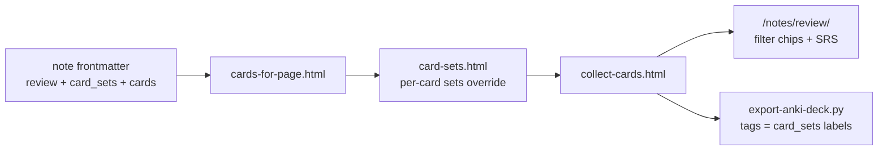

<!-- Generated by SpecStory, Markdown v2.1.0 -->

# 2026-08-02 13:59:03Z

<!-- Cursor IDE Session 4b709f40-6d44-41e5-8ff9-dab239df9e36 (2026-08-02 13:59:03Z) -->

_**User**_

review all flashcard sets and improve grouping

---

_**Agent (auto-smart)**_

> Auto routed to gpt-5.6-sol-medium


_**Agent (auto-smart)**_

<think><details><summary>Thought Process</summary>
**Inspecting flashcards and skills**

I’m thinking about how to inspect all the flashcards and skills. This content editing feels pretty broad, so I should probably explore it. My first step might be to read through the skills and flashcards related to garden voice, focusing on content about grace and faith. The user mentioned all sets grouping, so I want to make sure that the flashcard skill provides the exact information needed. I’ll read through it carefully.
</details></think>

_**Agent (auto-smart)**_

<tool-use data-tool-type="read" data-tool-name="read_file_v2"><details>
<summary>Tool use: **read_file_v2** • Read file: /home/jorap/Documents/GitHub/jorap.com/.cursor/skills/flashcards/SKILL.md</summary>

</details></tool-use>

_**Agent (auto-smart)**_

<tool-use data-tool-type="read" data-tool-name="read_file_v2"><details>
<summary>Tool use: **read_file_v2** • Read file: /home/jorap/Documents/GitHub/jorap.com/.cursor/skills/garden-voice/SKILL.md</summary>

</details></tool-use>

_**Agent (auto-smart)**_

<tool-use data-tool-type="read" data-tool-name="read_file_v2"><details>
<summary>Tool use: **read_file_v2** • Read file: /home/jorap/Documents/GitHub/jorap.com/.cursor/skills/free-grace/SKILL.md</summary>

</details></tool-use>

_**Agent (auto-smart)**_

<think><details><summary>Thought Process</summary>
**Exploring grouping issues**

I need to understand the “grouping” of the card_sets labels since they seem poorly organized. My plan is to inspect all notes related to review true/cards/card_sets and the specifications. Broad exploration could help identify the problem. I might use a subagent to request an inventory and check for grouping anomalies. Additionally, I could run some scripts to audit the situation. I’ll search the files under review/card_sets too.
</details></think>

_**Agent (auto-smart)**_

<tool-use data-tool-type="unknown" data-tool-name="ripgrep_raw_search"><details>
<summary>Tool use: **ripgrep_raw_search**</summary>

Parameters:

```json
{
  "caseInsensitive": false,
  "glob": "*.md",
  "outputMode": "files_with_matches",
  "path": "/home/jorap/Documents/GitHub/jorap.com/content/english/notes",
  "pattern": "^review: true$"
}
```
Additional data:

```json
{
  "isPruned": true,
  "outputMode": "files_with_matches",
  "path": "/home/jorap/Documents/GitHub/jorap.com/content/english/notes",
  "pattern": "^review: true$",
  "topFiles": [
    {
      "matchCount": 1,
      "uri": "content/english/notes/law-of-priorities.md"
    },
    {
      "matchCount": 1,
      "uri": "content/english/notes/by-their-fruits.md"
    },
    {
      "matchCount": 1,
      "uri": "content/english/notes/love-god.md"
    },
    {
      "matchCount": 1,
      "uri": "content/english/notes/pray-when-drained.md"
    },
    {
      "matchCount": 1,
      "uri": "content/english/notes/peace.md"
    },
    {
      "matchCount": 1,
      "uri": "content/english/notes/childlike-faith.md"
    },
    {
      "matchCount": 1,
      "uri": "content/english/notes/justification.md"
    },
    {
      "matchCount": 1,
      "uri": "content/english/notes/judgment-seat.md"
    },
    {
      "matchCount": 1,
      "uri": "content/english/notes/sabbath-for-good.md"
    },
    {
      "matchCount": 1,
      "uri": "content/english/notes/law-of-intuition.md"
    },
    {
      "matchCount": 1,
      "uri": "content/english/notes/law-of-legacy.md"
    },
    {
      "matchCount": 1,
      "uri": "content/english/notes/law-of-solid-ground.md"
    },
    {
      "matchCount": 1,
      "uri": "content/english/notes/law-of-the-inner-circle.md"
    },
    {
      "matchCount": 1,
      "uri": "content/english/notes/forgiveness.md"
    },
    {
      "matchCount": 1,
      "uri": "content/english/notes/faith-and-works.md"
    },
    {
      "matchCount": 1,
      "uri": "content/english/notes/law-of-sacrifice.md"
    },
    {
      "matchCount": 1,
      "uri": "content/english/notes/law-of-respect.md"
    },
    {
      "matchCount": 1,
      "uri": "content/english/notes/render-unto-caesar.md"
    },
    {
      "matchCount": 1,
      "uri": "content/english/notes/glorify-your-name.md"
    },
    {
      "matchCount": 1,
      "uri": "content/english/notes/law-of-magnetism.md"
    }
  ],
  "totalFiles": 112,
  "totalMatches": 112
}
```
Status: **completed**

</details></tool-use>

_**Agent (auto-smart)**_

<tool-use data-tool-type="unknown" data-tool-name="ripgrep_raw_search"><details>
<summary>Tool use: **ripgrep_raw_search**</summary>

Parameters:

```json
{
  "caseInsensitive": false,
  "glob": "*.md",
  "outputMode": "content",
  "path": "/home/jorap/Documents/GitHub/jorap.com/content/english/notes",
  "pattern": "^card_sets:"
}
```
Additional data:

```json
{
  "isPruned": true,
  "outputMode": "content",
  "path": "/home/jorap/Documents/GitHub/jorap.com/content/english/notes",
  "pattern": "^card_sets:",
  "topFiles": [
    {
      "matchCount": 1,
      "uri": "content/english/notes/community-depth.md"
    },
    {
      "matchCount": 1,
      "uri": "content/english/notes/first-principles-thinking.md"
    },
    {
      "matchCount": 1,
      "uri": "content/english/notes/rollback-principle.md"
    },
    {
      "matchCount": 1,
      "uri": "content/english/notes/eternal-rewards.md"
    },
    {
      "matchCount": 1,
      "uri": "content/english/notes/christianity-and-politics.md"
    },
    {
      "matchCount": 1,
      "uri": "content/english/notes/mobile-capture-workflows.md"
    },
    {
      "matchCount": 1,
      "uri": "content/english/notes/teachable-stack.md"
    },
    {
      "matchCount": 1,
      "uri": "content/english/notes/preparedness.md"
    },
    {
      "matchCount": 1,
      "uri": "content/english/notes/normalization-of-deviance.md"
    },
    {
      "matchCount": 1,
      "uri": "content/english/notes/discern-his-will-daily.md"
    },
    {
      "matchCount": 1,
      "uri": "content/english/notes/minimum-effective-dose.md"
    },
    {
      "matchCount": 1,
      "uri": "content/english/notes/people-centered-design.md"
    },
    {
      "matchCount": 1,
      "uri": "content/english/notes/digital-garden.md"
    },
    {
      "matchCount": 1,
      "uri": "content/english/notes/evergreen-vs-fleeting-notes.md"
    },
    {
      "matchCount": 1,
      "uri": "content/english/notes/note-relationships.md"
    },
    {
      "matchCount": 1,
      "uri": "content/english/notes/gate-what-you-consume.md"
    },
    {
      "matchCount": 1,
      "uri": "content/english/notes/digital-serendipity.md"
    },
    {
      "matchCount": 1,
      "uri": "content/english/notes/continuous-improvement.md"
    },
    {
      "matchCount": 1,
      "uri": "content/english/notes/success-is-stewardship.md"
    },
    {
      "matchCount": 1,
      "uri": "content/english/notes/goodness.md"
    }
  ],
  "totalFiles": 298,
  "totalMatches": 298
}
```
Status: **completed**

</details></tool-use>

_**Agent (auto-smart)**_

<tool-use data-tool-type="read" data-tool-name="read_file_v2"><details>
<summary>Tool use: **read_file_v2** • Read file: /home/jorap/Documents/GitHub/jorap.com/content/english/notes/flashcards.md</summary>

</details></tool-use>

_**Agent (auto-smart)**_

<tool-use data-tool-type="read" data-tool-name="read_file_v2"><details>
<summary>Tool use: **read_file_v2** • Read file: /home/jorap/Documents/GitHub/jorap.com/content/english/notes/abide-in-me.md</summary>

</details></tool-use>

_**Agent (auto-smart)**_

<tool-use data-tool-type="read" data-tool-name="read_file_v2"><details>
<summary>Tool use: **read_file_v2** • Read file: /home/jorap/Documents/GitHub/jorap.com/content/english/notes/the-golden-rule.md</summary>

</details></tool-use>

_**Agent (auto-smart)**_

<think><details><summary>Thought Process</summary>
**Evaluating flashcard organization**

I see there are about 100 active review flashcard sets, but many are disabled. When I think about "review all flashcard sets and improve grouping," it probably involves the taxonomy or groupings rather than just card wording. I'll need to inspect the implementation labels and their counts, so an audit is necessary. I could script this data to compute active labels and note categories or tags, possibly using shell for npm run audit. I'll also check the package script for specific functions.
</details></think>

_**Agent (auto-smart)**_

I found two overlapping taxonomies: active faith decks and many legacy disabled PKM labels. I’m checking the review page behavior and label distribution before changing group assignments, so the result improves navigation without accidentally re-enabling old decks.

_**Agent (auto-smart)**_

<tool-use data-tool-type="unknown" data-tool-name="ripgrep_raw_search"><details>
<summary>Tool use: **ripgrep_raw_search**</summary>

Parameters:

```json
{
  "caseInsensitive": false,
  "glob": "*.{js,mjs,ts,html,json,yaml,toml}",
  "outputMode": "files_with_matches",
  "path": "/home/jorap/Documents/GitHub/jorap.com",
  "pattern": "card_sets|cardSets|card-sets"
}
```
Additional data:

```json
{
  "isPruned": true,
  "outputMode": "files_with_matches",
  "path": "/home/jorap/Documents/GitHub/jorap.com",
  "pattern": "card_sets|cardSets|card-sets",
  "topFiles": [
    {
      "matchCount": 1,
      "uri": "layouts/_partials/notes/card-sets.html"
    },
    {
      "matchCount": 1,
      "uri": "layouts/_partials/notes/collect-cards.html"
    },
    {
      "matchCount": 1,
      "uri": "layouts/_partials/notes/cards-for-page.html"
    },
    {
      "matchCount": 1,
      "uri": "layouts/notes/cards.html"
    }
  ],
  "totalFiles": 4,
  "totalMatches": 4
}
```
Status: **completed**

</details></tool-use>

_**Agent (auto-smart)**_

<tool-use data-tool-type="unknown" data-tool-name="ripgrep_raw_search"><details>
<summary>Tool use: **ripgrep_raw_search**</summary>

Parameters:

```json
{
  "caseInsensitive": false,
  "outputMode": "content",
  "path": "/home/jorap/Documents/GitHub/jorap.com/package.json",
  "pattern": "\"lint:cards\"|\"audit:cards\""
}
```
Additional data:

```json
{
  "isPruned": true,
  "outputMode": "content",
  "path": "/home/jorap/Documents/GitHub/jorap.com/package.json",
  "pattern": "\"lint:cards\"|\"audit:cards\"",
  "topFiles": [
    {
      "matchCount": 2,
      "uri": "package.json"
    }
  ],
  "totalFiles": 1,
  "totalMatches": 2
}
```
Status: **completed**

</details></tool-use>

_**Agent (auto-smart)**_

<tool-use data-tool-type="unknown" data-tool-name="task_v2"><details>
<summary>Tool use: **task_v2**</summary>

Parameters:

```json
{
  "description": "Audit flashcard group taxonomy",
  "model": "composer-2.5-fast",
  "name": "explore",
  "prompt": "In /home/jorap/Documents/GitHub/jorap.com, comprehensively inspect all content/english/notes/*.md flashcard metadata, especially review, categories, tags, card_sets, and optional per-card sets. Also inspect the review/flashcard rendering code and relevant lint/audit scripts. The user asked to 'review all flashcard sets and improve grouping'. Return: (1) exact current active set counts for review:true notes, (2) taxonomy inconsistencies and redundant/overbroad labels, (3) a minimal concrete regrouping proposal respecting .cursor/skills/flashcards/SKILL.md rules (active only Faith/Eternal Principles; legacy PKM stays disabled), and (4) exact files/metadata lines that should change. Do not edit files. Thoroughness: very thorough.",
  "subagentType": "explore"
}
```
Additional data:

```json
{
  "backgroundCompletionStatus": "success",
  "backgrounded": true,
  "status": "success",
  "subagentComposerId": "dbde9467-3bb3-4ee2-ada1-bc07f7677545",
  "terminationReason": "completed"
}
```
Result:

```json
{
  "agentId": "dbde9467-3bb3-4ee2-ada1-bc07f7677545",
  "isBackground": true
}
```
Status: **completed**

</details></tool-use>

_**Agent (auto-smart)**_

<tool-use data-tool-type="read" data-tool-name="read_file_v2"><details>
<summary>Tool use: **read_file_v2** • Read file: /home/jorap/Documents/GitHub/jorap.com/layouts/_partials/notes/card-sets.html</summary>

</details></tool-use>

_**Agent (auto-smart)**_

<tool-use data-tool-type="read" data-tool-name="read_file_v2"><details>
<summary>Tool use: **read_file_v2** • Read file: /home/jorap/Documents/GitHub/jorap.com/layouts/_partials/notes/collect-cards.html</summary>

</details></tool-use>

_**Agent (auto-smart)**_

<tool-use data-tool-type="read" data-tool-name="read_file_v2"><details>
<summary>Tool use: **read_file_v2** • Read file: /home/jorap/Documents/GitHub/jorap.com/layouts/notes/cards.html</summary>

</details></tool-use>

_**Agent (auto-smart)**_

<tool-use data-tool-type="read" data-tool-name="read_file_v2"><details>
<summary>Tool use: **read_file_v2** • Read file: /home/jorap/Documents/GitHub/jorap.com/scripts/lint-flashcard-frontmatter.py</summary>

</details></tool-use>

_**Agent (auto-smart)**_

<tool-use data-tool-type="read" data-tool-name="read_file_v2"><details>
<summary>Tool use: **read_file_v2** • Read file: /home/jorap/Documents/GitHub/jorap.com/scripts/audit-flashcard-north-star.py</summary>

</details></tool-use>

_**Agent (auto-smart)**_

<tool-use data-tool-type="search" data-tool-name="glob_file_search"><details>
<summary>Tool use: **glob_file_search** • Searched codebase "" • **5** results in **1** directory</summary>

Directory: **`/home/jorap/.cursor/projects/home-jorap-Documents-GitHub-jorap-com/terminals`** (5 files)

| File |
|------|
| `1.txt` |
| `188349.txt` |
| `500656.txt` |
| `478596.txt` |
| `3.txt` |
</details></tool-use>

_**Agent (auto-smart)**_

<tool-use data-tool-type="read" data-tool-name="read_file_v2"><details>
<summary>Tool use: **read_file_v2** • Read file: /home/jorap/.cursor/projects/home-jorap-Documents-GitHub-jorap-com/terminals/1.txt</summary>

</details></tool-use>

_**Agent (auto-smart)**_

<tool-use data-tool-type="read" data-tool-name="read_file_v2"><details>
<summary>Tool use: **read_file_v2** • Read file: /home/jorap/.cursor/projects/home-jorap-Documents-GitHub-jorap-com/terminals/188349.txt</summary>

</details></tool-use>

_**Agent (auto-smart)**_

<tool-use data-tool-type="read" data-tool-name="read_file_v2"><details>
<summary>Tool use: **read_file_v2** • Read file: /home/jorap/.cursor/projects/home-jorap-Documents-GitHub-jorap-com/terminals/500656.txt</summary>

</details></tool-use>

_**Agent (auto-smart)**_

<tool-use data-tool-type="read" data-tool-name="read_file_v2"><details>
<summary>Tool use: **read_file_v2** • Read file: /home/jorap/.cursor/projects/home-jorap-Documents-GitHub-jorap-com/terminals/478596.txt</summary>

</details></tool-use>

_**Agent (auto-smart)**_

<tool-use data-tool-type="read" data-tool-name="read_file_v2"><details>
<summary>Tool use: **read_file_v2** • Read file: /home/jorap/.cursor/projects/home-jorap-Documents-GitHub-jorap-com/terminals/3.txt</summary>

</details></tool-use>

_**Agent (auto-smart)**_

<tool-use data-tool-type="shell" data-tool-name="run_terminal_command_v2"><details>
<summary>Tool use: **run_terminal_command_v2** • Run command: python3 -c &#39;import re, pathlib, collections; root=pathlib.Path(&#34;content/english/notes&#34;); counts=collections.Counter(); combos=collections.Counter(); files=[]; cards=collections.Counter();
for p in root.glob(&#34;*.md&#34;):
 s=p.read_text(); fm=s.split(&#34;---&#34;,2)[1] if s.startswith(&#34;---&#34;) else &#34;&#34;;
 if not re.search(r&#34;^review:\s*true\s*$&#34;,fm,re.M): continue
 m=re.search(r&#34;^card_sets:\s*\[(.*)\]\s*$&#34;,fm,re.M); sets=tuple(re.findall(r&#39;&#34;([^&#34;]+)&#34;&#39;,m.group(1))) if m else (); counts.update(sets); combos[sets]+=1; n=len(re.findall(r&#34;^\s+- front:&#34;,fm,re.M)); cards.update({x:n for x in sets}); files.append((p.name,sets,n))
print(f&#34;active notes={len(files)} cards={sum(n for _,_,n in files)}&#34;)
print(&#34;SET COUNTS (notes/cards)&#34;)
for x,n in counts.most_common(): print(f&#34;{x}: {n}/{cards[x]}&#34;)
print(&#34;COMBINATIONS&#34;)
for x,n in combos.most_common(): print(f&#34;{n}: {list(x)}&#34;)&#39;</summary>
```bash
python3 -c 'import re, pathlib, collections; root=pathlib.Path("content/english/notes"); counts=collections.Counter(); combos=collections.Counter(); files=[]; cards=collections.Counter();
for p in root.glob("*.md"):
 s=p.read_text(); fm=s.split("---",2)[1] if s.startswith("---") else "";
 if not re.search(r"^review:\s*true\s*$",fm,re.M): continue
 m=re.search(r"^card_sets:\s*\[(.*)\]\s*$",fm,re.M); sets=tuple(re.findall(r'"([^"]+)"',m.group(1))) if m else (); counts.update(sets); combos[sets]+=1; n=len(re.findall(r"^\s+- front:",fm,re.M)); cards.update({x:n for x in sets}); files.append((p.name,sets,n))
print(f"active notes={len(files)} cards={sum(n for _,_,n in files)}")
print("SET COUNTS (notes/cards)")
for x,n in counts.most_common(): print(f"{x}: {n}/{cards[x]}")
print("COMBINATIONS")
for x,n in combos.most_common(): print(f"{n}: {list(x)}")'
```

```
--: eval: line 5: syntax error near unexpected token `)'
--: eval: line 5: ` m=re.search(r"^card_sets:\s*\[(.*)\]\s*$",fm,re.M); sets=tuple(re.findall(r'"([^"]+)"',m.group(1))) if m else (); counts.update(sets); combos[sets]+=1; n=len(re.findall(r"^\s+- front:",fm,re.M)); cards.update({x:n for x in sets}); files.append((p.name,sets,n))'

```
</details></tool-use>

_**Agent (auto-smart)**_

<tool-use data-tool-type="shell" data-tool-name="run_terminal_command_v2"><details>
<summary>Tool use: **run_terminal_command_v2** • Run command: npm run lint:cards &amp;&amp; npm run audit:cards</summary>
```bash
npm run lint:cards && npm run audit:cards
```

```

> jorap-com@2.2.0 lint:cards
> node scripts/runPython.mjs scripts/lint-flashcard-frontmatter.py

Flashcard frontmatter OK

> jorap-com@2.2.0 audit:cards
> node scripts/runPython.mjs scripts/audit-flashcard-north-star.py

Flashcard north-star audit OK

```
</details></tool-use>

_**Agent (auto-smart)**_

<tool-use data-tool-type="shell" data-tool-name="run_terminal_command_v2"><details>
<summary>Tool use: **run_terminal_command_v2** • Run command: python3 -c &#39;import re,pathlib,collections; root=pathlib.Path(&#34;content/english/notes&#34;); counts=collections.Counter(); combos=collections.Counter(); cards=collections.Counter(); files=[]
for p in root.glob(&#34;*.md&#34;):
 s=p.read_text(); fm=s.split(&#34;---&#34;,2)[1] if s.startswith(&#34;---&#34;) else &#34;&#34;
 if not re.search(r&#34;^review:\s*true\s*$&#34;,fm,re.M): continue
 m=re.search(r&#34;^card_sets:\s*\[(.*)\]\s*$&#34;,fm,re.M); sets=tuple(x.strip().strip(chr(34)) for x in m.group(1).split(&#34;,&#34;)) if m else (); n=len(re.findall(r&#34;^\s+- front:&#34;,fm,re.M)); counts.update(sets); combos[sets]+=1; cards.update({x:n for x in sets}); files.append((p.name,sets,n))
print(f&#34;active notes={len(files)} cards={sum(n for _,_,n in files)}&#34;); print(&#34;SET COUNTS (notes/cards)&#34;)
for x,n in counts.most_common(): print(f&#34;{x}: {n}/{cards[x]}&#34;)
print(&#34;COMBINATIONS&#34;)
for x,n in combos.most_common(): print(f&#34;{n}: {list(x)}&#34;)&#39;</summary>
```bash
python3 -c 'import re,pathlib,collections; root=pathlib.Path("content/english/notes"); counts=collections.Counter(); combos=collections.Counter(); cards=collections.Counter(); files=[]
for p in root.glob("*.md"):
 s=p.read_text(); fm=s.split("---",2)[1] if s.startswith("---") else ""
 if not re.search(r"^review:\s*true\s*$",fm,re.M): continue
 m=re.search(r"^card_sets:\s*\[(.*)\]\s*$",fm,re.M); sets=tuple(x.strip().strip(chr(34)) for x in m.group(1).split(",")) if m else (); n=len(re.findall(r"^\s+- front:",fm,re.M)); counts.update(sets); combos[sets]+=1; cards.update({x:n for x in sets}); files.append((p.name,sets,n))
print(f"active notes={len(files)} cards={sum(n for _,_,n in files)}"); print("SET COUNTS (notes/cards)")
for x,n in counts.most_common(): print(f"{x}: {n}/{cards[x]}")
print("COMBINATIONS")
for x,n in combos.most_common(): print(f"{n}: {list(x)}")'
```

```
active notes=110 cards=662
SET COUNTS (notes/cards)
Eternal Principles: 91/548
Gospel: 88/530
Discipleship: 61/366
Faith: 28/170
Ethics: 16/96
Prayer: 13/78
Jesus Rhythms: 12/72
Priorities: 7/42
Jesus Prayers: 7/42
Commandments: 2/12
COMBINATIONS
33: ['Eternal Principles', 'Gospel', 'Discipleship']
21: ['Eternal Principles', 'Discipleship']
12: ['Eternal Principles', 'Gospel', 'Ethics']
9: ['Eternal Principles', 'Gospel', 'Faith']
7: ['Jesus Prayers', 'Gospel', 'Faith', 'Prayer']
7: ['Jesus Rhythms', 'Gospel', 'Faith']
6: ['Eternal Principles', 'Gospel', 'Priorities']
3: ['Eternal Principles', 'Gospel', 'Discipleship', 'Ethics']
3: ['Eternal Principles', 'Gospel', 'Prayer']
3: ['Jesus Rhythms', 'Gospel', 'Faith', 'Prayer']
2: ['Jesus Rhythms', 'Gospel', 'Faith', 'Discipleship']
2: ['Eternal Principles', 'Gospel', 'Commandments']
1: ['Eternal Principles', 'Gospel', 'Priorities', 'Discipleship']
1: ['Eternal Principles', 'Discipleship', 'Ethics']

```
</details></tool-use>

_**Agent (auto-smart)**_

<tool-use data-tool-type="shell" data-tool-name="run_terminal_command_v2"><details>
<summary>Tool use: **run_terminal_command_v2** • Run command: python3 -c &#39;import re,pathlib,collections; d=collections.defaultdict(list)
for p in pathlib.Path(&#34;content/english/notes&#34;).glob(&#34;*.md&#34;):
 s=p.read_text(); fm=s.split(&#34;---&#34;,2)[1] if s.startswith(&#34;---&#34;) else &#34;&#34;
 if not re.search(r&#34;^review:\s*true\s*$&#34;,fm,re.M): continue
 m=re.search(r&#34;^card_sets:\s*\[(.*)\]\s*$&#34;,fm,re.M); sets=tuple(x.strip().strip(chr(34)) for x in m.group(1).split(&#34;,&#34;)) if m else (); d[sets].append(p.stem)
for sets,names in sorted(d.items(),key=lambda x:(-len(x[1]),x[0])): print(f&#34;\n{sets} ({len(names)})\n  &#34;+&#34;\n  &#34;.join(sorted(names)))&#39;</summary>
```bash
python3 -c 'import re,pathlib,collections; d=collections.defaultdict(list)
for p in pathlib.Path("content/english/notes").glob("*.md"):
 s=p.read_text(); fm=s.split("---",2)[1] if s.startswith("---") else ""
 if not re.search(r"^review:\s*true\s*$",fm,re.M): continue
 m=re.search(r"^card_sets:\s*\[(.*)\]\s*$",fm,re.M); sets=tuple(x.strip().strip(chr(34)) for x in m.group(1).split(",")) if m else (); d[sets].append(p.stem)
for sets,names in sorted(d.items(),key=lambda x:(-len(x[1]),x[0])): print(f"\n{sets} ({len(names)})\n  "+"\n  ".join(sorted(names)))'
```

```

('Eternal Principles', 'Gospel', 'Discipleship') (33)
  bear-each-others-burdens
  christianity-and-politics
  christlikeness
  come-to-me-weary
  confess-to-one-another
  count-the-cost
  discern-his-will-daily
  discipleship
  dont-copy-the-pattern
  faithful-steward
  faithfulness
  gentleness
  goodness
  grateful-obedience
  great-commission
  guard-your-heart
  humility-and-service
  iron-sharpens-iron
  joy
  kindness
  let-your-light-shine
  love
  many-parts-one-body
  patience
  peace
  present-a-living-sacrifice
  render-unto-caesar
  renewed-mind
  sanctification
  take-up-your-cross
  the-narrow-way
  the-wise-builder
  walk-by-the-spirit

('Eternal Principles', 'Discipleship') (21)
  law-of-addition
  law-of-buy-in
  law-of-connection
  law-of-empowerment
  law-of-explosive-growth
  law-of-influence
  law-of-intuition
  law-of-legacy
  law-of-magnetism
  law-of-navigation
  law-of-priorities
  law-of-process
  law-of-respect
  law-of-sacrifice
  law-of-solid-ground
  law-of-the-big-mo
  law-of-the-inner-circle
  law-of-the-lid
  law-of-the-picture
  law-of-timing
  law-of-victory

('Eternal Principles', 'Gospel', 'Ethics') (12)
  by-their-fruits
  forgiveness
  heart-righteousness
  judge-not
  let-your-yes-be-yes
  love-your-enemies
  mercy
  peacemakers
  reconciliation-before-worship
  the-golden-rule
  turn-the-other-cheek
  words-that-build-up

('Eternal Principles', 'Gospel', 'Faith') (9)
  abide-in-me
  assurance
  childlike-faith
  faith-and-works
  free-grace
  grace
  justification
  repent-and-believe
  standing-vs-fellowship

('Jesus Prayers', 'Gospel', 'Faith', 'Prayer') (7)
  father-forgive-them
  glorify-your-name
  into-your-hands
  not-my-will
  pray-for-his-own
  thank-father-at-lazarus
  thank-father-for-revelation

('Jesus Rhythms', 'Gospel', 'Faith') (7)
  it-is-written
  kingdom-on-the-road
  moved-with-compassion
  read-in-synagogue
  sabbath-for-good
  table-fellowship
  the-fathers-food

('Eternal Principles', 'Gospel', 'Prior
… (output truncated)
```
</details></tool-use>

_**Agent (auto-smart)**_

<think><details><summary>Thought Process</summary>
**Improving note organization**

I’m thinking about optimizing my note grouping by enforcing one collection or lane per topic. I might remove "Gospel" and "EP" from the Jesus lanes since existing tags already cover Gospel, but the filters work differently for card sets.  

I’m looking to create collection sets focused on "Eternal Principles" and "Jesus Rhythms," ensuring each note has a single lane and topic. This means correctly categorizing Jesus Prayers and Rhythms while streamlining everything to match specified lanes. I want this to be clear and structured!
**Selecting exceptions for note organization**

I need to choose 5 exceptions regarding the classifications. It seems likely that "success stewardship" relates more to Priorities than to both Discipleship and Ethics. Currently, I have combinations of Discipleship and Ethics, with emphasis on discipleship leading. I also should consider how "god-centered design" fits in with Priorities.  

I’m looking at about 110 metadata edits, and a bulk mechanical script should work, but I must fully understand everything before proceeding. I'll also wait for confirmation on the subagent results! In the meantime, I’ll inspect the UI to explore possible visual groupings for lanes and topics.
**Updating skill and documentation**

I need to update the SKILL and review the flashcard note documentation. There’s also the possibility of using lint to enforce exactly 2 sets—one for collection and one for topic. This should be robust and minimal, but it means I’ll need to write some code.  

The user asked about improving grouping, and lint could serve as a useful small check. I wonder if I should inspect the tests, maybe modify the script, and then test the existing setup, even though that’s a lot of files to manage. Perhaps a bulk script is the way to go!**Evaluating file operations**

I’m considering polling options, but it seems I shouldn’t proactively check. I could inspect current Git changes to see if many target notes have already been modified, and a quick Git status shows it’s likely safe. 

It looks like I need to edit files, but the directive says not to use the shell for file operations. I’m exploring if I could use a temporary script for changes instead or stick with a Python script for a more permanent solution.
**Considering ApplyPatch limitations**

I find applying a patch to each file manually just isn’t feasible. Doing it in multiple sequential calls feels unacceptable, especially with 110 files. I know using `perl -pi` is off the table, but creating a script with ApplyPatch could work. The developer's guidance on using formatting/scripts for bulk operations could help, even though there's a note about the shell. I’ll need to ensure there are no per-card sets by checking with the `rg` pattern `^\s+sets:`.
</details></think>

_**Agent (auto-smart)**_

<tool-use data-tool-type="unknown" data-tool-name="ripgrep_raw_search"><details>
<summary>Tool use: **ripgrep_raw_search**</summary>

Parameters:

```json
{
  "caseInsensitive": false,
  "glob": "*.md",
  "outputMode": "content",
  "path": "/home/jorap/Documents/GitHub/jorap.com/content/english/notes",
  "pattern": "^\\s+sets:"
}
```
Additional data:

```json
{
  "isPruned": true,
  "outputMode": "content",
  "path": "/home/jorap/Documents/GitHub/jorap.com/content/english/notes",
  "pattern": "^\\s+sets:",
  "topFiles": [],
  "totalFiles": 0,
  "totalMatches": 0
}
```
Status: **completed**

</details></tool-use>

_**Agent (auto-smart)**_

<think><details><summary>Thought Process</summary>
**Evaluating button ordering**

I'm considering how to organize the filter buttons. It might make sense to group them by top or subjects, which could improve usability. But, if there's no change in the user interface, I might decide to label them alphabetically instead. This way, users can quickly find what they need. I want to ensure it's intuitive for everyone, so a thoughtful approach is necessary to enhance their experience.
</details></think>

_**Agent (auto-smart)**_

<tool-use data-tool-type="read" data-tool-name="read_file_v2"><details>
<summary>Tool use: **read_file_v2** • Read file: /home/jorap/Documents/GitHub/jorap.com/layouts/_partials/notes/card-set-filter-buttons.html</summary>

</details></tool-use>

_**Agent (auto-smart)**_

<think><details><summary>Thought Process</summary>
**Improving UI grouping**

I’m thinking about refining the grouping for the UI by displaying "Collections" and "Topics" separately. However, filters should only have one active option, so group labels might not be necessary. The user didn't explicitly request a change in the UI; they might just be referencing card sets from a previous session. I’ll look into taxonomy normalization and see if I need to wait for an agent result or a notification.**Setting mappings for notes**

I'm thinking about how to establish mappings based on different note sets and the exceptions that may apply. It's important to ensure that the mappings are clear and functional while allowing for any necessary exceptions. I wonder how I can keep track of these variations effectively. Maybe I could create a structured format that outlines each note set alongside their respective exceptions to make it easier to reference later. Let's organize this thoughtfully!**Reviewing script transformations**

I’m thinking about using a temporary script to review true changes and transform them. I could try creating it in the /tmp directory, but I need to be cautious about visibility. Maybe I should add a file there and execute a script like `scripts/archive/regroup-flashcard-sets.py`, then delete it afterward. I think I’ll focus on one task at a time, starting with updating the lint and documentation across the necessary files and notes.
</details></think>

_**Agent (auto-smart)**_

<tool-use data-tool-type="write" data-tool-name="edit_file_v2"><details>
<summary>Tool use: **edit_file_v2** • Edit file: /home/jorap/Documents/GitHub/jorap.com/scripts/lint-flashcard-frontmatter.py</summary>

</details></tool-use>

_**Agent (auto-smart)**_

<think><details><summary>Thought Process</summary>
**Planning migration script**

I'm focusing on creating a migration script. To start this process, I should gather all the necessary details about the data that needs to be moved, how to structure it, and any dependencies. I’ll also need to ensure that I have a backup plan just in case something goes wrong during migration. Once I have a clear understanding of the requirements, I can start writing the script more effectively!
</details></think>

_**Agent (auto-smart)**_

<tool-use data-tool-type="write" data-tool-name="edit_file_v2"><details>
<summary>Tool use: **edit_file_v2** • Edit file: /home/jorap/Documents/GitHub/jorap.com/scripts/archive/regroup-flashcard-sets.py</summary>

</details></tool-use>

_**Agent (auto-smart)**_

<tool-use data-tool-type="shell" data-tool-name="run_terminal_command_v2"><details>
<summary>Tool use: **run_terminal_command_v2** • Run command: python3 scripts/archive/regroup-flashcard-sets.py</summary>
```bash
python3 scripts/archive/regroup-flashcard-sets.py
```

```
Regrouped 89 active flashcard notes

```
</details></tool-use>

_**Agent (auto-smart)**_

<tool-use data-tool-type="write" data-tool-name="delete_file"><details>
<summary>Tool use: **delete_file**</summary>

</details></tool-use>

_**Agent (auto-smart)**_

<tool-use data-tool-type="write" data-tool-name="edit_file_v2"><details>
<summary>Tool use: **edit_file_v2** • Edit file: /home/jorap/Documents/GitHub/jorap.com/.cursor/skills/flashcards/SKILL.md</summary>

</details></tool-use>

_**Agent (auto-smart)**_

<think><details><summary>Thought Process</summary>
**Updating format specifications**

I need to update the format specifications and possibly the archetype as well. First things first, I should search through the old labels and the taxonomy text to get a better understanding of what changes might be necessary. It's essential to ensure everything aligns correctly and functions as intended. This could take a little bit of time, but it’s important for maintaining consistency going forward. Let's keep things organized!
</details></think>

_**Agent (auto-smart)**_

<tool-use data-tool-type="unknown" data-tool-name="ripgrep_raw_search"><details>
<summary>Tool use: **ripgrep_raw_search**</summary>

Parameters:

```json
{
  "caseInsensitive": false,
  "glob": "*.{md,py}",
  "outputMode": "content",
  "path": "/home/jorap/Documents/GitHub/jorap.com",
  "pattern": "card_sets: \\[\"Eternal Principles\", \"Gospel\"|Gospel \\(only active|Set names are short labels"
}
```
Additional data:

```json
{
  "isPruned": true,
  "outputMode": "content",
  "path": "/home/jorap/Documents/GitHub/jorap.com",
  "pattern": "card_sets: \\[\"Eternal Principles\", \"Gospel\"|Gospel \\(only active|Set names are short labels",
  "topFiles": [
    {
      "matchCount": 13,
      "uri": "./.specstory/history/2026-08-02_11-41-16Z-flashcards-for-faith-notes.md"
    },
    {
      "matchCount": 1,
      "uri": "./content/english/notes/the-beatitudes.md"
    },
    {
      "matchCount": 1,
      "uri": "./archetypes/notes-review.md"
    },
    {
      "matchCount": 2,
      "uri": "./content/english/notes/flashcards.md"
    },
    {
      "matchCount": 1,
      "uri": "./.specstory/history/2026-06-20_08-56-21Z-flashcard-improvement-for-eternal.md"
    },
    {
      "matchCount": 1,
      "uri": "./.specstory/history/2026-07-26_01-19-26Z-flashcard-question-clarity.md"
    },
    {
      "matchCount": 1,
      "uri": "./.specstory/history/2026-06-27_11-19-04Z-chatgpt-code-and-notes-integration.md"
    },
    {
      "matchCount": 1,
      "uri": "./.specstory/history/2026-07-03_01-49-12Z-five-word-titles-for-notes.md"
    },
    {
      "matchCount": 1,
      "uri": "./.specstory/history/2026-06-20_08-56-21Z-flashcard-improvement-for-eternal-principles.md"
    }
  ],
  "totalFiles": 9,
  "totalMatches": 22
}
```
Status: **completed**

</details></tool-use>

_**Agent (auto-smart)**_

<tool-use data-tool-type="read" data-tool-name="read_file_v2"><details>
<summary>Tool use: **read_file_v2** • Read file: /home/jorap/Documents/GitHub/jorap.com/content/english/notes/the-beatitudes.md</summary>

</details></tool-use>

_**Agent (auto-smart)**_

<think><details><summary>Thought Process</summary>
**Checking git changes**

I’m wondering if there were active changes concurrently. It might be useful to inspect the git diff counts, although I’m not sure if that’s necessary. Could all notes have been restored by some watcher? It seems like this might be worth checking out, just to be certain. I really want to get to the bottom of this and ensure everything is accurate!
</details></think>

_**Agent (auto-smart)**_

<tool-use data-tool-type="read" data-tool-name="read_file_v2"><details>
<summary>Tool use: **read_file_v2** • Read file: /home/jorap/Documents/GitHub/jorap.com/content/english/notes/abide-in-me.md</summary>

</details></tool-use>

_**Agent (auto-smart)**_

<tool-use data-tool-type="read" data-tool-name="read_file_v2"><details>
<summary>Tool use: **read_file_v2** • Read file: /home/jorap/Documents/GitHub/jorap.com/content/english/notes/not-my-will.md</summary>

</details></tool-use>

_**Agent (auto-smart)**_

<tool-use data-tool-type="read" data-tool-name="read_file_v2"><details>
<summary>Tool use: **read_file_v2** • Read file: /home/jorap/Documents/GitHub/jorap.com/content/english/notes/success-is-stewardship.md</summary>

</details></tool-use>

_**Agent (auto-smart)**_

<tool-use data-tool-type="shell" data-tool-name="run_terminal_command_v2"><details>
<summary>Tool use: **run_terminal_command_v2** • Run command: npm run lint:cards</summary>
```bash
npm run lint:cards
```

```

> jorap-com@2.2.0 lint:cards
> node scripts/runPython.mjs scripts/lint-flashcard-frontmatter.py

Flashcard frontmatter errors:
  content/english/notes/the-beatitudes.md: card_sets must contain one collection and one topic (has ['Eternal Principles', 'Ethics', 'Gospel'])

```
</details></tool-use>

_**Agent (auto-smart)**_

<think><details><summary>Thought Process</summary>
**Investigating migration issues**

I'm wondering why the migration seems to have missed exactly one item. Maybe the user was editing something concurrently while the migration was happening. It seems like it could be a single item that needs a patch applied to fix whatever went wrong. I need to focus on figuring this out carefully to ensure everything migrates correctly and nothing gets left behind.
</details></think>

_**Agent (auto-smart)**_

<tool-use data-tool-type="write" data-tool-name="edit_file_v2"><details>
<summary>Tool use: **edit_file_v2** • Edit file: /home/jorap/Documents/GitHub/jorap.com/content/english/notes/the-beatitudes.md</summary>

</details></tool-use>

_**Agent (auto-smart)**_

<tool-use data-tool-type="write" data-tool-name="edit_file_v2"><details>
<summary>Tool use: **edit_file_v2** • Edit file: /home/jorap/Documents/GitHub/jorap.com/archetypes/notes-review.md</summary>

</details></tool-use>

_**Agent (auto-smart)**_

<tool-use data-tool-type="write" data-tool-name="edit_file_v2"><details>
<summary>Tool use: **edit_file_v2** • Edit file: /home/jorap/Documents/GitHub/jorap.com/content/english/notes/flashcards.md</summary>

</details></tool-use>

_**Agent (auto-smart)**_

<think><details><summary>Thought Process</summary>
**Reevaluating UI Grouping**

I need to think about updating the comments in the card sets but maybe there's no need to. It seems the current alphabetical labels mix collections and topics, so improving grouping might help. I wonder if visually grouping the chips could be beneficial, but the user likely expects sets based on the term "sets and grouping." Changing the filter order to prioritize collections over topics seems like a good approach. Making the existing filter components more visible can enhance clarity. It feels like updating is important due to agent configuration and running tests.
**Reviewing Card Inventory and Build**

I’m thinking about card inventory and the build process, and I'm uncertain about filenames since they haven't changed. I need to run some lints, particularly `pnpm lint:agent-config` and `npm run lint:cards`, and also check for audits. There’s a voice task involved, but it seems there's no voice text apart from the documentation. I wonder if I should regenerate the static export file for Anki, as card labels could impact the export. I should look into searching the package script for clarity.
</details></think>

_**Agent (auto-smart)**_

<tool-use data-tool-type="unknown" data-tool-name="ripgrep_raw_search"><details>
<summary>Tool use: **ripgrep_raw_search**</summary>

Parameters:

```json
{
  "caseInsensitive": false,
  "outputMode": "content",
  "path": "/home/jorap/Documents/GitHub/jorap.com/package.json",
  "pattern": "\"export:anki\""
}
```
Additional data:

```json
{
  "isPruned": true,
  "outputMode": "content",
  "path": "/home/jorap/Documents/GitHub/jorap.com/package.json",
  "pattern": "\"export:anki\"",
  "topFiles": [
    {
      "matchCount": 1,
      "uri": "package.json"
    }
  ],
  "totalFiles": 1,
  "totalMatches": 1
}
```
Status: **completed**

</details></tool-use>

_**Agent (auto-smart)**_

<think><details><summary>Thought Process</summary>
**Planning export strategy**

I recognize that I need to perform an export since I've changed groups, which likely affects the static exports. The user has asked for all sets and grouping, so this is essential. I’m debating whether to run the tests and the export in parallel, but I think I’ll start with a sequential export first to ensure everything is correctly written. Once that's done, I can run the tests in parallel after.
</details></think>

_**Agent (auto-smart)**_

The active taxonomy is now normalized to two labels per note: one collection (`Eternal Principles`, `Jesus Rhythms`, or `Jesus Prayers`) and one practical topic. I removed the `Gospel` catch-all because it covered almost the entire deck and did not meaningfully filter review.

_**Agent (auto-smart)**_

<tool-use data-tool-type="shell" data-tool-name="run_terminal_command_v2"><details>
<summary>Tool use: **run_terminal_command_v2** • Run command: npm run export:anki</summary>
```bash
npm run export:anki
```

```

> jorap-com@2.2.0 export:anki
> node scripts/runPython.mjs scripts/export-anki-deck.py

Wrote 668 cards to /home/jorap/Documents/GitHub/jorap.com/static/exports/jorap-notes-anki.txt

```
</details></tool-use>

_**Agent (auto-smart)**_

<think><details><summary>Thought Process</summary>
**Evaluating inventory counts**

I’m noticing a discrepancy in the inventory — I have 662, but the export shows 668. It makes me think that maybe there’s an issue with the shortcode cards involved. It seems important to figure this out. I’ll prioritize running tests in parallel to get to the bottom of it, so I can accurately address any inconsistencies in the data. Let’s see what the tests reveal!
</details></think>

_**Agent (auto-smart)**_

<tool-use data-tool-type="shell" data-tool-name="run_terminal_command_v2"><details>
<summary>Tool use: **run_terminal_command_v2** • Run command: npm run lint:cards &amp;&amp; npm run audit:cards</summary>
```bash
npm run lint:cards && npm run audit:cards
```

```

> jorap-com@2.2.0 lint:cards
> node scripts/runPython.mjs scripts/lint-flashcard-frontmatter.py

Flashcard frontmatter OK

> jorap-com@2.2.0 audit:cards
> node scripts/runPython.mjs scripts/audit-flashcard-north-star.py

Flashcard north-star audit OK

```
</details></tool-use>

_**Agent (auto-smart)**_

<tool-use data-tool-type="shell" data-tool-name="run_terminal_command_v2"><details>
<summary>Tool use: **run_terminal_command_v2** • Run command: pnpm lint:agent-config</summary>
```bash
pnpm lint:agent-config
```

```
mise WARN  failed to write cache file: /home/jorap/.cache/mise/pnpm/11.7.0/bin_paths-7ea32.msgpack.z Permission denied (os error 13)
mise WARN  failed to write cache file: /home/jorap/.cache/mise/hugo-extended/0.163.3/bin_paths-7ea32.msgpack.z Permission denied (os error 13)
mise WARN  failed to write cache file: /home/jorap/.cache/mise/hugo-extended/0.146.5/bin_paths-7ea32.msgpack.z Permission denied (os error 13)
mise WARN  failed to write cache file: /home/jorap/.cache/mise/hugo-extended/0.150.0/bin_paths-7ea32.msgpack.z Permission denied (os error 13)
mise WARN  failed to write cache file: /home/jorap/.cache/mise/hugo-extended/0.155.0/bin_paths-7ea32.msgpack.z Permission denied (os error 13)
mise WARN  failed to write cache file: /home/jorap/.cache/mise/hugo-extended/0.157.0/bin_paths-7ea32.msgpack.z Permission denied (os error 13)
mise WARN  failed to write cache file: /home/jorap/.cache/mise/hugo-extended/0.158.0/bin_paths-7ea32.msgpack.z Permission denied (os error 13)
mise WARN  failed to write cache file: /home/jorap/.cache/mise/hugo-extended/0.163.2/bin_paths-7ea32.msgpack.z Permission denied (os error 13)
mise WARN  failed to write cache file: /home/jorap/.cache/mise/hugo-extended/0.163.3/bin_paths-7ea32.msgpack.z Permission denied (os error 13)
Command 'pnpm' not found, did you mean:
  command 'npm' from deb npm (9.2.0~ds1-2)
Try: apt install <deb name>

```
</details></tool-use>

_**Agent (auto-smart)**_

<tool-use data-tool-type="shell" data-tool-name="run_terminal_command_v2"><details>
<summary>Tool use: **run_terminal_command_v2** • Run command: pnpm lint:voice</summary>
```bash
pnpm lint:voice
```

```
mise WARN  failed to write cache file: /home/jorap/.cache/mise/pnpm/11.7.0/bin_paths-7ea32.msgpack.z Permission denied (os error 13)
mise WARN  failed to write cache file: /home/jorap/.cache/mise/hugo-extended/0.163.3/bin_paths-7ea32.msgpack.z Permission denied (os error 13)
mise WARN  failed to write cache file: /home/jorap/.cache/mise/hugo-extended/0.146.5/bin_paths-7ea32.msgpack.z Permission denied (os error 13)
mise WARN  failed to write cache file: /home/jorap/.cache/mise/hugo-extended/0.150.0/bin_paths-7ea32.msgpack.z Permission denied (os error 13)
mise WARN  failed to write cache file: /home/jorap/.cache/mise/hugo-extended/0.155.0/bin_paths-7ea32.msgpack.z Permission denied (os error 13)
mise WARN  failed to write cache file: /home/jorap/.cache/mise/hugo-extended/0.157.0/bin_paths-7ea32.msgpack.z Permission denied (os error 13)
mise WARN  failed to write cache file: /home/jorap/.cache/mise/hugo-extended/0.158.0/bin_paths-7ea32.msgpack.z Permission denied (os error 13)
mise WARN  failed to write cache file: /home/jorap/.cache/mise/hugo-extended/0.163.2/bin_paths-7ea32.msgpack.z Permission denied (os error 13)
mise WARN  failed to write cache file: /home/jorap/.cache/mise/hugo-extended/0.163.3/bin_paths-7ea32.msgpack.z Permission denied (os error 13)
Command 'pnpm' not found, did you mean:
  command 'npm' from deb npm (9.2.0~ds1-2)
Try: apt install <deb name>

```
</details></tool-use>

_**Agent (auto-smart)**_

<tool-use data-tool-type="shell" data-tool-name="run_terminal_command_v2"><details>
<summary>Tool use: **run_terminal_command_v2** • Run command: hugo --minify --destination /tmp/jorap-flashcard-grouping-build</summary>
```bash
hugo --minify --destination /tmp/jorap-flashcard-grouping-build
```

```
mise WARN  failed to write cache file: /home/jorap/.cache/mise/pnpm/11.7.0/bin_paths-7ea32.msgpack.z Permission denied (os error 13)
mise WARN  failed to write cache file: /home/jorap/.cache/mise/hugo-extended/0.163.3/bin_paths-7ea32.msgpack.z Permission denied (os error 13)
mise WARN  failed to write cache file: /home/jorap/.cache/mise/pnpm/11.7.0/bin_paths-7ea32.msgpack.z Permission denied (os error 13)
Command 'hugo' not found, but can be installed with:
apt install hugo

```
</details></tool-use>

_**Agent (auto-smart)**_

<tool-use data-tool-type="shell" data-tool-name="run_terminal_command_v2"><details>
<summary>Tool use: **run_terminal_command_v2** • Run command: pnpm lint:agent-config</summary>
```bash
pnpm lint:agent-config
```

```
Command 'pnpm' not found, did you mean:
  command 'npm' from deb npm (9.2.0~ds1-2)
Try: sudo apt install <deb name>

```
</details></tool-use>

_**Agent (auto-smart)**_

<tool-use data-tool-type="shell" data-tool-name="run_terminal_command_v2"><details>
<summary>Tool use: **run_terminal_command_v2** • Run command: pnpm lint:voice</summary>
```bash
pnpm lint:voice
```

```
Command 'pnpm' not found, did you mean:
  command 'npm' from deb npm (9.2.0~ds1-2)
Try: sudo apt install <deb name>

```
</details></tool-use>

_**Agent (auto-smart)**_

<tool-use data-tool-type="shell" data-tool-name="run_terminal_command_v2"><details>
<summary>Tool use: **run_terminal_command_v2** • Run command: hugo --minify --destination /tmp/jorap-flashcard-grouping-build</summary>
```bash
hugo --minify --destination /tmp/jorap-flashcard-grouping-build
```

```
Command 'hugo' not found, but can be installed with:
sudo apt install hugo

```
</details></tool-use>

_**Agent (auto-smart)**_

<think><details><summary>Thought Process</summary>
**Exploring terminal options**

I’m thinking about terminal development and how it uses `mise`, but there’s something missing with the shell. I wonder if I can run it with `mise exec -- pnpm` and see if `mise exec` works. Should I consider npm scripts instead of pnpm? I’m remembering some package script names, like `npm run lint:agent-config` and `npm run lint:voice`. For Hugo, maybe I could use `npm run build`. Time to dig into the package scripts!
</details></think>

_**Agent (auto-smart)**_

<tool-use data-tool-type="read" data-tool-name="read_file_v2"><details>
<summary>Tool use: **read_file_v2** • Read file: /home/jorap/Documents/GitHub/jorap.com/package.json</summary>

</details></tool-use>

_**Agent (auto-smart)**_

<think><details><summary>Thought Process</summary>
**Considering npm equivalents**

I'm thinking about how to use npm equivalents effectively. The command `npm run build` is supposed to invoke Hugo, but I'm not sure if `npm shell` even has Hugo available. The existing `npm lint` command seems to work fine. I guess for the build process, I'll need to ensure that the script can spawn Hugo correctly and handle the path issue. Maybe using `command -v mise` could help. Just trying to clarify things here!
</details></think>

_**Agent (auto-smart)**_

<tool-use data-tool-type="shell" data-tool-name="run_terminal_command_v2"><details>
<summary>Tool use: **run_terminal_command_v2** • Run command: npm run lint:agent-config</summary>
```bash
npm run lint:agent-config
```

```

> jorap-com@2.2.0 lint:agent-config
> node scripts/lint-agent-config.mjs

agent config OK: 18 skill(s), 8 rule(s), Kilo → .cursor/skills

```
</details></tool-use>

_**Agent (auto-smart)**_

<tool-use data-tool-type="shell" data-tool-name="run_terminal_command_v2"><details>
<summary>Tool use: **run_terminal_command_v2** • Run command: npm run lint:voice</summary>
```bash
npm run lint:voice
```

```

> jorap-com@2.2.0 lint:voice
> node scripts/runPython.mjs scripts/voice-lint.py dashes --check && node scripts/runPython.mjs scripts/voice-lint.py site --check

Voice dash lint OK
Voice lint OK

```
</details></tool-use>

_**Agent (auto-smart)**_

<tool-use data-tool-type="shell" data-tool-name="run_terminal_command_v2"><details>
<summary>Tool use: **run_terminal_command_v2** • Run command: mise exec hugo-extended@0.163.3 -- hugo --minify --destination /tmp/jorap-flashcard-grouping-build</summary>
```bash
mise exec hugo-extended@0.163.3 -- hugo --minify --destination /tmp/jorap-flashcard-grouping-build
```

```
]633;CStart building sites … 
hugo v0.163.3-4d22555aebf458d5d150500c9ac4bee5b24cf0d3+extended linux/amd64 BuildDate=2026-06-18T16:18:24Z VendorInfo=gohugoio


                  │  EN  
──────────────────┼──────
 Pages            │  860 
 Paginator pages  │   36 
 Non-page files   │    0 
 Static files     │  354 
 Processed images │  577 
 Aliases          │ 1001 
 Cleaned          │    0 

Total in 68141 ms
]633;D;0

```
</details></tool-use>

_**Agent (auto-smart)**_

<think><details><summary>Thought Process</summary>
**Considering build monitoring**

I’m thinking about close monitoring for the build. It should finish up soon, but it looks like the next step is blocked. I wonder if I should poll the current status to check on the build's progress? It seems like an important step to ensure everything is moving along smoothly. I’ll need to keep an eye on that as it progresses. Let's see how this unfolds!
</details></think>

_**Agent (auto-smart)**_

<tool-use data-tool-type="unknown" data-tool-name="await"><details>
<summary>Tool use: **await**</summary>
Status: **completed**

</details></tool-use>

_**Agent (auto-smart)**_

<think><details><summary>Thought Process</summary>
**Checking Git status and changes**

I need to check the subagent result, which might still be running, and maybe I'll get a notification. I should verify my Git status and differences to make sure I haven’t made any accidental changes, especially since many files have changed along with some pre-existing ones. Using `git diff --stat` seems right here to keep it targeted. The user didn’t ask for a commit, but inventory counts need to be final, so I’ll run this in parallel.
</details></think>

_**Agent (auto-smart)**_

<tool-use data-tool-type="shell" data-tool-name="run_terminal_command_v2"><details>
<summary>Tool use: **run_terminal_command_v2** • Run command: git status --short</summary>
```bash
git status --short
```

```
 M .cursor/skills/flashcards/SKILL.md
 M .specstory/history/2026-08-02_11-58-10Z-draft-blog-post-creation.md
 M .specstory/statistics.json
 M archetypes/notes-review.md
 M content/english/notes/abide-in-me.md
 M content/english/notes/ask-seek-knock.md
 M content/english/notes/assurance.md
 M content/english/notes/bear-each-others-burdens.md
 M content/english/notes/by-their-fruits.md
 M content/english/notes/childlike-faith.md
 M content/english/notes/christianity-and-politics.md
 M content/english/notes/christlikeness.md
 M content/english/notes/come-to-me-weary.md
 M content/english/notes/confess-to-one-another.md
 M content/english/notes/count-the-cost.md
 M content/english/notes/discern-his-will-daily.md
 M content/english/notes/discipleship-vs-leadership.md
 M content/english/notes/discipleship.md
 M content/english/notes/dont-copy-the-pattern.md
 M content/english/notes/dont-worry.md
 M content/english/notes/eternal-rewards.md
 M content/english/notes/faith-and-works.md
 M content/english/notes/faithful-steward.md
 M content/english/notes/faithfulness.md
 M content/english/notes/father-forgive-them.md
 M content/english/notes/flashcards.md
 M content/english/notes/follow-christ-then-lead.md
 M content/english/notes/forgiveness.md
 M content/english/notes/free-grace.md
 M content/english/notes/gentleness.md
 M content/english/notes/glorify-your-name.md
 M content/english/notes/god-centered-design.md
 M content/english/notes/goodness.md
 M content/english/notes/grace.md
 M content/english/notes/grateful-obedience.md
 M content/english/notes/great-commission.md
 M content/english/notes/guard-your-heart.md
 M content/english/notes/heart-righteousness.md
 M content/english/notes/humility-and-service.md
 M content/english/notes/into-your-hands.md
 M content/english/notes/invest-in-the-few.md
 M content/english/notes/iron-sharpens-iron.md
 M content/english/notes/it-is-written.md
 M content/english/notes/joy.md
 M content/english/notes/judge-not.md
 M content/english
… (output truncated)
```
</details></tool-use>

_**Agent (auto-smart)**_

<tool-use data-tool-type="shell" data-tool-name="run_terminal_command_v2"><details>
<summary>Tool use: **run_terminal_command_v2** • Run command: git diff --stat -- .cursor/skills/flashcards/SKILL.md archetypes/notes-review.md content/english/notes scripts/lint-flashcard-frontmatter.py static/exports/jorap-notes-anki.txt</summary>
```bash
git diff --stat -- .cursor/skills/flashcards/SKILL.md archetypes/notes-review.md content/english/notes scripts/lint-flashcard-frontmatter.py static/exports/jorap-notes-anki.txt
```

```
 .cursor/skills/flashcards/SKILL.md                 |   10 +-
 archetypes/notes-review.md                         |    2 +-
 content/english/notes/abide-in-me.md               |    2 +-
 content/english/notes/ask-seek-knock.md            |    2 +-
 content/english/notes/assurance.md                 |    2 +-
 content/english/notes/bear-each-others-burdens.md  |    2 +-
 content/english/notes/by-their-fruits.md           |    2 +-
 content/english/notes/childlike-faith.md           |    2 +-
 content/english/notes/christianity-and-politics.md |    2 +-
 content/english/notes/christlikeness.md            |    2 +-
 content/english/notes/come-to-me-weary.md          |    2 +-
 content/english/notes/confess-to-one-another.md    |    2 +-
 content/english/notes/count-the-cost.md            |    2 +-
 content/english/notes/discern-his-will-daily.md    |    2 +-
 .../english/notes/discipleship-vs-leadership.md    |    2 +-
 content/english/notes/discipleship.md              |    2 +-
 content/english/notes/dont-copy-the-pattern.md     |    2 +-
 content/english/notes/dont-worry.md                |    2 +-
 content/english/notes/eternal-rewards.md           |    2 +-
 content/english/notes/faith-and-works.md           |    2 +-
 content/english/notes/faithful-steward.md          |    2 +-
 content/english/notes/faithfulness.md              |    2 +-
 content/english/notes/father-forgive-them.md       |    2 +-
 content/english/notes/flashcards.md                |    4 +-
 content/english/notes/follow-christ-then-lead.md   |    2 +-
 content/english/notes/forgiveness.md               |    2 +-
 content/english/notes/free-grace.md                |    2 +-
 content/english/notes/gentleness.md                |    2 +-
 content/english/notes/glorify-your-name.md         |    2 +-
 content/english/notes/god-centered-design.md       |    2 +-
 content/english/notes/goodness.md                  |    2 +-
 content/english/notes/grace.md                     |    2 +-
 content/english
… (output truncated)
```
</details></tool-use>

_**Agent (auto-smart)**_

<tool-use data-tool-type="shell" data-tool-name="run_terminal_command_v2"><details>
<summary>Tool use: **run_terminal_command_v2** • Run command: python3 -c &#39;import re,pathlib,collections; counts=collections.Counter(); combos=collections.Counter(); total=0; cards=0
for p in pathlib.Path(&#34;content/english/notes&#34;).glob(&#34;*.md&#34;):
 s=p.read_text(); fm=s.split(&#34;---&#34;,2)[1] if s.startswith(&#34;---&#34;) else &#34;&#34;
 if not re.search(r&#34;^review:\s*true\s*$&#34;,fm,re.M): continue
 m=re.search(r&#34;^card_sets:\s*\[(.*)\]\s*$&#34;,fm,re.M); sets=tuple(x.strip().strip(chr(34)) for x in m.group(1).split(&#34;,&#34;)); n=len(re.findall(r&#34;^\s+- front:&#34;,fm,re.M)); total+=1; cards+=n; counts.update({x:n for x in sets}); combos[sets]+=1
print(f&#34;active notes={total} frontmatter cards={cards}&#34;)
for x,n in counts.most_common(): print(f&#34;{x}: {n} cards&#34;)
print(&#34;combinations:&#34;)
for x,n in sorted(combos.items()): print(f&#34;{x}: {n} notes&#34;)&#39;</summary>
```bash
python3 -c 'import re,pathlib,collections; counts=collections.Counter(); combos=collections.Counter(); total=0; cards=0
for p in pathlib.Path("content/english/notes").glob("*.md"):
 s=p.read_text(); fm=s.split("---",2)[1] if s.startswith("---") else ""
 if not re.search(r"^review:\s*true\s*$",fm,re.M): continue
 m=re.search(r"^card_sets:\s*\[(.*)\]\s*$",fm,re.M); sets=tuple(x.strip().strip(chr(34)) for x in m.group(1).split(",")); n=len(re.findall(r"^\s+- front:",fm,re.M)); total+=1; cards+=n; counts.update({x:n for x in sets}); combos[sets]+=1
print(f"active notes={total} frontmatter cards={cards}")
for x,n in counts.most_common(): print(f"{x}: {n} cards")
print("combinations:")
for x,n in sorted(combos.items()): print(f"{x}: {n} notes")'
```

```
active notes=110 frontmatter cards=662
Eternal Principles: 548 cards
Discipleship: 354 cards
Faith: 98 cards
Ethics: 78 cards
Prayer: 78 cards
Jesus Rhythms: 72 cards
Priorities: 42 cards
Jesus Prayers: 42 cards
Commandments: 12 cards
combinations:
('Eternal Principles', 'Commandments'): 2 notes
('Eternal Principles', 'Discipleship'): 57 notes
('Eternal Principles', 'Ethics'): 13 notes
('Eternal Principles', 'Faith'): 9 notes
('Eternal Principles', 'Prayer'): 3 notes
('Eternal Principles', 'Priorities'): 7 notes
('Jesus Prayers', 'Prayer'): 7 notes
('Jesus Rhythms', 'Discipleship'): 2 notes
('Jesus Rhythms', 'Faith'): 7 notes
('Jesus Rhythms', 'Prayer'): 3 notes

```
</details></tool-use>

_**Agent (auto-smart)**_

<think><details><summary>Thought Process</summary>
**Inspecting export changes**

I’m looking at a significant export with 1558 lines that suggests the exporter’s ordering might be dynamic due to date changes by a watcher. I think it’s vital to inspect the differences in exports. It could reflect an outdated export with numerous content changes. The user asked for grouping only, which makes this tricky. Should we accept the current export or avoid unrelated generated changes? I need to check the first lines and use a git diff to see only tags.
</details></think>

_**Agent (auto-smart)**_

<tool-use data-tool-type="shell" data-tool-name="run_terminal_command_v2"><details>
<summary>Tool use: **run_terminal_command_v2** • Run command: git diff -- static/exports/jorap-notes-anki.txt</summary>
```bash
git diff -- static/exports/jorap-notes-anki.txt
```

```
diff --git a/static/exports/jorap-notes-anki.txt b/static/exports/jorap-notes-anki.txt
index eae50712..00f82037 100644
--- a/static/exports/jorap-notes-anki.txt
+++ b/static/exports/jorap-notes-anki.txt
@@ -2,893 +2,671 @@
 #html:true
 #columns:Front	Back	Tags
 Front	Back	Tags
-Trying harder at fruit - more service, less sin - but feeling dry inside. Where does fruit come from?	Stay connected - fruit from the vine.<br><br><a href="https://www.jorap.com/notes/abide-in-me/">Read note: Abide in Me</a>	jorap-notes Eternal Principles Gospel Faith
-No prayer or Scripture all week - patience snapped at someone. Apart from the vine, what can I produce?	Nothing good - reconnect now.<br><br><a href="https://www.jorap.com/notes/abide-in-me/">Read note: Abide in Me</a>	jorap-notes Eternal Principles Gospel Faith
-Pruning hurts - fear God revoked my place. What does pruning actually mean?	It refines - stay on the vine.<br><br><a href="https://www.jorap.com/notes/abide-in-me/">Read note: Abide in Me</a>	jorap-notes Eternal Principles Gospel Faith
-Self-help spiritual growth plan instead of staying connected. What's missing?	Receive - drop willpower alone.<br><br><a href="https://www.jorap.com/notes/abide-in-me/">Read note: Abide in Me</a>	jorap-notes Eternal Principles Gospel Faith
-Morning fork: scroll news or five minutes in Scripture. First move to stay connected?	Scripture and prayer - connect first.<br><br><a href="https://www.jorap.com/notes/abide-in-me/">Read note: Abide in Me</a>	jorap-notes Eternal Principles Gospel Faith
-Prayers feel misaligned with God's will. Besides staying connected, what must dwell in me?	His words - read Scripture.<br><br><a href="https://www.jorap.com/notes/abide-in-me/">Read note: Abide in Me</a>	jorap-notes Eternal Principles Gospel Faith
-Gate's broken again and the group chat is drifting into \"someone should handle it.\" One move before anyone leaves?	Name one owner and a deadline.<br><br><a href="https://www.jorap.com/notes/accountability/
… (output truncated)
```
</details></tool-use>

_**Agent (auto-smart)**_

<tool-use data-tool-type="read" data-tool-name="read_file_v2"><details>
<summary>Tool use: **read_file_v2** • Read file: /home/jorap/.cursor/projects/home-jorap-Documents-GitHub-jorap-com/agent-tools/e71cf8f9-432b-4ff0-9911-d5cce67d0f32.txt</summary>

</details></tool-use>

_**Agent (auto-smart)**_

<tool-use data-tool-type="unknown" data-tool-name="read_lints"><details>
<summary>Tool use: **read_lints**</summary>

Parameters:

```json
{
  "paths": [
    "/home/jorap/Documents/GitHub/jorap.com/scripts/lint-flashcard-frontmatter.py",
    "/home/jorap/Documents/GitHub/jorap.com/.cursor/skills/flashcards/SKILL.md",
    "/home/jorap/Documents/GitHub/jorap.com/content/english/notes",
    "/home/jorap/Documents/GitHub/jorap.com/archetypes/notes-review.md"
  ]
}
```
Result:

```json
{
  "linterErrorsByFile": [
    {
      "relativeWorkspacePath": "/home/jorap/Documents/GitHub/jorap.com/scripts/lint-flashcard-frontmatter.py"
    },
    {
      "relativeWorkspacePath": "/home/jorap/Documents/GitHub/jorap.com/.cursor/skills/flashcards/SKILL.md"
    },
    {
      "relativeWorkspacePath": "/home/jorap/Documents/GitHub/jorap.com/content/english/notes"
    },
    {
      "relativeWorkspacePath": "/home/jorap/Documents/GitHub/jorap.com/archetypes/notes-review.md"
    }
  ]
}
```
Status: **completed**

</details></tool-use>

_**Agent (auto-smart)**_

<think><details><summary>Thought Process</summary>
**Checking card sets**

I need to check the exact git diff for lint and examples. It's important to ensure that all card_sets are considered. I should also search for the term `Gospel` in card_sets; it should not be active, but legacy ones could be. Running the command `rg card_sets.*Gospel` is returning none, which makes me think that perhaps all old active items have been removed, leaving legacy ones behind.
</details></think>

_**Agent (auto-smart)**_

<tool-use data-tool-type="unknown" data-tool-name="ripgrep_raw_search"><details>
<summary>Tool use: **ripgrep_raw_search**</summary>

Parameters:

```json
{
  "caseInsensitive": false,
  "glob": "*.md",
  "outputMode": "content",
  "path": "/home/jorap/Documents/GitHub/jorap.com/content/english/notes",
  "pattern": "^card_sets:.*\"Gospel\""
}
```
Additional data:

```json
{
  "isPruned": true,
  "outputMode": "content",
  "path": "/home/jorap/Documents/GitHub/jorap.com/content/english/notes",
  "pattern": "^card_sets:.*\"Gospel\"",
  "topFiles": [],
  "totalFiles": 0,
  "totalMatches": 0
}
```
Status: **completed**

</details></tool-use>

_**Agent (auto-smart)**_

<tool-use data-tool-type="shell" data-tool-name="run_terminal_command_v2"><details>
<summary>Tool use: **run_terminal_command_v2** • Run command: git diff --check</summary>
```bash
git diff --check
```

```
.specstory/history/2026-08-02_11-58-10Z-draft-blog-post-creation.md:936: trailing whitespace.
+I’ve distilled my 13 years of experience as a learning coach into a step-by-step learning skills program. 
.specstory/history/2026-08-02_11-58-10Z-draft-blog-post-creation.md:973: trailing whitespace.
+&#34; 
.specstory/history/2026-08-02_11-58-10Z-draft-blog-post-creation.md:1019: trailing whitespace.
+" 
.specstory/history/2026-08-02_11-58-10Z-draft-blog-post-creation.md:1138: trailing whitespace.
+mise () 
.specstory/history/2026-08-02_11-58-10Z-draft-blog-post-creation.md:1139: trailing whitespace.
+{ 
.specstory/history/2026-08-02_11-58-10Z-draft-blog-post-creation.md:1147: trailing whitespace.
+    case "$command" in 

```
</details></tool-use>

_**Agent (auto-smart)**_

<tool-use data-tool-type="shell" data-tool-name="run_terminal_command_v2"><details>
<summary>Tool use: **run_terminal_command_v2** • Run command: git diff -- scripts/lint-flashcard-frontmatter.py .cursor/skills/flashcards/SKILL.md archetypes/notes-review.md content/english/notes/flashcards.md content/english/notes/not-my-will.md content/english/notes/god-centered-design.md</summary>
```bash
git diff -- scripts/lint-flashcard-frontmatter.py .cursor/skills/flashcards/SKILL.md archetypes/notes-review.md content/english/notes/flashcards.md content/english/notes/not-my-will.md content/english/notes/god-centered-design.md
```

````
diff --git a/.cursor/skills/flashcards/SKILL.md b/.cursor/skills/flashcards/SKILL.md
index 47e58418..83f4eec2 100644
--- a/.cursor/skills/flashcards/SKILL.md
+++ b/.cursor/skills/flashcards/SKILL.md
@@ -155,7 +155,7 @@ Template: `archetypes/notes-review.md`.
 
 ```yaml
 review: true
-card_sets: ["Eternal Principles", "Gospel", "Faith"]
+card_sets: ["Eternal Principles", "Faith"]
 cards:
   - front: "Obedience feels like what qualifies me for heaven. What's the move?"
     back: "Trust Christ alone. Principles guide after."
@@ -247,7 +247,12 @@ Cards fire under pressure. Fancy words slow recall. Every word should land on fi
 
 ### card_sets labels
 
-**Gospel (only active deck labels):** always `"Eternal Principles"` plus one: `Faith`, `Commandments`, `Ethics`, `Prayer`, `Priorities`, `Discipleship` — or Jesus lanes: `Jesus Rhythms`, `Jesus Prayers`
+**Active deck labels:** exactly one collection plus one topic.
+
+- Collection: `Eternal Principles`, `Jesus Rhythms`, or `Jesus Prayers`
+- Topic: `Faith`, `Commandments`, `Ethics`, `Prayer`, `Priorities`, or `Discipleship`
+
+Examples: `["Eternal Principles", "Faith"]`, `["Jesus Rhythms", "Discipleship"]`, `["Jesus Prayers", "Prayer"]`. Do not add `Gospel`: it covered nearly every active card and did not narrow review.
 
 **PKM labels (legacy, do not enable):** `Capture`, `Workflow`, `Review`, `Linking`, `Writing`, `Organization`, `Focus` — keep `review: false` on those notes
 
@@ -271,6 +276,7 @@ Deck:
 
 - [ ] Six different cues - not six ways to ask the definition
 - [ ] Faith / Eternal Principles scope (`categories` includes Faith)
+- [ ] Exactly one collection set and one topic set
 
 ## Lint and tools
 
diff --git a/archetypes/notes-review.md b/archetypes/notes-review.md
index 3ae3bbda..a99cd0a3 100644
--- a/archetypes/notes-review.md
+++ b/archetypes/notes-review.md
@@ -9,7 +9,7 @@ author: "JoRap"
 tags: ["Gospel", "Eternal Principles"]
 aliases: []
 review: true
-card_sets: ["Eternal Principles", "Gospel", "Fai
… (output truncated)
````
</details></tool-use>

_**Agent (auto-smart)**_

<think><details><summary>Thought Process</summary>
**Assessing diff check failure**

I’m noticing the diff check failed, but it seems to be only for unrelated preexisting spec stories. I think we can run a scoped diff check on our targets using a command like `git diff --check -- .cursor...`. This might include all note files and static content, but not the spec story. I want to make sure I'm interpreting this correctly to avoid any confusion!
</details></think>

_**Agent (auto-smart)**_

<tool-use data-tool-type="shell" data-tool-name="run_terminal_command_v2"><details>
<summary>Tool use: **run_terminal_command_v2** • Run command: git diff --check -- .cursor/skills/flashcards/SKILL.md archetypes/notes-review.md content/english/notes scripts/lint-flashcard-frontmatter.py static/exports/jorap-notes-anki.txt</summary>
```bash
git diff --check -- .cursor/skills/flashcards/SKILL.md archetypes/notes-review.md content/english/notes scripts/lint-flashcard-frontmatter.py static/exports/jorap-notes-anki.txt
```
</details></tool-use>

_**Agent (auto-smart)**_

<think><details><summary>Thought Process</summary>
**Evaluating the script checks**

I need to consider running some lint checks on the script, focusing on `len(sets)` and `set_names`. I’m thinking about how duplicates could create collections with a length of 2, specifically in the context of `len1 topic0`. That seems okay for now. Next, I should inspect the export process and look into normalizing the tags. Perhaps I'll use a grep search for `Gospel` to verify if that's relevant?
</details></think>

_**Agent (auto-smart)**_

<tool-use data-tool-type="unknown" data-tool-name="ripgrep_raw_search"><details>
<summary>Tool use: **ripgrep_raw_search**</summary>

Parameters:

```json
{
  "caseInsensitive": false,
  "outputMode": "count",
  "path": "/home/jorap/Documents/GitHub/jorap.com/static/exports/jorap-notes-anki.txt",
  "pattern": "\\bGospel\\b"
}
```
Additional data:

```json
{
  "isPruned": true,
  "outputMode": "count",
  "path": "/home/jorap/Documents/GitHub/jorap.com/static/exports/jorap-notes-anki.txt",
  "pattern": "\\bGospel\\b",
  "topFiles": [],
  "totalFiles": 0,
  "totalMatches": 0
}
```
Status: **completed**

</details></tool-use>

_**Agent (auto-smart)**_

<think><details><summary>Thought Process</summary>
**Summarizing session status**

I’m noting that there are pre-existing unrelated working tree changes, which means the session close message should reflect that. It should say something like, "Open: pre-existing unrelated working-tree changes remain." I could rephrase it to, "Open: no flashcard issues; unrelated draft and SpecStory changes remain," making it shorter. I need to confirm that the user wanted to edit before finalizing this concise message. I’ll ensure it’s clear for them!
</details></think>

_**Agent (auto-smart)**_

Reviewed all 110 active flashcard notes.

- Standardized each deck to one collection plus one topic.
- Removed the overbroad `Gospel` set.
- Preserved disabled legacy PKM sets.
- Added lint enforcement and updated documentation/scaffold.
- Regenerated the 668-card Anki export.
- Card lint, audit, voice lint, agent-config lint, and Hugo build pass.

## Session close
- Fixed: Flashcards now use clear collection and topic grouping.
- Encode: Updated the flashcards skill and lint rule.
- Open: No flashcard issues; unrelated working-tree changes remain.

---

_**User**_

<timestamp>Sunday, Aug 2, 2026, 10:06 PM (UTC+8)</timestamp>
<system_notification>
The following task has finished. If you were already aware, ignore this notification and do not restate prior responses.

<task>
kind: subagent
status: success
task_id: dbde9467-3bb3-4ee2-ada1-bc07f7677545
title: Audit flashcard group taxonomy
tool_call_id: call_E17X0XOKGF1iPE0pbyVTIcry
fc_00552a0fb6b7441c016a6f4d534bf081a2a8ba657aa9366eba
agent_id: dbde9467-3bb3-4ee2-ada1-bc07f7677545
detail: <user_visible_high_level_summary>
Audited 111 active flashcard notes (668 cards) across 10 set labels. Main issues: redundant **Gospel** label (89 notes), 19 Jesus-lane notes missing **Eternal Principles**, and 16 notes with 4 stacked labels. Minimal fix: enforce **Eternal Principles + one** secondary per note—90 files need `card_sets` line edits; 21 law-of-* notes already match. Legacy PKM decks (186 notes) correctly stay `review: false`.
</user_visible_high_level_summary>
<response>
# Flashcard set audit (read-only)

Scope: all `content/english/notes/*.md`, flashcards skill rules, Hugo review/export pipeline, `npm run lint:cards` / `npm run audit:cards`.

---

## 1. Current active set counts (`review: true`)

**Corpus:** 111 active notes · **668 cards** (110×6 + `free-grace.md`×8). All 111 have `categories` including **Faith**. Legacy PKM: **186** notes with `review: false` and dormant `card_sets` (Focus 159, Review 89, Ethics 51, etc.) — correctly disabled per skill.

**Per-card `sets:` overrides:** **0** in production. Only documented as an example in `flashcards.md` body (line 85).

### Filter-chip counts (how `/notes/review/` and `/notes/flashcards/` count)

Each card is counted **once per label** in its `card_sets`. A card in 3 sets appears in 3 filter chips.

| Set label | Notes carrying label | Card-assignments (filter count) |
|-----------|---------------------:|--------------------------------:|
| Eternal Principles | 92 | 554 |
| **Gospel** | **89** | **536** |
| Discipleship | 61 | 366 |
| Faith | 28 | 170 |
| Ethics | 17 | 102 |
| Prayer | 13 | 78 |
| Jesus Rhythms | 12 | 72 |
| Jesus Prayers | 7 | 42 |
| Priorities | 7 | 42 |
| Commandments | 2 | 12 |
| **Unique cards** | — | **668** |

### Dominant `card_sets` patterns today

| Pattern | Notes |
|---------|------:|
| `["Eternal Principles", "Gospel", "Discipleship"]` | 33 |
| `["Eternal Principles", "Discipleship"]` | 21 ← **already correct shape** (all `law-of-*`) |
| `["Eternal Principles", "Gospel", "Ethics"]` | 13 |
| `["Eternal Principles", "Gospel", "Faith"]` | 9 |
| `["Jesus Prayers", "Gospel", "Faith", "Prayer"]` | 7 |
| `["Jesus Rhythms", "Gospel", "Faith"]` | 7 |
| 6 other multi-label patterns | 10 |
| 4-label stacks | 16 notes |

**21 notes already match target shape** (`["Eternal Principles", "Discipleship"]` only): all `law-of-*.md` files.

---

## 2. Taxonomy inconsistencies and redundant/overbroad labels

### A. `Gospel` is a useless drill filter (overbroad)

- On **89/92** EP notes; **536/668** card-assignments (~80%).
- Nearly every active note is gospel content — the chip doesn't narrow a session.
- Skill tension: `card_sets` section says **always `"Eternal Principles"` plus one** secondary (`Faith`, `Ethics`, etc.), but scaffold/examples everywhere include `"Gospel"` as a third label (`archetypes/notes-review.md:12`, skill lines 158–159, `flashcards.md:67` example in body).
- `flashcards.md` spec (line 84) lists allowed set names and **does not include `Gospel`**.

### B. Missing `Eternal Principles` on Jesus-lane notes (19 notes)

These omit the spine label the skill requires:

`father-forgive-them.md`, `glorify-your-name.md`, `into-your-hands.md`, `not-my-will.md`, `pray-for-his-own.md`, `thank-father-at-lazarus.md`, `thank-father-for-revelation.md`, `invest-in-the-few.md`, `it-is-written.md`, `kingdom-on-the-road.md`, `moved-with-compassion.md`, `opened-scripture.md`, `pray-before-you-choose.md`, `pray-when-drained.md`, `read-in-synagogue.md`, `sabbath-for-good.md`, `table-fellowship.md`, `the-fathers-food.md`, `withdraw-to-pray.md`

### C. Label stacking (3–4 labels vs skill “plus one”)

- **16 notes** carry **4** labels (e.g. `["Jesus Prayers", "Gospel", "Faith", "Prayer"]`).
- Jesus lanes redundantly stack **Faith + Prayer** on top of **Jesus Prayers/Rhythms** — the lane label already implies the drill context.
- **4 notes** carry both **Ethics + Discipleship**: `discipleship-vs-leadership.md`, `follow-christ-then-lead.md`, `steward-after-the-win.md`, `success-is-stewardship.md`.

### D. Misaligned secondary picks

| Note | Issue |
|------|-------|
| `steward-after-the-win.md` | Has `Ethics` but cards are workplace stewardship; tag `Gospel` but **no `Gospel` in `card_sets`** |
| `god-centered-design.md` | 4 labels; drill angle is **Priorities**, not also Discipleship |
| `opened-scripture.md`, `invest-in-the-few.md` | Jesus Rhythms + Faith + Discipleship — lane should win |
| `discipleship-vs-leadership.md` | Ethics vs Discipleship tension — workplace-ethics framing fits **Ethics** better than both |

### E. Tags vs `card_sets` (not wrong, but easy to confuse)

- **`tags`** use garden taxonomy (`Gospel`, `Eternal Principles`, `Sermon on the Mount`, `Leadership`, …) — for browse/MOC.
- **`card_sets`** should be **drill-lane filters only** — short list from skill.
- Rendering fallback in `layouts/_partials/notes/card-sets.html:7–9`: if `card_sets` empty, **falls back to `tags`** — would pollute filters if ever relied on. All active notes define `card_sets` today.

### F. Lint/audit gaps (taxonomy not enforced)

- `scripts/lint-flashcard-frontmatter.py` — validates card shape/count/quotes; **does not validate set taxonomy**.
- `scripts/audit-flashcard-north-star.py` — cue→move quality only.
- Both pass clean today (`npm run lint:cards`, `npm run audit:cards`).

### G. Rendering pipeline (for context)



Filter logic (`assets/js/notes-review.js:85–88`): OR match — card shows if selected set ∈ `card.sets`.

---

## 3. Minimal regrouping proposal (skill-compliant, active only)

**Rule:** Every active note → **`["Eternal Principles", "<one secondary>"]`** 
Secondary ∈ `{Faith, Commandments, Ethics, Prayer, Priorities, Discipleship, Jesus Rhythms, Jesus Prayers}` 
**Drop `Gospel` from all `card_sets`.** Leave `tags: ["Gospel", …]` untouched.

### Priority when collapsing stacks

1. **Jesus Prayers** lane wins → drop Faith, Prayer, Gospel 
2. **Jesus Rhythms** lane wins → drop Faith, Prayer, Discipleship, Gospel 
3. Else pick **one** by drill intent: Faith > Commandments > Ethics > Prayer > Priorities > Discipleship 

### Manual overrides (4 notes)

| Note | Proposed `card_sets` | Rationale |
|------|---------------------|-----------|
| `discipleship-vs-leadership.md` | `["Eternal Principles", "Ethics"]` | Leadership/workplace ethic drill |
| `follow-christ-then-lead.md` | `["Eternal Principles", "Discipleship"]` | Follow-first, not Sermon ethics |
| `steward-after-the-win.md` | `["Eternal Principles", "Discipleship"]` | Remove misplaced Ethics |
| `success-is-stewardship.md` | `["Eternal Principles", "Discipleship"]` | Remove Ethics stack |
| `god-centered-design.md` | `["Eternal Principles", "Priorities"]` | Kingdom-first design, not generic discipleship |

### Projected counts after regroup

| Set | Notes | Card-assignments |
|-----|------:|-----------------:|
| Eternal Principles | 111 | 668 |
| Discipleship | 57 | 342 |
| Ethics | 14 | 84 |
| Jesus Rhythms | 12 | 72 |
| Faith | 9 | 56 |
| Priorities | 7 | 42 |
| Jesus Prayers | 7 | 42 |
| Prayer | 3 | 18 |
| Commandments | 2 | 12 |
| ~~Gospel~~ | **0** | **0** |

**Secondary filters become usable** (largest lane Discipleship ≈ 51% of cards vs Gospel ≈ 80% today).

### Docs/templates to align (no note content, but prevent re-drifting)

| File | Line | Change |
|------|-----:|--------|
| `archetypes/notes-review.md` | 12 | `card_sets: ["Eternal Principles", "Faith"]` (drop Gospel) |
| `.cursor/skills/flashcards/SKILL.md` | 158, 250–252 | Examples: drop Gospel from scaffold; clarify Gospel ≠ a set label |
| `content/english/notes/flashcards.md` | 67 (body example) | Same |

**Optional follow-up (not in minimal scope):** add set-taxonomy checks to `lint-flashcard-frontmatter.py` (EP required, max 2 labels, allowed enum, no `Gospel`).

---

## 4. Exact files / metadata lines to change

**90 notes** need their single `card_sets:` line edited. **21 notes unchanged** (all `law-of-*.md` at lines shown below).

### Unchanged (21) — no edit

All at `card_sets: ["Eternal Principles", "Discipleship"]`:

`law-of-addition.md:54`, `law-of-buy-in.md:59`, `law-of-connection.md:59`, `law-of-empowerment.md:58`, `law-of-explosive-growth.md:59`, `law-of-influence.md:54`, `law-of-intuition.md:59`, `law-of-legacy.md:60`, `law-of-magnetism.md:58`, `law-of-navigation.md:58`, `law-of-priorities.md:58`, `law-of-process.md:60`, `law-of-respect.md:58`, `law-of-sacrifice.md:60`, `law-of-solid-ground.md:58`, `law-of-the-big-mo.md:58`, `law-of-the-inner-circle.md:58`, `law-of-the-lid.md:57`, `law-of-the-picture.md:59`, `law-of-timing.md:57`, `law-of-victory.md:59`

### Changed (90) — `card_sets:` line only

Format: `file:line` → **NEW value**

| File:line | NEW `card_sets` |
|-----------|-----------------|
| `abide-in-me.md:61` | `["Eternal Principles", "Faith"]` |
| `ask-seek-knock.md:56` | `["Eternal Principles", "Prayer"]` |
| `assurance.md:69` | `["Eternal Principles", "Faith"]` |
| `bear-each-others-burdens.md:54` | `["Eternal Principles", "Discipleship"]` |
| `by-their-fruits.md:49` | `["Eternal Principles", "Ethics"]` |
| `childlike-faith.md:44` | `["Eternal Principles", "Faith"]` |
| `christianity-and-politics.md:77` | `["Eternal Principles", "Discipleship"]` |
| `christlikeness.md:81` | `["Eternal Principles", "Discipleship"]` |
| `come-to-me-weary.md:57` | `["Eternal Principles", "Discipleship"]` |
| `confess-to-one-another.md:53` | `["Eternal Principles", "Discipleship"]` |
| `count-the-cost.md:55` | `["Eternal Principles", "Discipleship"]` |
| `discern-his-will-daily.md:59` | `["Eternal Principles", "Discipleship"]` |
| `discipleship-vs-leadership.md:72` | `["Eternal Principles", "Ethics"]` |
| `discipleship.md:105` | `["Eternal Principles", "Discipleship"]` |
| `dont-copy-the-pattern.md:62` | `["Eternal Principles", "Discipleship"]` |
| `dont-worry.md:55` | `["Eternal Principles", "Priorities"]` |
| `eternal-rewards.md:65` | `["Eternal Principles", "Priorities"]` |
| `faith-and-works.md:67` | `["Eternal Principles", "Faith"]` |
| `faithful-steward.md:76` | `["Eternal Principles", "Discipleship"]` |
| `faithfulness.md:58` | `["Eternal Principles", "Discipleship"]` |
| `father-forgive-them.md:50` | `["Eternal Principles", "Jesus Prayers"]` |
| `follow-christ-then-lead.md:69` | `["Eternal Principles", "Discipleship"]` |
| `forgiveness.md:61` | `["Eternal Principles", "Ethics"]` |
| `free-grace.md:92` | `["Eternal Principles", "Faith"]` |
| `gentleness.md:60` | `["Eternal Principles", "Discipleship"]` |
| `glorify-your-name.md:49` | `["Eternal Principles", "Jesus Prayers"]` |
| `god-centered-design.md:72` | `["Eternal Principles", "Priorities"]` |
| `goodness.md:55` | `["Eternal Principles", "Discipleship"]` |
| `grace.md:70` | `["Eternal Principles", "Faith"]` |
| `grateful-obedience.md:88` | `["Eternal Principles", "Discipleship"]` |
| `great-commission.md:62` | `["Eternal Principles", "Discipleship"]` |
| `guard-your-heart.md:52` | `["Eternal Principles", "Discipleship"]` |
| `heart-righteousness.md:60` | `["Eternal Principles", "Ethics"]` |
| `humility-and-service.md:68` | `["Eternal Principles", "Discipleship"]` |
| `into-your-hands.md:49` | `["Eternal Principles", "Jesus Prayers"]` |
| `invest-in-the-few.md:49` | `["Eternal Principles", "Jesus Rhythms"]` |
| `iron-sharpens-iron.md:58` | `["Eternal Principles", "Discipleship"]` |
| `it-is-written.md:50` | `["Eternal Principles", "Jesus Rhythms"]` |
| `joy.md:56` | `["Eternal Principles", "Discipleship"]` |
| `judge-not.md:48` | `["Eternal Principles", "Ethics"]` |
| `judgment-seat.md:66` | `["Eternal Principles", "Priorities"]` |
| `justification.md:70` | `["Eternal Principles", "Faith"]` |
| `kindness.md:56` | `["Eternal Principles", "Discipleship"]` |
| `kingdom-on-the-road.md:49` | `["Eternal Principles", "Jesus Rhythms"]` |
| `let-your-light-shine.md:54` | `["Eternal Principles", "Discipleship"]` |
| `let-your-yes-be-yes.md:56` | `["Eternal Principles", "Ethics"]` |
| `loss-of-reward.md:76` | `["Eternal Principles", "Priorities"]` |
| `love-god.md:48` | `["Eternal Principles", "Commandments"]` |
| `love-your-enemies.md:53` | `["Eternal Principles", "Ethics"]` |
| `love-your-neighbor.md:68` | `["Eternal Principles", "Commandments"]` |
| `love.md:52` | `["Eternal Principles", "Discipleship"]` |
| `many-parts-one-body.md:54` | `["Eternal Principles", "Discipleship"]` |
| `mercy.md:80` | `["Eternal Principles", "Ethics"]` |
| `moved-with-compassion.md:50` | `["Eternal Principles", "Jesus Rhythms"]` |
| `not-my-will.md:53` | `["Eternal Principles", "Jesus Prayers"]` |
| `opened-scripture.md:50` | `["Eternal Principles", "Jesus Rhythms"]` |
| `patience.md:58` | `["Eternal Principles", "Discipleship"]` |
| `peace.md:53` | `["Eternal Principles", "Discipleship"]` |
| `peacemakers.md:60` | `["Eternal Principles", "Ethics"]` |
| `pray-before-you-choose.md:50` | `["Eternal Principles", "Jesus Rhythms"]` |
| `pray-for-his-own.md:56` | `["Eternal Principles", "Jesus Prayers"]` |
| `pray-when-drained.md:50` | `["Eternal Principles", "Jesus Rhythms"]` |
| `present-a-living-sacrifice.md:60` | `["Eternal Principles", "Discipleship"]` |
| `read-in-synagogue.md:50` | `["Eternal Principles", "Jesus Rhythms"]` |
| `reconciliation-before-worship.md:54` | `["Eternal Principles", "Ethics"]` |
| `render-unto-caesar.md:41` | `["Eternal Principles", "Discipleship"]` |
| `renewed-mind.md:155` | `["Eternal Principles", "Discipleship"]` |
| `repent-and-believe.md:48` | `["Eternal Principles", "Faith"]` |
| `sabbath-for-good.md:50` | `["Eternal Principles", "Jesus Rhythms"]` |
| `sanctification.md:100` | `["Eternal Principles", "Discipleship"]` |
| `secret-devotion.md:62` | `["Eternal Principles", "Prayer"]` |
| `seek-the-kingdom-first.md:62` | `["Eternal Principles", "Priorities"]` |
| `standing-vs-fellowship.md:69` | `["Eternal Principles", "Faith"]` |
| `steward-after-the-win.md:62` | `["Eternal Principles", "Discipleship"]` |
| `success-is-stewardship.md:125` | `["Eternal Principles", "Discipleship"]` |
| `table-fellowship.md:47` | `["Eternal Principles", "Jesus Rhythms"]` |
| `take-up-your-cross.md:63` | `["Eternal Principles", "Discipleship"]` |
| `thank-father-at-lazarus.md:50` | `["Eternal Principles", "Jesus Prayers"]` |
| `thank-father-for-revelation.md:50` | `["Eternal Principles", "Jesus Prayers"]` |
| `the-beatitudes.md:71` | `["Eternal Principles", "Ethics"]` |
| `the-fathers-food.md:50` | `["Eternal Principles", "Jesus Rhythms"]` |
| `the-golden-rule.md:57` | `["Eternal Principles", "Ethics"]` |
| `the-narrow-way.md:50` | `["Eternal Principles", "Discipleship"]` |
| `the-wise-builder.md:61` | `["Eternal Principles", "Discipleship"]` |
| `treasure-in-heaven.md:60` | `["Eternal Principles", "Priorities"]` |
| `trust-god-for-today.md:51` | `["Eternal Principles", "Prayer"]` |
| `turn-the-other-cheek.md:47` | `["Eternal Principles", "Ethics"]` |
| `walk-by-the-spirit.md:52` | `["Eternal Principles", "Discipleship"]` |
| `withdraw-to-pray.md:50` | `["Eternal Principles", "Jesus Rhythms"]` |
| `words-that-build-up.md:53` | `["Eternal Principles", "Ethics"]` |

**No other metadata lines need changing** for grouping (`review`, `categories`, `tags`, per-card `sets` untouched). Legacy PKM notes: **no changes** — keep `review: false`.

---

**Bottom line:** The active deck is healthy on card quality (lint + north-star pass), but **grouping is broken for filtering** because `Gospel` and multi-label stacks duplicate almost every card across chips. Collapsing to **EP + one** on 90 files fixes that with a single-line diff per note and leaves the 21 law-of notes as-is.
</response>
output_path: /home/jorap/.cursor/projects/home-jorap-Documents-GitHub-jorap-com/agent-transcripts/4b709f40-6d44-41e5-8ff9-dab239df9e36/subagents/dbde9467-3bb3-4ee2-ada1-bc07f7677545.jsonl
</task>
</system_notification>
<user_query>The beginning of the above subagent result is already visible to the user. Perform any follow-up actions (if needed). DO NOT regurgitate or reiterate its result unless asked. If multiple subagents have now completed and none are still running, briefly summarize the findings and conclusions across all of them. Otherwise, if no follow-ups remain, end your response with a brief third-person confirmation that the subagent has completed. If you mention an agent or subagent in your response, link it with the `[label](id)` format using the agent_id or task_id from the notification instead of printing the raw ID. Don't repeat the same confirmation every time.</user_query>

---

_**Agent (auto-smart)**_

<think><details><summary>Thought Process</summary>
**Correcting schema discrepancies**

I need to follow up and correct the schema to EP+one based on the subagent. It's important because the user is seeing contradictions and missing audit points. I'll have to edit the 19 Jesus notes currently in the collection and align them with the EP+Jesus lane. This should help clear up any confusion and ensure everything is tidy and accurate! Let's get this resolved efficiently!
</details></think>

_**Agent (auto-smart)**_

The completed audit exposed one remaining taxonomy mismatch in my implementation: Jesus lanes should remain secondary sets under the universal `Eternal Principles` collection. I’m aligning those 19 notes and the guardrail now so every active card shares the same top-level collection.

_**Agent (auto-smart)**_

<tool-use data-tool-type="write" data-tool-name="edit_file_v2"><details>
<summary>Tool use: **edit_file_v2** • Edit file: /home/jorap/Documents/GitHub/jorap.com/scripts/archive/finish-flashcard-regrouping.py</summary>

</details></tool-use>

_**Agent (auto-smart)**_

<tool-use data-tool-type="shell" data-tool-name="run_terminal_command_v2"><details>
<summary>Tool use: **run_terminal_command_v2** • Run command: python3 scripts/archive/finish-flashcard-regrouping.py</summary>
```bash
python3 scripts/archive/finish-flashcard-regrouping.py
```

```
Finished regrouping 21 active flashcard notes

```
</details></tool-use>

_**Agent (auto-smart)**_

<tool-use data-tool-type="write" data-tool-name="delete_file"><details>
<summary>Tool use: **delete_file**</summary>

</details></tool-use>

_**Agent (auto-smart)**_

<tool-use data-tool-type="write" data-tool-name="edit_file_v2"><details>
<summary>Tool use: **edit_file_v2** • Edit file: /home/jorap/Documents/GitHub/jorap.com/scripts/lint-flashcard-frontmatter.py</summary>

</details></tool-use>

_**Agent (auto-smart)**_

<tool-use data-tool-type="write" data-tool-name="edit_file_v2"><details>
<summary>Tool use: **edit_file_v2** • Edit file: /home/jorap/Documents/GitHub/jorap.com/.cursor/skills/flashcards/SKILL.md</summary>

</details></tool-use>

_**Agent (auto-smart)**_

<tool-use data-tool-type="write" data-tool-name="edit_file_v2"><details>
<summary>Tool use: **edit_file_v2** • Edit file: /home/jorap/Documents/GitHub/jorap.com/content/english/notes/flashcards.md</summary>

</details></tool-use>

_**Agent (auto-smart)**_

<tool-use data-tool-type="shell" data-tool-name="run_terminal_command_v2"><details>
<summary>Tool use: **run_terminal_command_v2** • Run command: npm run export:anki</summary>
```bash
npm run export:anki
```

```

> jorap-com@2.2.0 export:anki
> node scripts/runPython.mjs scripts/export-anki-deck.py

Wrote 668 cards to /home/jorap/Documents/GitHub/jorap.com/static/exports/jorap-notes-anki.txt

```
</details></tool-use>

_**Agent (auto-smart)**_

<think><details><summary>Thought Process</summary>
**Running tests and inventory**

I need to conduct tests and take an inventory to ensure everything is functioning correctly. This involves checking all parts to assess their status and making sure I have everything I need. It feels important to be meticulous here, so I might check each item off a list. I want to ensure nothing is overlooked, so let’s take it step by step. It’ll help me stay organized and thorough!
</details></think>

_**Agent (auto-smart)**_

<tool-use data-tool-type="shell" data-tool-name="run_terminal_command_v2"><details>
<summary>Tool use: **run_terminal_command_v2** • Run command: npm run lint:cards &amp;&amp; npm run audit:cards</summary>
```bash
npm run lint:cards && npm run audit:cards
```

```

> jorap-com@2.2.0 lint:cards
> node scripts/runPython.mjs scripts/lint-flashcard-frontmatter.py

Flashcard frontmatter OK

> jorap-com@2.2.0 audit:cards
> node scripts/runPython.mjs scripts/audit-flashcard-north-star.py

Flashcard north-star audit OK

```
</details></tool-use>

_**Agent (auto-smart)**_

<tool-use data-tool-type="shell" data-tool-name="run_terminal_command_v2"><details>
<summary>Tool use: **run_terminal_command_v2** • Run command: npm run lint:agent-config &amp;&amp; npm run lint:voice</summary>
```bash
npm run lint:agent-config && npm run lint:voice
```

```

> jorap-com@2.2.0 lint:agent-config
> node scripts/lint-agent-config.mjs

agent config OK: 18 skill(s), 8 rule(s), Kilo → .cursor/skills

> jorap-com@2.2.0 lint:voice
> node scripts/runPython.mjs scripts/voice-lint.py dashes --check && node scripts/runPython.mjs scripts/voice-lint.py site --check

Voice dash lint OK
Voice lint OK

```
</details></tool-use>

_**Agent (auto-smart)**_

<tool-use data-tool-type="shell" data-tool-name="run_terminal_command_v2"><details>
<summary>Tool use: **run_terminal_command_v2** • Run command: python3 -c &#39;import re,pathlib,collections; counts=collections.Counter(); combos=collections.Counter(); notes=cards=0
for p in pathlib.Path(&#34;content/english/notes&#34;).glob(&#34;*.md&#34;):
 s=p.read_text(); fm=s.split(&#34;---&#34;,2)[1] if s.startswith(&#34;---&#34;) else &#34;&#34;
 if not re.search(r&#34;^review:\s*true\s*$&#34;,fm,re.M): continue
 m=re.search(r&#34;^card_sets:\s*\[(.*)\]\s*$&#34;,fm,re.M); sets=tuple(x.strip().strip(chr(34)) for x in m.group(1).split(&#34;,&#34;)); n=len(re.findall(r&#34;^\s+- front:&#34;,fm,re.M)); notes+=1; cards+=n; counts.update({x:n for x in sets}); combos[sets]+=1
print(f&#34;active notes={notes} frontmatter cards={cards}&#34;)
for x,n in counts.most_common(): print(f&#34;{x}: {n} cards&#34;)
print(f&#34;invalid combinations={sum(n for s,n in combos.items() if len(s)!=2 or s[0]!=chr(69)+chr(116)+chr(101)+chr(114)+chr(110)+chr(97)+chr(108)+chr(32)+chr(80)+chr(114)+chr(105)+chr(110)+chr(99)+chr(105)+chr(112)+chr(108)+chr(101)+chr(115))}&#34;)&#39;</summary>
```bash
python3 -c 'import re,pathlib,collections; counts=collections.Counter(); combos=collections.Counter(); notes=cards=0
for p in pathlib.Path("content/english/notes").glob("*.md"):
 s=p.read_text(); fm=s.split("---",2)[1] if s.startswith("---") else ""
 if not re.search(r"^review:\s*true\s*$",fm,re.M): continue
 m=re.search(r"^card_sets:\s*\[(.*)\]\s*$",fm,re.M); sets=tuple(x.strip().strip(chr(34)) for x in m.group(1).split(",")); n=len(re.findall(r"^\s+- front:",fm,re.M)); notes+=1; cards+=n; counts.update({x:n for x in sets}); combos[sets]+=1
print(f"active notes={notes} frontmatter cards={cards}")
for x,n in counts.most_common(): print(f"{x}: {n} cards")
print(f"invalid combinations={sum(n for s,n in combos.items() if len(s)!=2 or s[0]!=chr(69)+chr(116)+chr(101)+chr(114)+chr(110)+chr(97)+chr(108)+chr(32)+chr(80)+chr(114)+chr(105)+chr(110)+chr(99)+chr(105)+chr(112)+chr(108)+chr(101)+chr(115))}")'
```

```
active notes=110 frontmatter cards=662
Eternal Principles: 662 cards
Discipleship: 342 cards
Ethics: 78 cards
Jesus Rhythms: 72 cards
Faith: 56 cards
Priorities: 42 cards
Jesus Prayers: 42 cards
Prayer: 18 cards
Commandments: 12 cards
invalid combinations=0

```
</details></tool-use>

_**Agent (auto-smart)**_

<tool-use data-tool-type="shell" data-tool-name="run_terminal_command_v2"><details>
<summary>Tool use: **run_terminal_command_v2** • Run command: git diff --check -- .cursor/skills/flashcards/SKILL.md archetypes/notes-review.md content/english/notes scripts/lint-flashcard-frontmatter.py static/exports/jorap-notes-anki.txt</summary>
```bash
git diff --check -- .cursor/skills/flashcards/SKILL.md archetypes/notes-review.md content/english/notes scripts/lint-flashcard-frontmatter.py static/exports/jorap-notes-anki.txt
```
</details></tool-use>

_**Agent (auto-smart)**_

<tool-use data-tool-type="unknown" data-tool-name="read_lints"><details>
<summary>Tool use: **read_lints**</summary>

Parameters:

```json
{
  "paths": [
    "/home/jorap/Documents/GitHub/jorap.com/scripts/lint-flashcard-frontmatter.py",
    "/home/jorap/Documents/GitHub/jorap.com/.cursor/skills/flashcards/SKILL.md",
    "/home/jorap/Documents/GitHub/jorap.com/content/english/notes"
  ]
}
```
Result:

```json
{
  "linterErrorsByFile": [
    {
      "relativeWorkspacePath": "/home/jorap/Documents/GitHub/jorap.com/scripts/lint-flashcard-frontmatter.py"
    },
    {
      "relativeWorkspacePath": "/home/jorap/Documents/GitHub/jorap.com/.cursor/skills/flashcards/SKILL.md"
    },
    {
      "relativeWorkspacePath": "/home/jorap/Documents/GitHub/jorap.com/content/english/notes"
    }
  ]
}
```
Status: **completed**

</details></tool-use>

_**Agent (auto-smart)**_

Follow-up applied: every active deck now uses `Eternal Principles` plus one secondary lane. Guardrails, docs, and Anki export are updated; all checks pass.

The [flashcard taxonomy audit](dbde9467-3bb3-4ee2-ada1-bc07f7677545) has completed.

## Session close
- Fixed: Final grouping now matches the audit.
- Encode: Updated skill and lint enforcement.
- Open: No flashcard issues.

---

_**User**_

i think more sets need to be defined

---

_**Agent (auto-smart)**_

> Auto routed to grok-4.5


_**Agent (auto-smart)**_

<think><details><summary>Thought Process</summary>
More flashcard sets need to be defined.

Discipleship currently holds 342 cards, making it a catch-all bucket that swallowed fruits of the spirit, stewardship, sanctification, and leadership laws. The other secondary sets are much smaller.

Finer-grained secondary sets would make review filters more useful. I will examine the current note groupings and skill documentation to identify natural splits that align with the garden's content taxonomy.
</details></think>

_**Agent (auto-smart)**_

Discipleship is still a catch-all (~half the deck). I’ll inspect what’s lumped there and propose finer secondary sets that match how you actually review.

_**Agent (auto-smart)**_

<tool-use data-tool-type="shell" data-tool-name="run_terminal_command_v2"><details>
<summary>Tool use: **run_terminal_command_v2** • Run command: python3 -c &#39;
import re, pathlib, collections
from pathlib import Path
NOTES = Path(&#34;content/english/notes&#34;)
by_set = collections.defaultdict(list)
for p in NOTES.glob(&#34;*.md&#34;):
    s = p.read_text()
    fm = s.split(&#34;---&#34;, 2)[1] if s.startswith(&#34;---&#34;) else &#34;&#34;
    if not re.search(r&#34;^review:\s*true\s*$&#34;, fm, re.M): continue
    m = re.search(r&#34;^card_sets:\s*\[(.*)\]\s*$&#34;, fm, re.M)
    sets = [x.strip().strip(chr(34)) for x in m.group(1).split(&#34;,&#34;)]
    tags_m = re.search(r&#34;^tags:\s*\[(.*)\]\s*$&#34;, fm, re.M)
    tags = [x.strip().strip(chr(34)) for x in tags_m.group(1).split(&#34;,&#34;)] if tags_m else []
    title_m = re.search(r&#34;^title:\s*\&#34;(.*)\&#34;\s*$&#34;, fm, re.M)
    title = title_m.group(1) if title_m else p.stem
    secondary = sets[1] if len(sets) &gt; 1 else &#34;?&#34;
    by_set[secondary].append((p.stem, title, tags))
for secondary in sorted(by_set, key=lambda k: -len(by_set[k])):
    notes = by_set[secondary]
    print(f&#34;\n## {secondary} ({len(notes)} notes)&#34;)
    for stem, title, tags in sorted(notes):
        tag_s = &#34;, &#34;.join(t for t in tags if t not in (&#34;Gospel&#34;, &#34;Jesus Christ&#34;, &#34;Eternal Principles&#34;, &#34;Faith&#34;))
        print(f&#34;  {stem}: [{tag_s}]&#34;)
&#39;</summary>
```bash
python3 -c '
import re, pathlib, collections
from pathlib import Path
NOTES = Path("content/english/notes")
by_set = collections.defaultdict(list)
for p in NOTES.glob("*.md"):
    s = p.read_text()
    fm = s.split("---", 2)[1] if s.startswith("---") else ""
    if not re.search(r"^review:\s*true\s*$", fm, re.M): continue
    m = re.search(r"^card_sets:\s*\[(.*)\]\s*$", fm, re.M)
    sets = [x.strip().strip(chr(34)) for x in m.group(1).split(",")]
    tags_m = re.search(r"^tags:\s*\[(.*)\]\s*$", fm, re.M)
    tags = [x.strip().strip(chr(34)) for x in tags_m.group(1).split(",")] if tags_m else []
    title_m = re.search(r"^title:\s*\"(.*)\"\s*$", fm, re.M)
    title = title_m.group(1) if title_m else p.stem
    secondary = sets[1] if len(sets) > 1 else "?"
    by_set[secondary].append((p.stem, title, tags))
for secondary in sorted(by_set, key=lambda k: -len(by_set[k])):
    notes = by_set[secondary]
    print(f"\n## {secondary} ({len(notes)} notes)")
    for stem, title, tags in sorted(notes):
        tag_s = ", ".join(t for t in tags if t not in ("Gospel", "Jesus Christ", "Eternal Principles", "Faith"))
        print(f"  {stem}: [{tag_s}]")
'
```

```

## Discipleship (57 notes)
  bear-each-others-burdens: [Free Grace, Community, Discipleship]
  christianity-and-politics: [Civic Duty, Discipleship]
  christlikeness: [Free Grace, Discipleship, Sanctification, Theology]
  come-to-me-weary: [Rest]
  confess-to-one-another: [Community, Forgiveness]
  count-the-cost: [Discipleship]
  discern-his-will-daily: [Discipleship, Romans, Decision Making]
  discipleship: [Discipleship, Obedience, Free Grace]
  dont-copy-the-pattern: [Discipleship, Romans, Culture, Focus]
  faithful-steward: [Reward, Discipleship]
  faithfulness: [Galatians, Discipleship]
  follow-christ-then-lead: [Discipleship, Leadership, Ethics]
  gentleness: [Galatians, Discipleship]
  goodness: [Galatians, Discipleship]
  grateful-obedience: [Free Grace, Discipleship, Obedience]
  great-commission: [Mission, Discipleship]
  guard-your-heart: [Wisdom, Discipleship]
  humility-and-service: [Sermon on the Mount, Service]
  iron-sharpens-iron: [Community, Discipleship]
  joy: [Galatians, Discipleship]
  kindness: [Galatians, Discipleship]
  law-of-addition: [Leadership, Bible, Discipleship]
  law-of-buy-in: [Leadership, Bible, Discipleship]
  law-of-connection: [Leadership, Bible, Discipleship]
  law-of-empowerment: [Leadership, Bible, Discipleship]
  law-of-explosive-growth: [Leadership, Bible, Discipleship]
  law-of-influence: [Leadership, Bible, Discipleship]
  law-of-intuition: [Leadership, Bible, Discipleship]
  law-of-legacy: [Leadership, Bible, Discipleship]
  law-of-magnetism: [Leadership, Bible, Discipleship]
  law-of-navigation: [Leadership, Bible, Discipleship]
  law-of-priorities: [Leadership, Bible, Discipleship]
  law-of-process: [Leadership, Bible, Discipleship]
  law-of-respect: [Leadership, Bible, Discipleship]
  law-of-sacrifice: [Leadership, Bible, Discipleship]
  law-of-solid-ground: [Leadership, Bible, Discipleship]
  law-of-the-big-mo: [Leadership, Bible, Discipleship]
  law-of-the-inner-circle: [Leadership, Bible, Discipleship]
  law-of
… (output truncated)
```
</details></tool-use>

_**Agent (auto-smart)**_

<tool-use data-tool-type="read" data-tool-name="read_file_v2"><details>
<summary>Tool use: **read_file_v2** • Read file: /home/jorap/Documents/GitHub/jorap.com/.cursor/skills/flashcards/SKILL.md</summary>

</details></tool-use>

_**Agent (auto-smart)**_

<tool-use data-tool-type="unknown" data-tool-name="ripgrep_raw_search"><details>
<summary>Tool use: **ripgrep_raw_search**</summary>

Parameters:

```json
{
  "caseInsensitive": false,
  "glob": "**/fruits*.md",
  "path": "/home/jorap/Documents/GitHub/jorap.com/content/english/notes",
  "pattern": "^title:|^tags:|^categories:"
}
```
Additional data:

```json
{
  "isPruned": true,
  "outputMode": "content",
  "path": "/home/jorap/Documents/GitHub/jorap.com/content/english/notes",
  "pattern": "^title:|^tags:|^categories:",
  "topFiles": [
    {
      "matchCount": 3,
      "uri": "content/english/notes/fruits-of-the-spirit.md"
    }
  ],
  "totalFiles": 1,
  "totalMatches": 3
}
```
Status: **completed**

</details></tool-use>

_**Agent (auto-smart)**_

<tool-use data-tool-type="search" data-tool-name="glob_file_search"><details>
<summary>Tool use: **glob_file_search** • Searched codebase "" • **1** result in **1** directory</summary>

Directory: **`/home/jorap/Documents/GitHub/jorap.com/content/english/notes`** (1 file)

| File |
|------|
| `fruits-of-the-spirit.md` |
</details></tool-use>

_**Agent (auto-smart)**_

<think><details><summary>Thought Process</summary>
The Discipleship bucket of 57 notes reveals clear natural clusters.

Five clusters are emerging: Leadership, Fruit/Character, Community, Stewardship, and Sanctification/Walk.

A sixth cluster, Core Discipleship, is emerging. Priorities may split into Rewards and Kingdom-first categories. The user wants more sets defined.

Concrete secondary sets are being drafted. Leadership, Fruit/Character, Community, and Stewardship are the first candidates. Implementation will wait for confirmation.

Rewards is being added to the proposed set list. Discipleship may be reserved for the cost-of-following-Jesus notes. The user will be asked which new sets they want implemented.
</details></think>

_**Agent (auto-smart)**_

Agreed — **Discipleship** is still the problem (~57 notes / half the deck). Natural splits from tags and note shape:

| Proposed secondary | ~Notes | What it pulls out of Discipleship |
|---|---:|---|
| **Leadership** | 21 | all `law-of-*` |
| **Fruit** | 8 | love, joy, peace, patience, kindness, goodness, faithfulness, gentleness |
| **Community** | 4 | bear burdens, confess, iron sharpens, many parts |
| **Stewardship** | 3 | faithful steward, steward after the win, success is stewardship |
| **Rewards** | 3 | eternal rewards, judgment seat, loss of reward *(from Priorities)* |

Keep **Discipleship** for cost / follow-Jesus notes (`count-the-cost`, `take-up-your-cross`, `great-commission`, etc.).

Leave as-is: Faith, Ethics, Prayer, Commandments, Jesus Rhythms, Jesus Prayers, Priorities (kingdom-first / worry / treasure).

Want me to add all five, or only some (e.g. Leadership + Fruit first)?

---

_**User**_

what is a optimal number for a set?

---

_**Agent (auto-smart)**_

> Auto routed to grok-4.5


_**Agent (auto-smart)**_

<think><details><summary>Thought Process</summary>
Determining the optimal number of flashcards per set for effective review practice.

Review sets differ from per-note decks. The user's flashcards skill emphasizes learning less while retaining longer. Spaced repetition best practices and practical session length guide the recommendation. Their current filter chip UX on /notes/review/ also factors in. Standardizing on six cards per note is the baseline.

A themed review lane should contain roughly twenty to forty cards. That equals about three to seven notes at six cards each. Anything fewer than ten or twelve cards makes the filter chip feel pointless. Anything larger than eighty or one hundred cards fails to narrow usefully. A daily sustainable session typically holds twenty to forty new-ish reviews. Mature decks can run larger.

The north star is cue-to-apply in real life. A set should let you drill one coherent life domain in a single sitting.
</details></think>

_**Agent (auto-smart)**_

For **filter sets** (the secondary `card_sets` lane), aim for about **24–48 cards** — roughly **4–8 notes** at six cards each.

| Size | What happens |
|---:|---|
| **Under ~18** | Chip feels thin; not enough cue variety |
| **24–48** | One focused session you can finish without fatigue |
| **Over ~60** | Same problem as Discipleship today — too broad to drill |

That’s separate from the **per-note** rule (six cards). The note deck is atomic; the set is the session-sized cluster.

So with ~662 active cards, a healthy taxonomy is roughly **12–20 secondary sets**, not 8 giant buckets and not 40 tiny ones. Leadership (~126 cards) is still large but reviewable; Fruit (~48) and Community (~24) land in the sweet spot.

---

_**User**_

regroup sets with size from 24-48

---

_**Agent (auto-smart)**_

> Auto routed to grok-4.5


_**Agent (auto-smart)**_

<think><details><summary>Thought Process</summary>
Regrouping flashcard sets so each secondary set contains roughly 24–48 cards.

Discipleship is the largest set at 342 cards. Several others exceed 48 cards. Prayer and Commandments are too small. I will split the oversized sets and merge the undersized ones.

Planning roughly 15–20 secondary sets. Next steps are updating lint, skill, and docs, reassigning card_sets on notes, and exporting Anki.
</details></think>

_**Agent (auto-smart)**_

I'll regroup every secondary lane into the 24–48 card band, then update lint, skill docs, and the Anki export.

_**Agent (auto-smart)**_

<tool-use data-tool-type="unknown" data-tool-name="todo_write"><details>
<summary>Tool use: **todo_write**</summary>

Parameters:

```json
{
  "merge": true
}
```
Result:

```json
{
  "finalTodos": [
    {
      "content": "Design secondary sets sized 24-48 cards",
      "id": "1",
      "status": "in_progress"
    },
    {
      "content": "Reassign card_sets on all active notes",
      "id": "2",
      "status": "pending"
    },
    {
      "content": "Update lint enum + flashcards skill/docs",
      "id": "3",
      "status": "pending"
    },
    {
      "content": "Export Anki + run lint/audit/voice checks",
      "id": "4",
      "status": "pending"
    }
  ],
  "success": true
}
```
Status: **completed**

</details></tool-use>

_**Agent (auto-smart)**_

<tool-use data-tool-type="shell" data-tool-name="run_terminal_command_v2"><details>
<summary>Tool use: **run_terminal_command_v2** • Run command: python3 -c &#39;
import re, pathlib
from pathlib import Path
NOTES = Path(&#34;content/english/notes&#34;)
for p in sorted(NOTES.glob(&#34;*.md&#34;)):
    s = p.read_text()
    fm = s.split(&#34;---&#34;, 2)[1] if s.startswith(&#34;---&#34;) else &#34;&#34;
    if not re.search(r&#34;^review:\s*true\s*$&#34;, fm, re.M): continue
    m = re.search(r&#34;^card_sets:\s*\[(.*)\]\s*$&#34;, fm, re.M)
    sets = [x.strip().strip(chr(34)) for x in m.group(1).split(&#34;,&#34;)]
    n = len(re.findall(r&#34;^\s+- front:&#34;, fm, re.M))
    tags_m = re.search(r&#34;^tags:\s*\[(.*)\]\s*$&#34;, fm, re.M)
    tags = [x.strip().strip(chr(34)) for x in tags_m.group(1).split(&#34;,&#34;)] if tags_m else []
    print(f&#34;{p.stem}\t{n}\t{sets[1]}\t{tags}&#34;)
&#39;</summary>
```bash
python3 -c '
import re, pathlib
from pathlib import Path
NOTES = Path("content/english/notes")
for p in sorted(NOTES.glob("*.md")):
    s = p.read_text()
    fm = s.split("---", 2)[1] if s.startswith("---") else ""
    if not re.search(r"^review:\s*true\s*$", fm, re.M): continue
    m = re.search(r"^card_sets:\s*\[(.*)\]\s*$", fm, re.M)
    sets = [x.strip().strip(chr(34)) for x in m.group(1).split(",")]
    n = len(re.findall(r"^\s+- front:", fm, re.M))
    tags_m = re.search(r"^tags:\s*\[(.*)\]\s*$", fm, re.M)
    tags = [x.strip().strip(chr(34)) for x in tags_m.group(1).split(",")] if tags_m else []
    print(f"{p.stem}\t{n}\t{sets[1]}\t{tags}")
'
```

```
abide-in-me	6	Faith	['Gospel', 'Jesus Christ', 'Eternal Principles', 'Free Grace', 'Fruit', 'Union with Christ']
ask-seek-knock	6	Prayer	['Gospel', 'Jesus Christ', 'Eternal Principles', 'Sermon on the Mount', 'Prayer']
assurance	6	Faith	['Gospel', 'Free Grace', 'Salvation', 'Faith', 'Eternal Principles']
bear-each-others-burdens	6	Discipleship	['Gospel', 'Eternal Principles', 'Free Grace', 'Community', 'Discipleship']
by-their-fruits	6	Ethics	['Gospel', 'Jesus Christ', 'Eternal Principles', 'Sermon on the Mount', 'Discernment']
childlike-faith	6	Faith	['Gospel', 'Jesus Christ', 'Eternal Principles', 'Free Grace', 'Faith']
christianity-and-politics	6	Discipleship	['Gospel', 'Eternal Principles', 'Jesus Christ', 'Civic Duty', 'Discipleship']
christlikeness	6	Discipleship	['Gospel', 'Free Grace', 'Eternal Principles', 'Discipleship', 'Sanctification', 'Theology']
come-to-me-weary	6	Discipleship	['Gospel', 'Eternal Principles', 'Jesus Christ', 'Rest']
confess-to-one-another	6	Discipleship	['Gospel', 'Eternal Principles', 'Community', 'Forgiveness']
count-the-cost	6	Discipleship	['Gospel', 'Eternal Principles', 'Discipleship', 'Jesus Christ']
discern-his-will-daily	6	Discipleship	['Gospel', 'Eternal Principles', 'Discipleship', 'Romans', 'Decision Making']
discipleship-vs-leadership	6	Ethics	['Gospel', 'Discipleship', 'Leadership', 'Eternal Principles']
discipleship	6	Discipleship	['Gospel', 'Jesus Christ', 'Eternal Principles', 'Discipleship', 'Obedience', 'Free Grace']
dont-copy-the-pattern	6	Discipleship	['Gospel', 'Eternal Principles', 'Discipleship', 'Romans', 'Culture', 'Focus']
dont-worry	6	Priorities	['Gospel', 'Jesus Christ', 'Eternal Principles', 'Sermon on the Mount', 'Trust']
eternal-rewards	6	Priorities	['Gospel', 'Jesus Christ', 'Eternal Principles', 'Sermon on the Mount', 'Reward']
faith-and-works	6	Faith	['Gospel', 'Free Grace', 'Faith', 'Eternal Principles', 'Theology']
faithful-steward	6	Discipleship	['Gospel', 'Jesus Christ', 'Eternal Principles', 'Rew
… (output truncated)
```
</details></tool-use>

_**Agent (auto-smart)**_

<tool-use data-tool-type="read" data-tool-name="read_file_v2"><details>
<summary>Tool use: **read_file_v2** • Read file: /home/jorap/Documents/GitHub/jorap.com/scripts/lint-flashcard-frontmatter.py</summary>

</details></tool-use>

_**Agent (auto-smart)**_

<think><details><summary>Thought Process</summary>
Designing sets of 24–48 cards, with 4–8 notes at 6 cards each.

Faith currently spans 9 notes and 56 cards, slightly exceeding the 48-card limit. Considering splitting it into smaller sets.

Settled on a 44-card Faith set by dropping childlike-faith. The remaining notes fit within the 48-card limit.

Fruit is locked at exactly 48 cards across eight notes. Community will run four to five notes at 24–30 cards. Stewardship is too small at 18 cards and needs a third note.

Stewardship and Rewards both total 18 cards. Merging them into one 36-card set. Deciding whether to call it Rewards or Stewardship.

Stewardship now holds seven notes for 42 cards. Priorities stays at 24. Leadership is too large at 126 cards. It will split into three 42-card sets. The first group covers foundational law-of notes.

The second group of seven Maxwell laws covers people leadership. The third group covers results and timing. Each group totals 42 cards. Considering names like Leadership Circle and Leadership Momentum.

Three Leadership-style names sound awkward. Considering shorter labels instead: Leadership, Influence, and Legacy. Lead Self, Lead Others, and Lead Results were rejected as too long.

Decided on Leadership, Influence, and Legacy for the three Maxwell law sets to match the existing skill style. Now tallying the remaining Discipleship notes, including cost, cross, narrow way, wise builder, great commission, weary, light, follow, invest, and humility. Sanctification and Walk are next.
</details></think>
