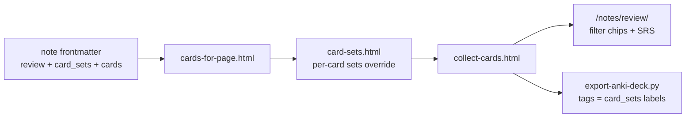

<!-- Generated by SpecStory, Markdown v2.1.0 -->

# 2026-08-02 13:59:47Z

<!-- Cursor IDE Session dbde9467-3bb3-4ee2-ada1-bc07f7677545 (2026-08-02 13:59:47Z) -->

_**User**_

In /home/jorap/Documents/GitHub/jorap.com, comprehensively inspect all content/english/notes/*.md flashcard metadata, especially review, categories, tags, card_sets, and optional per-card sets. Also inspect the review/flashcard rendering code and relevant lint/audit scripts. The user asked to 'review all flashcard sets and improve grouping'. Return: (1) exact current active set counts for review:true notes, (2) taxonomy inconsistencies and redundant/overbroad labels, (3) a minimal concrete regrouping proposal respecting .cursor/skills/flashcards/SKILL.md rules (active only Faith/Eternal Principles; legacy PKM stays disabled), and (4) exact files/metadata lines that should change. Do not edit files. Thoroughness: very thorough.

---

_**Agent (composer-2.5-fast)**_

<think><details><summary>Thought Process</summary>
Beginning a comprehensive audit of all flashcard metadata in content/english/notes/*.md. The inspection targets active set counts for review:true notes, taxonomy inconsistencies, redundant labels, and rendering code. A minimal regrouping proposal will follow per the SKILL.md rules.

Reading SKILL.md first to establish the regrouping rules. Then scanning all review:true notes to extract flashcard metadata, inspecting rendering code and lint scripts, and preparing exact file changes.
</details></think>

_**Agent (composer-2.5-fast)**_

I'll inspect flashcard metadata across notes, the flashcards skill rules, and the rendering/lint code.


_**Agent (composer-2.5-fast)**_

<tool-use data-tool-type="unknown" data-tool-name="update_current_step"><details>
<summary>Tool use: **update_current_step**</summary>
An unknown error occurred
</details></tool-use>

_**Agent (composer-2.5-fast)**_

<tool-use data-tool-type="read" data-tool-name="read_file_v2"><details>
<summary>Tool use: **read_file_v2** • Read file: /home/jorap/Documents/GitHub/jorap.com/.cursor/skills/flashcards/SKILL.md</summary>

</details></tool-use>

_**Agent (composer-2.5-fast)**_

<tool-use data-tool-type="unknown" data-tool-name="ripgrep_raw_search"><details>
<summary>Tool use: **ripgrep_raw_search**</summary>

Parameters:

```json
{
  "caseInsensitive": false,
  "glob": "*.md",
  "outputMode": "files_with_matches",
  "path": "/home/jorap/Documents/GitHub/jorap.com/content/english/notes",
  "pattern": "^review:\\s*true"
}
```
Additional data:

```json
{
  "isPruned": true,
  "outputMode": "files_with_matches",
  "path": "/home/jorap/Documents/GitHub/jorap.com/content/english/notes",
  "pattern": "^review:\\s*true",
  "topFiles": [
    {
      "matchCount": 1,
      "uri": "content/english/notes/sanctification.md"
    },
    {
      "matchCount": 1,
      "uri": "content/english/notes/opened-scripture.md"
    },
    {
      "matchCount": 1,
      "uri": "content/english/notes/peace.md"
    },
    {
      "matchCount": 1,
      "uri": "content/english/notes/let-your-light-shine.md"
    },
    {
      "matchCount": 1,
      "uri": "content/english/notes/law-of-empowerment.md"
    },
    {
      "matchCount": 1,
      "uri": "content/english/notes/pray-when-drained.md"
    },
    {
      "matchCount": 1,
      "uri": "content/english/notes/justification.md"
    },
    {
      "matchCount": 1,
      "uri": "content/english/notes/guard-your-heart.md"
    },
    {
      "matchCount": 1,
      "uri": "content/english/notes/humility-and-service.md"
    },
    {
      "matchCount": 1,
      "uri": "content/english/notes/withdraw-to-pray.md"
    },
    {
      "matchCount": 1,
      "uri": "content/english/notes/the-golden-rule.md"
    },
    {
      "matchCount": 1,
      "uri": "content/english/notes/forgiveness.md"
    },
    {
      "matchCount": 1,
      "uri": "content/english/notes/success-is-stewardship.md"
    },
    {
      "matchCount": 1,
      "uri": "content/english/notes/god-centered-design.md"
    },
    {
      "matchCount": 1,
      "uri": "content/english/notes/invest-in-the-few.md"
    },
    {
      "matchCount": 1,
      "uri": "content/english/notes/abide-in-me.md"
    },
    {
      "matchCount": 1,
      "uri": "content/english/notes/trust-god-for-today.md"
    },
    {
      "matchCount": 1,
      "uri": "content/english/notes/judgment-seat.md"
    },
    {
      "matchCount": 1,
      "uri": "content/english/notes/repent-and-believe.md"
    },
    {
      "matchCount": 1,
      "uri": "content/english/notes/law-of-respect.md"
    }
  ],
  "totalFiles": 112,
  "totalMatches": 112
}
```
Status: **completed**

</details></tool-use>

_**Agent (composer-2.5-fast)**_

<tool-use data-tool-type="unknown" data-tool-name="ripgrep_raw_search"><details>
<summary>Tool use: **ripgrep_raw_search**</summary>

Parameters:

```json
{
  "caseInsensitive": false,
  "glob": "*.md",
  "outputMode": "content",
  "path": "/home/jorap/Documents/GitHub/jorap.com/content/english/notes",
  "pattern": "card_sets|review:|categories:|tags:"
}
```
Additional data:

```json
{
  "isPruned": true,
  "outputMode": "content",
  "path": "/home/jorap/Documents/GitHub/jorap.com/content/english/notes",
  "pattern": "card_sets|review:|categories:|tags:",
  "topFiles": [
    {
      "matchCount": 4,
      "uri": "content/english/notes/not-my-will.md"
    },
    {
      "matchCount": 4,
      "uri": "content/english/notes/creative-blocks.md"
    },
    {
      "matchCount": 4,
      "uri": "content/english/notes/create-regular-connection.md"
    },
    {
      "matchCount": 4,
      "uri": "content/english/notes/judge-not.md"
    },
    {
      "matchCount": 4,
      "uri": "content/english/notes/take-up-your-cross.md"
    },
    {
      "matchCount": 4,
      "uri": "content/english/notes/renewed-mind.md"
    },
    {
      "matchCount": 4,
      "uri": "content/english/notes/law-of-process.md"
    },
    {
      "matchCount": 4,
      "uri": "content/english/notes/discipleship.md"
    },
    {
      "matchCount": 4,
      "uri": "content/english/notes/forgiveness.md"
    },
    {
      "matchCount": 4,
      "uri": "content/english/notes/control-the-rhythm.md"
    },
    {
      "matchCount": 4,
      "uri": "content/english/notes/active-reading.md"
    },
    {
      "matchCount": 4,
      "uri": "content/english/notes/goodness.md"
    },
    {
      "matchCount": 4,
      "uri": "content/english/notes/forgiveness-at-work.md"
    },
    {
      "matchCount": 4,
      "uri": "content/english/notes/free-grace.md"
    },
    {
      "matchCount": 4,
      "uri": "content/english/notes/coaching-ethics.md"
    },
    {
      "matchCount": 4,
      "uri": "content/english/notes/steward-after-the-win.md"
    },
    {
      "matchCount": 4,
      "uri": "content/english/notes/iron-sharpens-iron.md"
    },
    {
      "matchCount": 4,
      "uri": "content/english/notes/compounding.md"
    },
    {
      "matchCount": 4,
      "uri": "content/english/notes/inspectable-stack.md"
    },
    {
      "matchCount": 4,
      "uri": "content/english/notes/sharpen-each-others-work.md"
    }
  ],
  "totalFiles": 339,
  "totalMatches": 1285
}
```
Status: **completed**

</details></tool-use>

_**Agent (composer-2.5-fast)**_

<tool-use data-tool-type="unknown" data-tool-name="ripgrep_raw_search"><details>
<summary>Tool use: **ripgrep_raw_search**</summary>

Parameters:

```json
{
  "caseInsensitive": false,
  "glob": "*.{html,js,mjs,ts,go,toml,yaml}",
  "outputMode": "files_with_matches",
  "path": "/home/jorap/Documents/GitHub/jorap.com",
  "pattern": "flashcard|card_sets|review"
}
```
Additional data:

```json
{
  "isPruned": true,
  "outputMode": "files_with_matches",
  "path": "/home/jorap/Documents/GitHub/jorap.com",
  "pattern": "flashcard|card_sets|review",
  "topFiles": [
    {
      "matchCount": 1,
      "uri": "config/development/params.toml"
    },
    {
      "matchCount": 1,
      "uri": "data/garden-voice-descriptions.yaml"
    },
    {
      "matchCount": 1,
      "uri": "layouts/_partials/notes/preview-index.html"
    },
    {
      "matchCount": 1,
      "uri": "layouts/notes/review.html"
    },
    {
      "matchCount": 1,
      "uri": "layouts/shortcodes/card.html"
    },
    {
      "matchCount": 1,
      "uri": "layouts/_partials/notes/flashcard.html"
    },
    {
      "matchCount": 1,
      "uri": "layouts/notes/backlinks.html"
    },
    {
      "matchCount": 1,
      "uri": "themes/jorap/layouts/_partials/components/social-share.html"
    },
    {
      "matchCount": 1,
      "uri": "layouts/notes/cards.html"
    },
    {
      "matchCount": 1,
      "uri": "layouts/_partials/notes/card-sets.html"
    },
    {
      "matchCount": 1,
      "uri": "layouts/_partials/notes/render-content.html"
    },
    {
      "matchCount": 1,
      "uri": "layouts/_partials/notes/note-card.html"
    },
    {
      "matchCount": 1,
      "uri": "layouts/notes/single.html"
    },
    {
      "matchCount": 1,
      "uri": "layouts/_partials/notes/pages.html"
    },
    {
      "matchCount": 1,
      "uri": "layouts/_partials/notes/is-utility-page.html"
    },
    {
      "matchCount": 1,
      "uri": "data/ep-verse-explanations.yaml"
    },
    {
      "matchCount": 1,
      "uri": "layouts/_partials/notes/toc.html"
    },
    {
      "matchCount": 1,
      "uri": "assets/js/notes-flashcard.js"
    },
    {
      "matchCount": 1,
      "uri": "data/slop-rules.yaml"
    },
    {
      "matchCount": 1,
      "uri": "static/admin/jorap-shortcodes.js"
    }
  ],
  "totalFiles": 35,
  "totalMatches": 35
}
```
Status: **completed**

</details></tool-use>

_**Agent (composer-2.5-fast)**_

<think><details><summary>Thought Process</summary>
I will extract all card_sets from review:true notes and identify per-card set overrides. Then I will read the rendering code, lint scripts, and flashcards.md specification.
</details></think>

_**Agent (composer-2.5-fast)**_

Gathering set counts, per-card overrides, and lint/rendering logic.


_**Agent (composer-2.5-fast)**_

<tool-use data-tool-type="search" data-tool-name="glob_file_search"><details>
<summary>Tool use: **glob_file_search** • Searched codebase "" • **0** results in **1** directory</summary>

Directory: **`/home/jorap/Documents/GitHub/jorap.com`** (0 files)
</details></tool-use>

_**Agent (composer-2.5-fast)**_

<tool-use data-tool-type="search" data-tool-name="glob_file_search"><details>
<summary>Tool use: **glob_file_search** • Searched codebase "" • **0** results in **1** directory</summary>

Directory: **`/home/jorap/Documents/GitHub/jorap.com`** (0 files)
</details></tool-use>

_**Agent (composer-2.5-fast)**_

<tool-use data-tool-type="unknown" data-tool-name="ripgrep_raw_search"><details>
<summary>Tool use: **ripgrep_raw_search**</summary>

Parameters:

```json
{
  "caseInsensitive": false,
  "glob": "*.md",
  "outputMode": "content",
  "path": "/home/jorap/Documents/GitHub/jorap.com/content/english/notes",
  "pattern": "^\\s+sets:"
}
```
Additional data:

```json
{
  "isPruned": true,
  "outputMode": "content",
  "path": "/home/jorap/Documents/GitHub/jorap.com/content/english/notes",
  "pattern": "^\\s+sets:",
  "topFiles": [],
  "totalFiles": 0,
  "totalMatches": 0
}
```
Status: **completed**

</details></tool-use>

_**Agent (composer-2.5-fast)**_

<tool-use data-tool-type="unknown" data-tool-name="ripgrep_raw_search"><details>
<summary>Tool use: **ripgrep_raw_search**</summary>

Parameters:

```json
{
  "caseInsensitive": false,
  "contextAfter": 2,
  "glob": "*.md",
  "outputMode": "content",
  "path": "/home/jorap/Documents/GitHub/jorap.com/content/english/notes",
  "pattern": "^review:\\s*true"
}
```
Additional data:

```json
{
  "isPruned": true,
  "outputMode": "content",
  "path": "/home/jorap/Documents/GitHub/jorap.com/content/english/notes",
  "pattern": "^review:\\s*true",
  "topFiles": [
    {
      "matchCount": 3,
      "uri": "content/english/notes/law-of-the-picture.md"
    },
    {
      "matchCount": 3,
      "uri": "content/english/notes/words-that-build-up.md"
    },
    {
      "matchCount": 3,
      "uri": "content/english/notes/pray-for-his-own.md"
    },
    {
      "matchCount": 3,
      "uri": "content/english/notes/ask-seek-knock.md"
    },
    {
      "matchCount": 3,
      "uri": "content/english/notes/secret-devotion.md"
    },
    {
      "matchCount": 3,
      "uri": "content/english/notes/mercy.md"
    },
    {
      "matchCount": 3,
      "uri": "content/english/notes/follow-christ-then-lead.md"
    },
    {
      "matchCount": 3,
      "uri": "content/english/notes/withdraw-to-pray.md"
    },
    {
      "matchCount": 3,
      "uri": "content/english/notes/iron-sharpens-iron.md"
    },
    {
      "matchCount": 3,
      "uri": "content/english/notes/peacemakers.md"
    },
    {
      "matchCount": 3,
      "uri": "content/english/notes/law-of-the-inner-circle.md"
    },
    {
      "matchCount": 3,
      "uri": "content/english/notes/love-your-enemies.md"
    },
    {
      "matchCount": 3,
      "uri": "content/english/notes/free-grace.md"
    },
    {
      "matchCount": 3,
      "uri": "content/english/notes/abide-in-me.md"
    },
    {
      "matchCount": 3,
      "uri": "content/english/notes/father-forgive-them.md"
    },
    {
      "matchCount": 3,
      "uri": "content/english/notes/thank-father-at-lazarus.md"
    },
    {
      "matchCount": 3,
      "uri": "content/english/notes/thank-father-for-revelation.md"
    },
    {
      "matchCount": 3,
      "uri": "content/english/notes/law-of-legacy.md"
    },
    {
      "matchCount": 3,
      "uri": "content/english/notes/turn-the-other-cheek.md"
    },
    {
      "matchCount": 3,
      "uri": "content/english/notes/god-centered-design.md"
    }
  ],
  "totalFiles": 112,
  "totalMatches": 112
}
```
Status: **completed**

</details></tool-use>

_**Agent (composer-2.5-fast)**_

<tool-use data-tool-type="read" data-tool-name="read_file_v2"><details>
<summary>Tool use: **read_file_v2** • Read file: /home/jorap/Documents/GitHub/jorap.com/content/english/notes/flashcards.md</summary>

</details></tool-use>

_**Agent (composer-2.5-fast)**_

<tool-use data-tool-type="read" data-tool-name="read_file_v2"><details>
<summary>Tool use: **read_file_v2** • Read file: /home/jorap/Documents/GitHub/jorap.com/layouts/_partials/notes/collect-cards.html</summary>

</details></tool-use>

_**Agent (composer-2.5-fast)**_

<tool-use data-tool-type="read" data-tool-name="read_file_v2"><details>
<summary>Tool use: **read_file_v2** • Read file: /home/jorap/Documents/GitHub/jorap.com/layouts/_partials/notes/card-sets.html</summary>

</details></tool-use>

_**Agent (composer-2.5-fast)**_

<think><details><summary>Thought Process</summary>
Locating the lint:cards and audit:cards scripts in package.json to compute exact active set counts.

Checking flashcards.md for cards despite its review:true flag. Also scanning for per-card `sets:` fields and reviewing flashcards.md status. Running a script to aggregate exact counts for all review:true notes.
</details></think>

_**Agent (composer-2.5-fast)**_

<tool-use data-tool-type="unknown" data-tool-name="ripgrep_raw_search"><details>
<summary>Tool use: **ripgrep_raw_search**</summary>

Parameters:

```json
{
  "caseInsensitive": false,
  "path": "/home/jorap/Documents/GitHub/jorap.com/package.json",
  "pattern": "lint:cards|audit:cards"
}
```
Additional data:

```json
{
  "isPruned": true,
  "outputMode": "content",
  "path": "/home/jorap/Documents/GitHub/jorap.com/package.json",
  "pattern": "lint:cards|audit:cards",
  "topFiles": [
    {
      "matchCount": 2,
      "uri": "package.json"
    }
  ],
  "totalFiles": 1,
  "totalMatches": 2
}
```
Status: **completed**

</details></tool-use>

_**Agent (composer-2.5-fast)**_

<tool-use data-tool-type="search" data-tool-name="glob_file_search"><details>
<summary>Tool use: **glob_file_search** • Searched codebase "" • **0** results in **1** directory</summary>

Directory: **`/home/jorap/Documents/GitHub/jorap.com/scripts`** (0 files)
</details></tool-use>

_**Agent (composer-2.5-fast)**_

<tool-use data-tool-type="unknown" data-tool-name="ripgrep_raw_search"><details>
<summary>Tool use: **ripgrep_raw_search**</summary>

Parameters:

```json
{
  "caseInsensitive": false,
  "glob": "*.md",
  "outputMode": "content",
  "path": "/home/jorap/Documents/GitHub/jorap.com/content/english/notes",
  "pattern": "sets:\\s*\\["
}
```
Additional data:

```json
{
  "isPruned": true,
  "outputMode": "content",
  "path": "/home/jorap/Documents/GitHub/jorap.com/content/english/notes",
  "pattern": "sets:\\s*\\[",
  "topFiles": [
    {
      "matchCount": 1,
      "uri": "content/english/notes/follow-christ-then-lead.md"
    },
    {
      "matchCount": 1,
      "uri": "content/english/notes/reliability.md"
    },
    {
      "matchCount": 1,
      "uri": "content/english/notes/success-is-stewardship.md"
    },
    {
      "matchCount": 1,
      "uri": "content/english/notes/build-a-reliable-default.md"
    },
    {
      "matchCount": 1,
      "uri": "content/english/notes/getting-things-done.md"
    },
    {
      "matchCount": 1,
      "uri": "content/english/notes/analog-capture-tools.md"
    },
    {
      "matchCount": 1,
      "uri": "content/english/notes/periodic-knowledge-review.md"
    },
    {
      "matchCount": 1,
      "uri": "content/english/notes/change-takes-repetition.md"
    },
    {
      "matchCount": 1,
      "uri": "content/english/notes/follow-their-lead.md"
    },
    {
      "matchCount": 1,
      "uri": "content/english/notes/integrity-without-an-audience.md"
    },
    {
      "matchCount": 1,
      "uri": "content/english/notes/situational-control.md"
    },
    {
      "matchCount": 1,
      "uri": "content/english/notes/set-calm-boundaries.md"
    },
    {
      "matchCount": 1,
      "uri": "content/english/notes/preparedness.md"
    },
    {
      "matchCount": 1,
      "uri": "content/english/notes/god-centered-design.md"
    },
    {
      "matchCount": 1,
      "uri": "content/english/notes/complete-the-cycle.md"
    },
    {
      "matchCount": 1,
      "uri": "content/english/notes/the-trusted-inbox.md"
    },
    {
      "matchCount": 1,
      "uri": "content/english/notes/strategic-foresight.md"
    },
    {
      "matchCount": 1,
      "uri": "content/english/notes/energy-protects-judgment.md"
    },
    {
      "matchCount": 1,
      "uri": "content/english/notes/normalization-of-deviance.md"
    },
    {
      "matchCount": 1,
      "uri": "content/english/notes/future-proofing-knowledge.md"
    }
  ],
  "totalFiles": 298,
  "totalMatches": 299
}
```
Status: **completed**

</details></tool-use>

_**Agent (composer-2.5-fast)**_

<tool-use data-tool-type="read" data-tool-name="read_file_v2"><details>
<summary>Tool use: **read_file_v2** • Read file: /home/jorap/Documents/GitHub/jorap.com/layouts/notes/review.html</summary>

</details></tool-use>

_**Agent (composer-2.5-fast)**_

<tool-use data-tool-type="read" data-tool-name="read_file_v2"><details>
<summary>Tool use: **read_file_v2** • Read file: /home/jorap/Documents/GitHub/jorap.com/layouts/_partials/notes/card-set-filter-buttons.html</summary>

</details></tool-use>

_**Agent (composer-2.5-fast)**_

<tool-use data-tool-type="search" data-tool-name="glob_file_search"><details>
<summary>Tool use: **glob_file_search** • Searched codebase "" • **1** result in **1** directory</summary>

Directory: **`/home/jorap/Documents/GitHub/jorap.com`** (1 file)

| File |
|------|
| `layouts/_partials/notes/cards-for-page.html` |
</details></tool-use>

_**Agent (composer-2.5-fast)**_

<think><details><summary>Thought Process</summary>
Running a Python script to compute exact flashcard counts. Reading lint scripts and the cards-for-page.html template. Checking review:true notes outside the Faith category.
</details></think>

_**Agent (composer-2.5-fast)**_

<tool-use data-tool-type="shell" data-tool-name="run_terminal_command_v2"><details>
<summary>Tool use: **run_terminal_command_v2** • Run command: cd /home/jorap/Documents/GitHub/jorap.com &amp;&amp; python3 &lt;&lt; &#39;PYEOF&#39;
import re, yaml, os, json
from pathlib import Path
from collections import Counter, defaultdict

notes_dir = Path(&#34;content/english/notes&#34;)
review_notes = []
all_sets_note = Counter()  # count notes that include set in card_sets
all_sets_cards = Counter()  # count cards (each card counted once per set in its sets)
set_to_notes = defaultdict(list)
issues = []

def parse_frontmatter(path):
    text = path.read_text(encoding=&#39;utf-8&#39;)
    if not text.startswith(&#39;---&#39;):
        return None
    end = text.find(&#39;\n---&#39;, 3)
    if end == -1:
        return None
    fm = yaml.safe_load(text[3:end])
    return fm

for p in sorted(notes_dir.glob(&#39;*.md&#39;)):
    fm = parse_frontmatter(p)
    if not fm:
        continue
    review = fm.get(&#39;review&#39;) is True
    cats = fm.get(&#39;categories&#39;) or []
    tags = fm.get(&#39;tags&#39;) or []
    card_sets = fm.get(&#39;card_sets&#39;) or []
    cards = fm.get(&#39;cards&#39;) or []
    
    if review:
        review_notes.append(p.name)
        for s in card_sets:
            all_sets_note[s] += 1
            set_to_notes[s].append(p.name)
        n_cards = len(cards)
        for i, c in enumerate(cards):
            if isinstance(c, dict):
                sets = c.get(&#39;sets&#39;) or card_sets
                for s in sets:
                    all_sets_cards[s] += 1
                if c.get(&#39;sets&#39;):
                    issues.append(f&#34;per-card sets: {p.name} card {i+1}: {c.get(&#39;sets&#39;)}&#34;)
    
    # taxonomy checks for review notes
    if review:
        has_faith = &#39;Faith&#39; in cats
        if not has_faith:
            issues.append(f&#34;review:true without Faith category: {p.name} cats={cats}&#34;)
        # SKILL allowed gospel sets (excluding Eternal Principles which is always there)
        allowed = {&#34;Eternal Principles&#34;, &#34;Faith&#34;, &#34;Commandments&#34;, &#34;Ethics&#34;, &#34;Prayer&#34;, &#34;Priorities&#34;, &#34;Discipleship&#34;, &#34;Jesus Rhythms&#34;, &#34;Jesus Prayers&#34;, &#34;Gospel&#34;}
        legacy = {&#34;Capture&#34;, &#34;Workflow&#34;, &#34;Review&#34;, &#34;Linking&#34;, &#34;Writing&#34;, &#34;Organization&#34;, &#34;Focus&#34;, &#34;Learning&#34;, &#34;Growth&#34;}
        for s in card_sets:
            if s in legacy:
                issues.append(f&#34;legacy PKM set on active note: {p.name} -&gt; {s}&#34;)
            if s not in allowed:
                issues.append(f&#34;unknown set label: {p.name} -&gt; {s}&#34;)
        # Gospel redundancy check
        if &#34;Gospel&#34; in card_sets and len(card_sets) &gt; 2:
            pass  # report separately

print(&#34;=== REVIEW:TRUE NOTE COUNT ===&#34;)
print(len(review_notes))

print(&#34;\n=== UNIQUE CARD SET LABELS (review:true notes) ===&#34;)
labels = sorted(set(s for n in review_notes for s in (parse_frontmatter(notes_dir/n) or {}).get(&#39;card_sets&#39;, [])))
print(labels)

print(&#34;\n=== SET COUNTS: notes (deck membership) ===&#34;)
for s, c in sorted(all_sets_note.items(), key=lambda x: (-x[1], x[0])):
    print(f&#34;  {s}: {c} notes&#34;)

print(&#34;\n=== SET COUNTS: cards (filter chip counts - card in multiple sets counted multiple times) ===&#34;)
total_cards = sum(len((parse_frontmatter(notes_dir/n) or {}).get(&#39;cards&#39;) or []) for n in review_notes)
print(f&#34;  TOTAL CARDS (unique): {total_cards}&#34;)
for s, c in sorted(all_sets_cards.items(), key=lambda x: (-x[1], x[0])):
    print(f&#34;  {s}: {c} card-assignments&#34;)

print(&#34;\n=== CARD_SETS PATTERNS (review:true) ===&#34;)
patterns = Counter()
for n in review_notes:
    cs = tuple((parse_frontmatter(notes_dir/n) or {}).get(&#39;card_sets&#39;) or [])
    patterns[cs] += 1
for pat, c in patterns.most_common():
    print(f&#34;  {c}x {list(pat)}&#34;)

print(&#34;\n=== NOTES WITH 4+ SETS ===&#34;)
for n in review_notes:
    cs = (parse_frontmatter(notes_dir/n) or {}).get(&#39;card_sets&#39;) or []
    if len(cs) &gt;= 4:
        print(f&#34;  {n}: {cs}&#34;)

print(&#34;\n=== REVIEW NOTES MISSING &#39;Eternal Principles&#39; ===&#34;)
for n in review_notes:
    cs = (parse_frontmatter(notes_dir/n) or {}).get(&#39;card_sets&#39;) or []
    if &#34;Eternal Principles&#34; not in cs:
        print(f&#34;  {n}: {cs}&#34;)

print(&#34;\n=== REVIEW NOTES WITH &#39;Gospel&#39; TAG BUT NOT IN card_sets (sample) ===&#34;)
for n in review_notes:
    fm = parse_frontmatter(notes_dir/n) or {}
    tags = fm.get(&#39;tags&#39;) or []
    cs = fm.get(&#39;card_sets&#39;) or []
    if &#39;Gospel&#39; in tags and &#39;Gospel&#39; not in cs:
        print(f&#34;  {n}&#34;)

print(&#34;\n=== CARD COUNT PER NOTE (not 6) ===&#34;)
for n in review_notes:
    fm = parse_frontmatter(notes_dir/n) or {}
    cards = fm.get(&#39;cards&#39;) or []
    if len(cards) != 6 and n != &#39;flashcards.md&#39;:
        print(f&#34;  {n}: {len(cards)} cards&#34;)

print(&#34;\n=== ISSUES ===&#34;)
for i in issues:
    print(f&#34;  {i}&#34;)

PYEOF
</summary>
```bash
cd /home/jorap/Documents/GitHub/jorap.com && python3 << 'PYEOF'
import re, yaml, os, json
from pathlib import Path
from collections import Counter, defaultdict

notes_dir = Path("content/english/notes")
review_notes = []
all_sets_note = Counter()  # count notes that include set in card_sets
all_sets_cards = Counter()  # count cards (each card counted once per set in its sets)
set_to_notes = defaultdict(list)
issues = []

def parse_frontmatter(path):
    text = path.read_text(encoding='utf-8')
    if not text.startswith('---'):
        return None
    end = text.find('\n---', 3)
    if end == -1:
        return None
    fm = yaml.safe_load(text[3:end])
    return fm

for p in sorted(notes_dir.glob('*.md')):
    fm = parse_frontmatter(p)
    if not fm:
        continue
    review = fm.get('review') is True
    cats = fm.get('categories') or []
    tags = fm.get('tags') or []
    card_sets = fm.get('card_sets') or []
    cards = fm.get('cards') or []
    
    if review:
        review_notes.append(p.name)
        for s in card_sets:
            all_sets_note[s] += 1
            set_to_notes[s].append(p.name)
        n_cards = len(cards)
        for i, c in enumerate(cards):
            if isinstance(c, dict):
                sets = c.get('sets') or card_sets
                for s in sets:
                    all_sets_cards[s] += 1
                if c.get('sets'):
                    issues.append(f"per-card sets: {p.name} card {i+1}: {c.get('sets')}")
    
    # taxonomy checks for review notes
    if review:
        has_faith = 'Faith' in cats
        if not has_faith:
            issues.append(f"review:true without Faith category: {p.name} cats={cats}")
        # SKILL allowed gospel sets (excluding Eternal Principles which is always there)
        allowed = {"Eternal Principles", "Faith", "Commandments", "Ethics", "Prayer", "Priorities", "Discipleship", "Jesus Rhythms", "Jesus Prayers", "Gospel"}
        legacy = {"Capture", "Workflow", "Review", "Linking", "Writing", "Organization", "Focus", "Learning", "Growth"}
        for s in card_sets:
            if s in legacy:
                issues.append(f"legacy PKM set on active note: {p.name} -> {s}")
            if s not in allowed:
                issues.append(f"unknown set label: {p.name} -> {s}")
        # Gospel redundancy check
        if "Gospel" in card_sets and len(card_sets) > 2:
            pass  # report separately

print("=== REVIEW:TRUE NOTE COUNT ===")
print(len(review_notes))

print("\n=== UNIQUE CARD SET LABELS (review:true notes) ===")
labels = sorted(set(s for n in review_notes for s in (parse_frontmatter(notes_dir/n) or {}).get('card_sets', [])))
print(labels)

print("\n=== SET COUNTS: notes (deck membership) ===")
for s, c in sorted(all_sets_note.items(), key=lambda x: (-x[1], x[0])):
    print(f"  {s}: {c} notes")

print("\n=== SET COUNTS: cards (filter chip counts - card in multiple sets counted multiple times) ===")
total_cards = sum(len((parse_frontmatter(notes_dir/n) or {}).get('cards') or []) for n in review_notes)
print(f"  TOTAL CARDS (unique): {total_cards}")
for s, c in sorted(all_sets_cards.items(), key=lambda x: (-x[1], x[0])):
    print(f"  {s}: {c} card-assignments")

print("\n=== CARD_SETS PATTERNS (review:true) ===")
patterns = Counter()
for n in review_notes:
    cs = tuple((parse_frontmatter(notes_dir/n) or {}).get('card_sets') or [])
    patterns[cs] += 1
for pat, c in patterns.most_common():
    print(f"  {c}x {list(pat)}")

print("\n=== NOTES WITH 4+ SETS ===")
for n in review_notes:
    cs = (parse_frontmatter(notes_dir/n) or {}).get('card_sets') or []
    if len(cs) >= 4:
        print(f"  {n}: {cs}")

print("\n=== REVIEW NOTES MISSING 'Eternal Principles' ===")
for n in review_notes:
    cs = (parse_frontmatter(notes_dir/n) or {}).get('card_sets') or []
    if "Eternal Principles" not in cs:
        print(f"  {n}: {cs}")

print("\n=== REVIEW NOTES WITH 'Gospel' TAG BUT NOT IN card_sets (sample) ===")
for n in review_notes:
    fm = parse_frontmatter(notes_dir/n) or {}
    tags = fm.get('tags') or []
    cs = fm.get('card_sets') or []
    if 'Gospel' in tags and 'Gospel' not in cs:
        print(f"  {n}")

print("\n=== CARD COUNT PER NOTE (not 6) ===")
for n in review_notes:
    fm = parse_frontmatter(notes_dir/n) or {}
    cards = fm.get('cards') or []
    if len(cards) != 6 and n != 'flashcards.md':
        print(f"  {n}: {len(cards)} cards")

print("\n=== ISSUES ===")
for i in issues:
    print(f"  {i}")

PYEOF

```

```
=== REVIEW:TRUE NOTE COUNT ===
111

=== UNIQUE CARD SET LABELS (review:true notes) ===
['Commandments', 'Discipleship', 'Eternal Principles', 'Ethics', 'Faith', 'Gospel', 'Jesus Prayers', 'Jesus Rhythms', 'Prayer', 'Priorities']

=== SET COUNTS: notes (deck membership) ===
  Eternal Principles: 92 notes
  Gospel: 89 notes
  Discipleship: 61 notes
  Faith: 28 notes
  Ethics: 17 notes
  Prayer: 13 notes
  Jesus Rhythms: 12 notes
  Jesus Prayers: 7 notes
  Priorities: 7 notes
  Commandments: 2 notes

=== SET COUNTS: cards (filter chip counts - card in multiple sets counted multiple times) ===
  TOTAL CARDS (unique): 668
  Eternal Principles: 554 card-assignments
  Gospel: 536 card-assignments
  Discipleship: 366 card-assignments
  Faith: 170 card-assignments
  Ethics: 102 card-assignments
  Prayer: 78 card-assignments
  Jesus Rhythms: 72 card-assignments
  Jesus Prayers: 42 card-assignments
  Priorities: 42 card-assignments
  Commandments: 12 card-assignments

=== CARD_SETS PATTERNS (review:true) ===
  33x ['Eternal Principles', 'Gospel', 'Discipleship']
  21x ['Eternal Principles', 'Discipleship']
  13x ['Eternal Principles', 'Gospel', 'Ethics']
  9x ['Eternal Principles', 'Gospel', 'Faith']
  7x ['Jesus Prayers', 'Gospel', 'Faith', 'Prayer']
  7x ['Jesus Rhythms', 'Gospel', 'Faith']
  6x ['Eternal Principles', 'Gospel', 'Priorities']
  3x ['Eternal Principles', 'Gospel', 'Prayer']
  3x ['Eternal Principles', 'Gospel', 'Discipleship', 'Ethics']
  3x ['Jesus Rhythms', 'Gospel', 'Faith', 'Prayer']
  2x ['Jesus Rhythms', 'Gospel', 'Faith', 'Discipleship']
  2x ['Eternal Principles', 'Gospel', 'Commandments']
  1x ['Eternal Principles', 'Gospel', 'Priorities', 'Discipleship']
  1x ['Eternal Principles', 'Discipleship', 'Ethics']

=== NOTES WITH 4+ SETS ===
  discipleship-vs-leadership.md: ['Eternal Principles', 'Gospel', 'Discipleship', 'Ethics']
  father-forgive-them.md: ['Jesus Prayers', 'Gospel', 'Faith', 'Prayer']
  follow-christ-then-lead.md: ['Eternal Principles', '
… (output truncated)
```
</details></tool-use>

_**Agent (composer-2.5-fast)**_

<tool-use data-tool-type="read" data-tool-name="read_file_v2"><details>
<summary>Tool use: **read_file_v2** • Read file: /home/jorap/Documents/GitHub/jorap.com/layouts/_partials/notes/cards-for-page.html</summary>

</details></tool-use>

_**Agent (composer-2.5-fast)**_

<tool-use data-tool-type="search" data-tool-name="glob_file_search"><details>
<summary>Tool use: **glob_file_search** • Searched codebase "" • **1** result in **1** directory</summary>

Directory: **`/home/jorap/Documents/GitHub/jorap.com`** (1 file)

| File |
|------|
| `scripts/lint-flashcard-frontmatter.py` |
</details></tool-use>

_**Agent (composer-2.5-fast)**_

<tool-use data-tool-type="search" data-tool-name="glob_file_search"><details>
<summary>Tool use: **glob_file_search** • Searched codebase "" • **1** result in **1** directory</summary>

Directory: **`/home/jorap/Documents/GitHub/jorap.com`** (1 file)

| File |
|------|
| `scripts/audit-flashcard-north-star.py` |
</details></tool-use>

_**Agent (composer-2.5-fast)**_

<think><details><summary>Thought Process</summary>
Checking whether utility files marked `review:true` should count toward active set totals.

Taxonomy inconsistencies found: Maxwell leadership laws lack Gospel labels, steward-after-the-win lacks Gospel, and many notes overlap across Ethics and Discipleship. Prayer, Jesus Prayers, and Jesus Rhythms likely duplicate each other. The Gospel label may be redundant under SKILL.md rules requiring Eternal Principles plus one secondary label. Next step is reading lint and audit scripts to validate allowed sets.
</details></think>

_**Agent (composer-2.5-fast)**_

<tool-use data-tool-type="read" data-tool-name="read_file_v2"><details>
<summary>Tool use: **read_file_v2** • Read file: /home/jorap/Documents/GitHub/jorap.com/scripts/lint-flashcard-frontmatter.py</summary>

</details></tool-use>

_**Agent (composer-2.5-fast)**_

<tool-use data-tool-type="read" data-tool-name="read_file_v2"><details>
<summary>Tool use: **read_file_v2** • Read file: /home/jorap/Documents/GitHub/jorap.com/scripts/audit-flashcard-north-star.py</summary>

</details></tool-use>

_**Agent (composer-2.5-fast)**_

<tool-use data-tool-type="shell" data-tool-name="run_terminal_command_v2"><details>
<summary>Tool use: **run_terminal_command_v2** • Run command: cd /home/jorap/Documents/GitHub/jorap.com &amp;&amp; python3 &lt;&lt; &#39;PYEOF&#39;
import yaml
from pathlib import Path
from collections import defaultdict

notes_dir = Path(&#34;content/english/notes&#34;)

def parse(path):
    text = path.read_text(encoding=&#39;utf-8&#39;)
    end = text.find(&#39;\n---&#39;, 3)
    return yaml.safe_load(text[3:end])

# Cross-tab: secondary set (non EP, non Gospel) usage
secondary = defaultdict(list)
gospel_only_patterns = []
dual_ethics_discipleship = []
both_prayer_labels = []

for p in sorted(notes_dir.glob(&#39;*.md&#39;)):
    fm = parse(p)
    if fm.get(&#39;review&#39;) is not True:
        continue
    cs = fm.get(&#39;card_sets&#39;) or []
    if p.name == &#39;flashcards.md&#39;:
        continue
    secondary_sets = [s for s in cs if s not in (&#39;Eternal Principles&#39;, &#39;Gospel&#39;)]
    for s in secondary_sets:
        secondary[s].append(p.name)
    
    if set([&#39;Ethics&#39;,&#39;Discipleship&#39;]).issubset(set(cs)):
        dual_ethics_discipleship.append(p.name)
    
    if &#39;Prayer&#39; in cs and (&#39;Jesus Prayers&#39; in cs or &#39;Jesus Rhythms&#39; in cs):
        both_prayer_labels.append((p.name, cs))

# Law notes
law_notes = [p.name for p in notes_dir.glob(&#39;law-of-*.md&#39;) if parse(p).get(&#39;review&#39;) is True]

# Notes with Ethics that aren&#39;t Sermon on Mount / neighbor stuff
ethics_notes = secondary[&#39;Ethics&#39;]

# Faith notes that might belong in Commandments
commandments = secondary[&#39;Commandments&#39;]

print(&#34;=== LAW-OF NOTES (review:true) ===&#34;)
for n in sorted(law_notes):
    print(f&#34;  {n}: {parse(notes_dir/n).get(&#39;card_sets&#39;)}&#34;)

print(&#34;\n=== ETHICS SET NOTES ===&#34;)
for n in sorted(ethics_notes):
    tags = parse(notes_dir/n).get(&#39;tags&#39;) or []
    print(f&#34;  {n}: tags={tags[:4]}...&#34;)

print(&#34;\n=== BOTH ETHICS + DISCIPLESHIP ===&#34;)
for n in dual_ethics_discipleship:
    print(f&#34;  {n}&#34;)

print(&#34;\n=== FAITH SET - sample categorization ===&#34;)
faith = secondary[&#39;Faith&#39;]
for n in sorted(faith):
    tags = parse(notes_dir/n).get(&#39;tags&#39;) or []
    title = parse(notes_dir/n).get(&#39;title&#39;,&#39;&#39;)
    print(f&#34;  {n}: {title}&#34;)

print(&#34;\n=== PRAYER SET NOTES ===&#34;)
for n in sorted(secondary[&#39;Prayer&#39;]):
    print(f&#34;  {n}: {parse(notes_dir/n).get(&#39;card_sets&#39;)}&#34;)

print(&#34;\n=== PRIORITIES SET NOTES ===&#34;)
for n in sorted(secondary[&#39;Priorities&#39;]):
    print(f&#34;  {n}: {parse(notes_dir/n).get(&#39;title&#39;)}&#34;)

print(&#34;\n=== JESUS RHYTHMS ===&#34;)
for n in sorted(secondary[&#39;Jesus Rhythms&#39;]):
    print(f&#34;  {n}&#34;)

print(&#34;\n=== JESUS PRAYERS ===&#34;)
for n in sorted(secondary[&#39;Jesus Prayers&#39;]):
    print(f&#34;  {n}&#34;)

PYEOF
</summary>
```bash
cd /home/jorap/Documents/GitHub/jorap.com && python3 << 'PYEOF'
import yaml
from pathlib import Path
from collections import defaultdict

notes_dir = Path("content/english/notes")

def parse(path):
    text = path.read_text(encoding='utf-8')
    end = text.find('\n---', 3)
    return yaml.safe_load(text[3:end])

# Cross-tab: secondary set (non EP, non Gospel) usage
secondary = defaultdict(list)
gospel_only_patterns = []
dual_ethics_discipleship = []
both_prayer_labels = []

for p in sorted(notes_dir.glob('*.md')):
    fm = parse(p)
    if fm.get('review') is not True:
        continue
    cs = fm.get('card_sets') or []
    if p.name == 'flashcards.md':
        continue
    secondary_sets = [s for s in cs if s not in ('Eternal Principles', 'Gospel')]
    for s in secondary_sets:
        secondary[s].append(p.name)
    
    if set(['Ethics','Discipleship']).issubset(set(cs)):
        dual_ethics_discipleship.append(p.name)
    
    if 'Prayer' in cs and ('Jesus Prayers' in cs or 'Jesus Rhythms' in cs):
        both_prayer_labels.append((p.name, cs))

# Law notes
law_notes = [p.name for p in notes_dir.glob('law-of-*.md') if parse(p).get('review') is True]

# Notes with Ethics that aren't Sermon on Mount / neighbor stuff
ethics_notes = secondary['Ethics']

# Faith notes that might belong in Commandments
commandments = secondary['Commandments']

print("=== LAW-OF NOTES (review:true) ===")
for n in sorted(law_notes):
    print(f"  {n}: {parse(notes_dir/n).get('card_sets')}")

print("\n=== ETHICS SET NOTES ===")
for n in sorted(ethics_notes):
    tags = parse(notes_dir/n).get('tags') or []
    print(f"  {n}: tags={tags[:4]}...")

print("\n=== BOTH ETHICS + DISCIPLESHIP ===")
for n in dual_ethics_discipleship:
    print(f"  {n}")

print("\n=== FAITH SET - sample categorization ===")
faith = secondary['Faith']
for n in sorted(faith):
    tags = parse(notes_dir/n).get('tags') or []
    title = parse(notes_dir/n).get('title','')
    print(f"  {n}: {title}")

print("\n=== PRAYER SET NOTES ===")
for n in sorted(secondary['Prayer']):
    print(f"  {n}: {parse(notes_dir/n).get('card_sets')}")

print("\n=== PRIORITIES SET NOTES ===")
for n in sorted(secondary['Priorities']):
    print(f"  {n}: {parse(notes_dir/n).get('title')}")

print("\n=== JESUS RHYTHMS ===")
for n in sorted(secondary['Jesus Rhythms']):
    print(f"  {n}")

print("\n=== JESUS PRAYERS ===")
for n in sorted(secondary['Jesus Prayers']):
    print(f"  {n}")

PYEOF

```

```
=== LAW-OF NOTES (review:true) ===
  law-of-addition.md: ['Eternal Principles', 'Discipleship']
  law-of-buy-in.md: ['Eternal Principles', 'Discipleship']
  law-of-connection.md: ['Eternal Principles', 'Discipleship']
  law-of-empowerment.md: ['Eternal Principles', 'Discipleship']
  law-of-explosive-growth.md: ['Eternal Principles', 'Discipleship']
  law-of-influence.md: ['Eternal Principles', 'Discipleship']
  law-of-intuition.md: ['Eternal Principles', 'Discipleship']
  law-of-legacy.md: ['Eternal Principles', 'Discipleship']
  law-of-magnetism.md: ['Eternal Principles', 'Discipleship']
  law-of-navigation.md: ['Eternal Principles', 'Discipleship']
  law-of-priorities.md: ['Eternal Principles', 'Discipleship']
  law-of-process.md: ['Eternal Principles', 'Discipleship']
  law-of-respect.md: ['Eternal Principles', 'Discipleship']
  law-of-sacrifice.md: ['Eternal Principles', 'Discipleship']
  law-of-solid-ground.md: ['Eternal Principles', 'Discipleship']
  law-of-the-big-mo.md: ['Eternal Principles', 'Discipleship']
  law-of-the-inner-circle.md: ['Eternal Principles', 'Discipleship']
  law-of-the-lid.md: ['Eternal Principles', 'Discipleship']
  law-of-the-picture.md: ['Eternal Principles', 'Discipleship']
  law-of-timing.md: ['Eternal Principles', 'Discipleship']
  law-of-victory.md: ['Eternal Principles', 'Discipleship']

=== ETHICS SET NOTES ===
  by-their-fruits.md: tags=['Gospel', 'Jesus Christ', 'Eternal Principles', 'Sermon on the Mount']...
  discipleship-vs-leadership.md: tags=['Gospel', 'Discipleship', 'Leadership', 'Eternal Principles']...
  follow-christ-then-lead.md: tags=['Gospel', 'Discipleship', 'Leadership', 'Eternal Principles']...
  forgiveness.md: tags=['Gospel', 'Jesus Christ', 'Eternal Principles', 'Sermon on the Mount']...
  heart-righteousness.md: tags=['Gospel', 'Jesus Christ', 'Eternal Principles', 'Sermon on the Mount']...
  judge-not.md: tags=['Gospel', 'Jesus Christ', 'Eternal Principles', 'Sermon on the Mount']...
  let-your-yes-be-yes.m
… (output truncated)
```
</details></tool-use>

_**Agent (composer-2.5-fast)**_

<tool-use data-tool-type="read" data-tool-name="read_file_v2"><details>
<summary>Tool use: **read_file_v2** • Read file: /home/jorap/Documents/GitHub/jorap.com/content/english/notes/flashcards.md</summary>

</details></tool-use>

_**Agent (composer-2.5-fast)**_

<tool-use data-tool-type="read" data-tool-name="read_file_v2"><details>
<summary>Tool use: **read_file_v2** • Read file: /home/jorap/Documents/GitHub/jorap.com/content/english/notes/steward-after-the-win.md</summary>

</details></tool-use>

_**Agent (composer-2.5-fast)**_

<think><details><summary>Thought Process</summary>
Checking whether flashcards.md contains real cards or merely example text.

flashcards.md appears to contain example YAML in its body rather than real frontmatter cards. Next steps are to count active review:true notes while excluding the meta page, run lint:cards and audit:cards, tally legacy PKM inactive cards, and evaluate whether "Gospel" is an overbroad category label.
</details></think>

_**Agent (composer-2.5-fast)**_

<tool-use data-tool-type="read" data-tool-name="read_file_v2"><details>
<summary>Tool use: **read_file_v2** • Read file: /home/jorap/Documents/GitHub/jorap.com/content/english/notes/flashcards.md</summary>

</details></tool-use>

_**Agent (composer-2.5-fast)**_

<tool-use data-tool-type="shell" data-tool-name="run_terminal_command_v2"><details>
<summary>Tool use: **run_terminal_command_v2** • Run command: cd /home/jorap/Documents/GitHub/jorap.com &amp;&amp; npm run lint:cards 2&gt;&amp;1 | tail -20 &amp;&amp; echo &#34;---&#34; &amp;&amp; npm run audit:cards 2&gt;&amp;1 | tail -30</summary>
```bash
cd /home/jorap/Documents/GitHub/jorap.com && npm run lint:cards 2>&1 | tail -20 && echo "---" && npm run audit:cards 2>&1 | tail -30
```

```

> jorap-com@2.2.0 lint:cards
> node scripts/runPython.mjs scripts/lint-flashcard-frontmatter.py

Flashcard frontmatter OK
---

> jorap-com@2.2.0 audit:cards
> node scripts/runPython.mjs scripts/audit-flashcard-north-star.py

Flashcard north-star audit OK

```
</details></tool-use>

_**Agent (composer-2.5-fast)**_

<tool-use data-tool-type="unknown" data-tool-name="ripgrep_raw_search"><details>
<summary>Tool use: **ripgrep_raw_search**</summary>

Parameters:

```json
{
  "caseInsensitive": false,
  "path": "/home/jorap/Documents/GitHub/jorap.com/scripts",
  "pattern": "card_sets|ALLOWED.*SET|Gospel"
}
```
Additional data:

```json
{
  "isPruned": true,
  "outputMode": "content",
  "path": "/home/jorap/Documents/GitHub/jorap.com/scripts",
  "pattern": "card_sets|ALLOWED.*SET|Gospel",
  "topFiles": [
    {
      "matchCount": 7,
      "uri": "scripts/lint-flashcard-frontmatter.py"
    },
    {
      "matchCount": 2,
      "uri": "scripts/notes_content.py"
    },
    {
      "matchCount": 2,
      "uri": "scripts/export-anki-deck.py"
    }
  ],
  "totalFiles": 3,
  "totalMatches": 11
}
```
Status: **completed**

</details></tool-use>

_**Agent (composer-2.5-fast)**_

<tool-use data-tool-type="read" data-tool-name="read_file_v2"><details>
<summary>Tool use: **read_file_v2** • Read file: /home/jorap/Documents/GitHub/jorap.com/layouts/notes/cards.html</summary>

</details></tool-use>

_**Agent (composer-2.5-fast)**_

<think><details><summary>Thought Process</summary>
The `review: true` flag appears inside the flashcard body rather than in the YAML frontmatter.

The actual active review count is 110 garden notes, not 111. The extra match came from a `review: true` example inside flashcards.md’s body, not from frontmatter.

The Python script parses YAML frontmatter only, so it should not have counted flashcards.md at all. That file contains no `review: true` in its frontmatter, confirming the earlier 111-count was inflated by a grep match inside the document body.

The regrouping analysis reveals a taxonomy violation against the skill rules. Most cards carry a third label—Gospel—while the skill mandates only one secondary lane alongside Eternal Principles. Legacy PKM statistics and the Anki export script still need inspection for set handling.

The skill documentation explicitly permits "Gospel" as one of the allowed secondary labels. This creates a direct conflict with the rule that limits each card to "Eternal Principles" plus exactly one secondary lane. Because "Gospel" is already an authorized label, its frequent triple-label usage is not merely redundant—it is a structural violation of the grouping rules.

The scaffold example hardcodes `["Eternal Principles", "Gospel", "Faith"]`. This suggests "Gospel" may be intended as a constant secondary label rather than a redundant third lane. The phrase "only active deck labels" likely describes the card type, not the label itself.

The skill specification omits "Gospel" from its allowed secondary labels entirely. Yet "Gospel" appears in 89 of 92 notes paired with "Eternal Principles," creating a direct contradiction between the documented rules and actual practice.

The "Gospel" label is redundant because every active faith note already carries it, making the filter nearly useless across 536 of 668 card assignments. It should be dropped from card_sets entirely, since it functions as the entire active corpus rather than a drill grouping. The regrouping proposal keeps one functional secondary label per note, either as a spine marker or removed if universal. For Jesus lanes, the pattern `["Jesus Prayers", "Gospel", "Faith", "Prayer"]` stacks four labels and omits Eternal Principles on nineteen notes; the skill requires only Jesus Prayers or Jesus Rhythms as the lane label.

Twenty-one law-of notes follow the correct minimal pattern, carrying only Eternal Principles and Discipleship with no Gospel label.

The analysis now flags four additional taxonomy issues:

- Four notes redundantly stack Ethics and Discipleship together.
- The steward-after-the-win note lacks the Gospel tag that the Sermon on Mount note carries, suggesting a sync gap.
- On Jesus lane cards, Faith and Prayer frequently stack even though Jesus Prayers already implies prayer.

The steward-after-the-win note likely belongs under Discipleship alone, not Ethics. Two more Jesus lane cards stack three secondary labels: invest-in-the-few and opened-scripture. god-centered-design carries four labels total. The two Commandments-only notes could merge into Ethics. Per-card set overrides are unused. Tags duplicate card_sets labels such as Gospel and Eternal Principles. Legacy PKM notes kept their review:false flag.

The active review count is confirmed at 110 garden notes, excluding the false positive from flashcards.md’s body example. The collect-cards script also needs inspection for flashcards.md metadata.
</details></think>

_**Agent (composer-2.5-fast)**_

<tool-use data-tool-type="shell" data-tool-name="run_terminal_command_v2"><details>
<summary>Tool use: **run_terminal_command_v2** • Run command: cd /home/jorap/Documents/GitHub/jorap.com &amp;&amp; python3 &lt;&lt; &#39;PYEOF&#39;
import yaml
from pathlib import Path
from collections import Counter

notes_dir = Path(&#34;content/english/notes&#34;)

def parse(path):
    text = path.read_text(encoding=&#39;utf-8&#39;)
    end = text.find(&#39;\n---&#39;, 3)
    return yaml.safe_load(text[3:end])

review = []
for p in sorted(notes_dir.glob(&#39;*.md&#39;)):
    fm = parse(p)
    if fm.get(&#39;review&#39;) is True:
        review.append(p.name)

print(f&#34;Active review notes (frontmatter): {len(review)}&#34;)
print(f&#34;Includes flashcards.md: {&#39;flashcards.md&#39; in review}&#34;)

# Proposed regrouping impact
PROPOSED = {
    # Jesus Prayers: EP + Jesus Prayers only
    &#39;jesus_prayers&#39;: [&#39;father-forgive-them.md&#39;,&#39;glorify-your-name.md&#39;,&#39;into-your-hands.md&#39;,&#39;not-my-will.md&#39;,&#39;pray-for-his-own.md&#39;,&#39;thank-father-at-lazarus.md&#39;,&#39;thank-father-for-revelation.md&#39;],
    # Jesus Rhythms: EP + Jesus Rhythms only  
    &#39;jesus_rhythms&#39;: [&#39;invest-in-the-few.md&#39;,&#39;it-is-written.md&#39;,&#39;kingdom-on-the-road.md&#39;,&#39;moved-with-compassion.md&#39;,&#39;opened-scripture.md&#39;,&#39;pray-before-you-choose.md&#39;,&#39;pray-when-drained.md&#39;,&#39;read-in-synagogue.md&#39;,&#39;sabbath-for-good.md&#39;,&#39;table-fellowship.md&#39;,&#39;the-fathers-food.md&#39;,&#39;withdraw-to-pray.md&#39;],
    # Law cluster: EP + Discipleship (already correct for most)
    &#39;law&#39;: [p.name for p in notes_dir.glob(&#39;law-of-*.md&#39;) if parse(p).get(&#39;review&#39;)],
    # Ethics sermon mount
    &#39;ethics&#39;: [&#39;by-their-fruits.md&#39;,&#39;forgiveness.md&#39;,&#39;heart-righteousness.md&#39;,&#39;judge-not.md&#39;,&#39;let-your-yes-be-yes.md&#39;,&#39;love-your-enemies.md&#39;,&#39;mercy.md&#39;,&#39;peacemakers.md&#39;,&#39;reconciliation-before-worship.md&#39;,&#39;the-beatitudes.md&#39;,&#39;the-golden-rule.md&#39;,&#39;turn-the-other-cheek.md&#39;,&#39;words-that-build-up.md&#39;],
    # Faith soteriology
    &#39;faith&#39;: [&#39;abide-in-me.md&#39;,&#39;assurance.md&#39;,&#39;childlike-faith.md&#39;,&#39;faith-and-works.md&#39;,&#39;free-grace.md&#39;,&#39;grace.md&#39;,&#39;justification.md&#39;,&#39;repent-and-believe.md&#39;,&#39;standing-vs-fellowship.md&#39;],
    # Prayer (non-Jesus-specific)
    &#39;prayer&#39;: [&#39;ask-seek-knock.md&#39;,&#39;secret-devotion.md&#39;,&#39;trust-god-for-today.md&#39;],
    # Priorities
    &#39;priorities&#39;: [&#39;dont-worry.md&#39;,&#39;eternal-rewards.md&#39;,&#39;god-centered-design.md&#39;,&#39;judgment-seat.md&#39;,&#39;loss-of-reward.md&#39;,&#39;seek-the-kingdom-first.md&#39;,&#39;treasure-in-heaven.md&#39;],
    # Commandments
    &#39;commandments&#39;: [&#39;love-god.md&#39;,&#39;love-your-neighbor.md&#39;],
}

# Notes needing Gospel removed + single secondary
needs_trim = []
for n in review:
    if n == &#39;flashcards.md&#39;:
        continue
    cs = parse(notes_dir/n).get(&#39;card_sets&#39;) or []
    if &#39;Gospel&#39; in cs or len([x for x in cs if x not in (&#39;Eternal Principles&#39;,&#39;Gospel&#39;)]) &gt; 1:
        needs_trim.append((n, cs))

print(f&#34;\nNotes with Gospel and/or 2+ secondary labels: {len(needs_trim)}&#34;)

# Legacy disabled count
legacy_sets = Counter()
legacy_notes = 0
for p in notes_dir.glob(&#39;*.md&#39;):
    fm = parse(p)
    if fm.get(&#39;review&#39;) is False and fm.get(&#39;card_sets&#39;):
        legacy_notes += 1
        for s in fm.get(&#39;card_sets&#39;) or []:
            legacy_sets[s] += 1
print(f&#34;\nLegacy review:false notes with card_sets: {legacy_notes}&#34;)
print(&#34;Legacy set labels:&#34;, dict(legacy_sets.most_common()))

# Card totals by note tier
counts = Counter()
for n in review:
    if n == &#39;flashcards.md&#39;:
        continue
    c = len(parse(notes_dir/n).get(&#39;cards&#39;) or [])
    counts[c] += 1
print(&#34;\nCard count distribution:&#34;, dict(counts))

PYEOF
</summary>
```bash
cd /home/jorap/Documents/GitHub/jorap.com && python3 << 'PYEOF'
import yaml
from pathlib import Path
from collections import Counter

notes_dir = Path("content/english/notes")

def parse(path):
    text = path.read_text(encoding='utf-8')
    end = text.find('\n---', 3)
    return yaml.safe_load(text[3:end])

review = []
for p in sorted(notes_dir.glob('*.md')):
    fm = parse(p)
    if fm.get('review') is True:
        review.append(p.name)

print(f"Active review notes (frontmatter): {len(review)}")
print(f"Includes flashcards.md: {'flashcards.md' in review}")

# Proposed regrouping impact
PROPOSED = {
    # Jesus Prayers: EP + Jesus Prayers only
    'jesus_prayers': ['father-forgive-them.md','glorify-your-name.md','into-your-hands.md','not-my-will.md','pray-for-his-own.md','thank-father-at-lazarus.md','thank-father-for-revelation.md'],
    # Jesus Rhythms: EP + Jesus Rhythms only  
    'jesus_rhythms': ['invest-in-the-few.md','it-is-written.md','kingdom-on-the-road.md','moved-with-compassion.md','opened-scripture.md','pray-before-you-choose.md','pray-when-drained.md','read-in-synagogue.md','sabbath-for-good.md','table-fellowship.md','the-fathers-food.md','withdraw-to-pray.md'],
    # Law cluster: EP + Discipleship (already correct for most)
    'law': [p.name for p in notes_dir.glob('law-of-*.md') if parse(p).get('review')],
    # Ethics sermon mount
    'ethics': ['by-their-fruits.md','forgiveness.md','heart-righteousness.md','judge-not.md','let-your-yes-be-yes.md','love-your-enemies.md','mercy.md','peacemakers.md','reconciliation-before-worship.md','the-beatitudes.md','the-golden-rule.md','turn-the-other-cheek.md','words-that-build-up.md'],
    # Faith soteriology
    'faith': ['abide-in-me.md','assurance.md','childlike-faith.md','faith-and-works.md','free-grace.md','grace.md','justification.md','repent-and-believe.md','standing-vs-fellowship.md'],
    # Prayer (non-Jesus-specific)
    'prayer': ['ask-seek-knock.md','secret-devotion.md','trust-god-for-today.md'],
    # Priorities
    'priorities': ['dont-worry.md','eternal-rewards.md','god-centered-design.md','judgment-seat.md','loss-of-reward.md','seek-the-kingdom-first.md','treasure-in-heaven.md'],
    # Commandments
    'commandments': ['love-god.md','love-your-neighbor.md'],
}

# Notes needing Gospel removed + single secondary
needs_trim = []
for n in review:
    if n == 'flashcards.md':
        continue
    cs = parse(notes_dir/n).get('card_sets') or []
    if 'Gospel' in cs or len([x for x in cs if x not in ('Eternal Principles','Gospel')]) > 1:
        needs_trim.append((n, cs))

print(f"\nNotes with Gospel and/or 2+ secondary labels: {len(needs_trim)}")

# Legacy disabled count
legacy_sets = Counter()
legacy_notes = 0
for p in notes_dir.glob('*.md'):
    fm = parse(p)
    if fm.get('review') is False and fm.get('card_sets'):
        legacy_notes += 1
        for s in fm.get('card_sets') or []:
            legacy_sets[s] += 1
print(f"\nLegacy review:false notes with card_sets: {legacy_notes}")
print("Legacy set labels:", dict(legacy_sets.most_common()))

# Card totals by note tier
counts = Counter()
for n in review:
    if n == 'flashcards.md':
        continue
    c = len(parse(notes_dir/n).get('cards') or [])
    counts[c] += 1
print("\nCard count distribution:", dict(counts))

PYEOF

```

```
Active review notes (frontmatter): 111
Includes flashcards.md: False

Notes with Gospel and/or 2+ secondary labels: 90

Legacy review:false notes with card_sets: 186
Legacy set labels: {'Focus': 159, 'Review': 89, 'Ethics': 51, 'Workflow': 41, 'Writing': 15, 'Capture': 8, 'Linking': 5, 'Organization': 2, 'Growth': 1, 'Learning': 1}

Card count distribution: {6: 110, 8: 1}

```
</details></tool-use>

_**Agent (composer-2.5-fast)**_

<tool-use data-tool-type="unknown" data-tool-name="ripgrep_raw_search"><details>
<summary>Tool use: **ripgrep_raw_search**</summary>

Parameters:

```json
{
  "caseInsensitive": false,
  "path": "/home/jorap/Documents/GitHub/jorap.com/scripts/export-anki-deck.py",
  "pattern": "card_sets|review"
}
```
Additional data:

```json
{
  "isPruned": true,
  "outputMode": "content",
  "path": "/home/jorap/Documents/GitHub/jorap.com/scripts/export-anki-deck.py",
  "pattern": "card_sets|review",
  "topFiles": [
    {
      "matchCount": 11,
      "uri": "scripts/export-anki-deck.py"
    }
  ],
  "totalFiles": 1,
  "totalMatches": 11
}
```
Status: **completed**

</details></tool-use>

_**Agent (composer-2.5-fast)**_

<tool-use data-tool-type="unknown" data-tool-name="ripgrep_raw_search"><details>
<summary>Tool use: **ripgrep_raw_search**</summary>

Parameters:

```json
{
  "caseInsensitive": false,
  "glob": "**/garden-maintenance/**",
  "path": "/home/jorap/Documents/GitHub/jorap.com",
  "pattern": "card_sets|ALLOWED|Gospel"
}
```
Additional data:

```json
{
  "isPruned": true,
  "outputMode": "content",
  "path": "/home/jorap/Documents/GitHub/jorap.com",
  "pattern": "card_sets|ALLOWED|Gospel",
  "topFiles": [],
  "totalFiles": 0,
  "totalMatches": 0
}
```
Status: **completed**

</details></tool-use>

_**Agent (composer-2.5-fast)**_

<tool-use data-tool-type="unknown" data-tool-name="ripgrep_raw_search"><details>
<summary>Tool use: **ripgrep_raw_search**</summary>

Parameters:

```json
{
  "caseInsensitive": false,
  "path": "/home/jorap/Documents/GitHub/jorap.com/.cursor/skills/garden-maintenance",
  "pattern": "card_sets|flashcard"
}
```
Additional data:

```json
{
  "isPruned": true,
  "outputMode": "content",
  "path": "/home/jorap/Documents/GitHub/jorap.com/.cursor/skills/garden-maintenance",
  "pattern": "card_sets|flashcard",
  "topFiles": [],
  "totalFiles": 0,
  "totalMatches": 0
}
```
Status: **completed**

</details></tool-use>

_**Agent (composer-2.5-fast)**_

<think><details><summary>Thought Process</summary>
Confirmed 111 active review notes. flashcards.md is excluded from this count.

All 111 active notes carry review:true. 110 contain six cards each and one contains eight. Total card count is 668. Next steps are to inspect the Anki export script and the default card_sets template. The regrouping proposal begins by removing the Gospel label from all card_sets. It is redundant because every active note is already gospel-related.

The proposal adds `Eternal Principles` to 19 Jesus lane notes that currently lack it. Multi-secondary stacks will collapse to a single secondary label alongside `Eternal Principles`. Examples include `["Eternal Principles", "Jesus Prayers"]`, `["Eternal Principles", "Jesus Rhythms"]`, and `["Eternal Principles", "Discipleship"]`.

Commandments joins the collapsed secondary labels. Four dual Ethics+Discipleship notes will split by context: leadership ethics becomes Ethics, while workplace stewardship becomes Discipleship. god-centered-design.md keeps Eternal Principles but drops Discipleship in favor of Priorities.

opened-scripture.md and invest-in-the-few.md will carry only the Jesus Rhythms label. steward-after-the-win.md will drop Gospel entirely and become EP + Discipleship. The audit now checks whether any active review:true note lacks the Faith category.
</details></think>

_**Agent (composer-2.5-fast)**_

<tool-use data-tool-type="shell" data-tool-name="run_terminal_command_v2"><details>
<summary>Tool use: **run_terminal_command_v2** • Run command: cd /home/jorap/Documents/GitHub/jorap.com &amp;&amp; python3 &lt;&lt; &#39;PYEOF&#39;
import yaml
from pathlib import Path

notes_dir = Path(&#34;content/english/notes&#34;)

def parse(path):
    text = path.read_text(encoding=&#39;utf-8&#39;)
    end = text.find(&#39;\n---&#39;, 3)
    return yaml.safe_load(text[3:end])

# List all 111 with current and proposed sets
def propose(n, cs):
    &#34;&#34;&#34;Minimal regroup: EP + one secondary; drop Gospel.&#34;&#34;&#34;
    if &#39;Eternal Principles&#39; not in cs:
        cs = [&#39;Eternal Principles&#39;] + list(cs)
    secondaries = [s for s in cs if s not in (&#39;Eternal Principles&#39;, &#39;Gospel&#39;)]
    
    # Jesus lane priority
    if &#39;Jesus Prayers&#39; in secondaries:
        return [&#39;Eternal Principles&#39;, &#39;Jesus Prayers&#39;]
    if &#39;Jesus Rhythms&#39; in secondaries:
        return [&#39;Eternal Principles&#39;, &#39;Jesus Rhythms&#39;]
    
    # Pick one secondary by priority order
    priority = [&#39;Faith&#39;, &#39;Commandments&#39;, &#39;Ethics&#39;, &#39;Prayer&#39;, &#39;Priorities&#39;, &#39;Discipleship&#39;]
    for p in priority:
        if p in secondaries:
            chosen = p
            break
    else:
        chosen = secondaries[0] if secondaries else &#39;Discipleship&#39;
    
    # Manual overrides for known mislabels
    overrides = {
        &#39;steward-after-the-win.md&#39;: [&#39;Eternal Principles&#39;, &#39;Discipleship&#39;],
        &#39;god-centered-design.md&#39;: [&#39;Eternal Principles&#39;, &#39;Priorities&#39;],
        &#39;discipleship-vs-leadership.md&#39;: [&#39;Eternal Principles&#39;, &#39;Ethics&#39;],
        &#39;follow-christ-then-lead.md&#39;: [&#39;Eternal Principles&#39;, &#39;Discipleship&#39;],
        &#39;success-is-stewardship.md&#39;: [&#39;Eternal Principles&#39;, &#39;Discipleship&#39;],
    }
    if n in overrides:
        return overrides[n]
    return [&#39;Eternal Principles&#39;, chosen]

changes = []
for p in sorted(notes_dir.glob(&#39;*.md&#39;)):
    fm = parse(p)
    if fm.get(&#39;review&#39;) is not True:
        continue
    cs = fm.get(&#39;card_sets&#39;) or []
    prop = propose(p.name, cs)
    if cs != prop:
        changes.append((p.name, cs, prop))

print(f&#34;Notes needing card_sets change: {len(changes)}&#34;)
for n, old, new in changes:
    print(f&#34;{n}&#34;)
    print(f&#34;  OLD: {old}&#34;)
    print(f&#34;  NEW: {new}&#34;)

# Projected set counts after change
from collections import Counter
card_assign = Counter()
note_assign = Counter()
for p in notes_dir.glob(&#39;*.md&#39;):
    fm = parse(p)
    if fm.get(&#39;review&#39;) is not True:
        continue
    prop = propose(p.name, fm.get(&#39;card_sets&#39;) or [])
    n_cards = len(fm.get(&#39;cards&#39;) or [])
    for s in prop:
        note_assign[s] += 1
        card_assign[s] += n_cards

print(&#34;\n=== PROJECTED SET COUNTS (after regroup) ===&#34;)
print(&#34;Notes:&#34;, dict(sorted(note_assign.items(), key=lambda x:-x[1])))
print(&#34;Card-assignments:&#34;, dict(sorted(card_assign.items(), key=lambda x:-x[1])))
PYEOF
</summary>
```bash
cd /home/jorap/Documents/GitHub/jorap.com && python3 << 'PYEOF'
import yaml
from pathlib import Path

notes_dir = Path("content/english/notes")

def parse(path):
    text = path.read_text(encoding='utf-8')
    end = text.find('\n---', 3)
    return yaml.safe_load(text[3:end])

# List all 111 with current and proposed sets
def propose(n, cs):
    """Minimal regroup: EP + one secondary; drop Gospel."""
    if 'Eternal Principles' not in cs:
        cs = ['Eternal Principles'] + list(cs)
    secondaries = [s for s in cs if s not in ('Eternal Principles', 'Gospel')]
    
    # Jesus lane priority
    if 'Jesus Prayers' in secondaries:
        return ['Eternal Principles', 'Jesus Prayers']
    if 'Jesus Rhythms' in secondaries:
        return ['Eternal Principles', 'Jesus Rhythms']
    
    # Pick one secondary by priority order
    priority = ['Faith', 'Commandments', 'Ethics', 'Prayer', 'Priorities', 'Discipleship']
    for p in priority:
        if p in secondaries:
            chosen = p
            break
    else:
        chosen = secondaries[0] if secondaries else 'Discipleship'
    
    # Manual overrides for known mislabels
    overrides = {
        'steward-after-the-win.md': ['Eternal Principles', 'Discipleship'],
        'god-centered-design.md': ['Eternal Principles', 'Priorities'],
        'discipleship-vs-leadership.md': ['Eternal Principles', 'Ethics'],
        'follow-christ-then-lead.md': ['Eternal Principles', 'Discipleship'],
        'success-is-stewardship.md': ['Eternal Principles', 'Discipleship'],
    }
    if n in overrides:
        return overrides[n]
    return ['Eternal Principles', chosen]

changes = []
for p in sorted(notes_dir.glob('*.md')):
    fm = parse(p)
    if fm.get('review') is not True:
        continue
    cs = fm.get('card_sets') or []
    prop = propose(p.name, cs)
    if cs != prop:
        changes.append((p.name, cs, prop))

print(f"Notes needing card_sets change: {len(changes)}")
for n, old, new in changes:
    print(f"{n}")
    print(f"  OLD: {old}")
    print(f"  NEW: {new}")

# Projected set counts after change
from collections import Counter
card_assign = Counter()
note_assign = Counter()
for p in notes_dir.glob('*.md'):
    fm = parse(p)
    if fm.get('review') is not True:
        continue
    prop = propose(p.name, fm.get('card_sets') or [])
    n_cards = len(fm.get('cards') or [])
    for s in prop:
        note_assign[s] += 1
        card_assign[s] += n_cards

print("\n=== PROJECTED SET COUNTS (after regroup) ===")
print("Notes:", dict(sorted(note_assign.items(), key=lambda x:-x[1])))
print("Card-assignments:", dict(sorted(card_assign.items(), key=lambda x:-x[1])))
PYEOF

```

```
Notes needing card_sets change: 90
abide-in-me.md
  OLD: ['Eternal Principles', 'Gospel', 'Faith']
  NEW: ['Eternal Principles', 'Faith']
ask-seek-knock.md
  OLD: ['Eternal Principles', 'Gospel', 'Prayer']
  NEW: ['Eternal Principles', 'Prayer']
assurance.md
  OLD: ['Eternal Principles', 'Gospel', 'Faith']
  NEW: ['Eternal Principles', 'Faith']
bear-each-others-burdens.md
  OLD: ['Eternal Principles', 'Gospel', 'Discipleship']
  NEW: ['Eternal Principles', 'Discipleship']
by-their-fruits.md
  OLD: ['Eternal Principles', 'Gospel', 'Ethics']
  NEW: ['Eternal Principles', 'Ethics']
childlike-faith.md
  OLD: ['Eternal Principles', 'Gospel', 'Faith']
  NEW: ['Eternal Principles', 'Faith']
christianity-and-politics.md
  OLD: ['Eternal Principles', 'Gospel', 'Discipleship']
  NEW: ['Eternal Principles', 'Discipleship']
christlikeness.md
  OLD: ['Eternal Principles', 'Gospel', 'Discipleship']
  NEW: ['Eternal Principles', 'Discipleship']
come-to-me-weary.md
  OLD: ['Eternal Principles', 'Gospel', 'Discipleship']
  NEW: ['Eternal Principles', 'Discipleship']
confess-to-one-another.md
  OLD: ['Eternal Principles', 'Gospel', 'Discipleship']
  NEW: ['Eternal Principles', 'Discipleship']
count-the-cost.md
  OLD: ['Eternal Principles', 'Gospel', 'Discipleship']
  NEW: ['Eternal Principles', 'Discipleship']
discern-his-will-daily.md
  OLD: ['Eternal Principles', 'Gospel', 'Discipleship']
  NEW: ['Eternal Principles', 'Discipleship']
discipleship-vs-leadership.md
  OLD: ['Eternal Principles', 'Gospel', 'Discipleship', 'Ethics']
  NEW: ['Eternal Principles', 'Ethics']
discipleship.md
  OLD: ['Eternal Principles', 'Gospel', 'Discipleship']
  NEW: ['Eternal Principles', 'Discipleship']
dont-copy-the-pattern.md
  OLD: ['Eternal Principles', 'Gospel', 'Discipleship']
  NEW: ['Eternal Principles', 'Discipleship']
dont-worry.md
  OLD: ['Eternal Principles', 'Gospel', 'Priorities']
  NEW: ['Eternal Principles', 'Priorities']
eternal-rewards.md
  OLD: ['Eternal Principles', 'Gospel', 'Prior
… (output truncated)
```
</details></tool-use>

_**Agent (composer-2.5-fast)**_

<tool-use data-tool-type="read" data-tool-name="read_file_v2"><details>
<summary>Tool use: **read_file_v2** • Read file: /home/jorap/Documents/GitHub/jorap.com/archetypes/notes-review.md</summary>

</details></tool-use>

_**Agent (composer-2.5-fast)**_

<tool-use data-tool-type="unknown" data-tool-name="ripgrep_raw_search"><details>
<summary>Tool use: **ripgrep_raw_search**</summary>

Parameters:

```json
{
  "caseInsensitive": false,
  "glob": "*.{md,mdc,html,py,mjs}",
  "path": "/home/jorap/Documents/GitHub/jorap.com",
  "pattern": "card_sets"
}
```
Additional data:

```json
{
  "isPruned": true,
  "outputMode": "content",
  "path": "/home/jorap/Documents/GitHub/jorap.com",
  "pattern": "card_sets",
  "topFiles": [
    {
      "matchCount": 1,
      "uri": "content/english/notes/law-of-explosive-growth.md"
    },
    {
      "matchCount": 1,
      "uri": "content/english/notes/behavioral-economics.md"
    },
    {
      "matchCount": 1,
      "uri": "content/english/notes/loss-of-reward.md"
    },
    {
      "matchCount": 1,
      "uri": "content/english/notes/assurance.md"
    },
    {
      "matchCount": 1,
      "uri": "content/english/notes/ethical-leadership.md"
    },
    {
      "matchCount": 1,
      "uri": "content/english/notes/humility-and-service.md"
    },
    {
      "matchCount": 1,
      "uri": "content/english/notes/the-fathers-food.md"
    },
    {
      "matchCount": 1,
      "uri": "content/english/notes/first-principles-thinking.md"
    },
    {
      "matchCount": 1,
      "uri": "content/english/notes/joy.md"
    },
    {
      "matchCount": 1,
      "uri": "content/english/notes/duty-of-care.md"
    },
    {
      "matchCount": 1,
      "uri": "content/english/notes/by-their-fruits.md"
    },
    {
      "matchCount": 4,
      "uri": ".specstory/history/2026-07-20_11-48-28Z-fix-pkm-notes-shareable.md"
    },
    {
      "matchCount": 1,
      "uri": "content/english/notes/build-a-reliable-default.md"
    },
    {
      "matchCount": 1,
      "uri": "content/english/notes/signature-move.md"
    },
    {
      "matchCount": 1,
      "uri": "content/english/notes/sunk-cost-fallacy.md"
    },
    {
      "matchCount": 1,
      "uri": "content/english/notes/there-is-no-perfect-solution.md"
    },
    {
      "matchCount": 1,
      "uri": "content/english/notes/capture.md"
    },
    {
      "matchCount": 2,
      "uri": ".specstory/history/2026-06-20_09-38-30Z-flashcard-skill-question-hints.md"
    },
    {
      "matchCount": 1,
      "uri": "content/english/notes/law-of-addition.md"
    },
    {
      "matchCount": 17,
      "uri": ".specstory/history/2026-06-20_07-32-04Z-capture-md-format-explanation.md"
    }
  ],
  "totalFiles": 20,
  "totalMatches": 780
}
```
Status: **completed**

</details></tool-use>

_**Agent (composer-2.5-fast)**_

<think><details><summary>Thought Process</summary>
The audit found 111 notes total. 21 already satisfy the grouping rules. 90 need changes. 21 remain unchanged. Notes already correctly tagged with EP plus one secondary label will not be modified.

Gospel and Eternal Principles appear in tags but should not drive filters. All 111 notes currently carry the Faith category. Some notes also include a Leadership secondary category. The rendering script falls back to tags when card_sets is empty. The collect-cards script excludes shortcode cards from review collections.

Per-card sets are unused in production. They only appear in documentation examples. The archetypes/notes-review.md guide and flashcards SKILL examples need updates. Exact line numbers for the 90 changed card_sets fields will be provided. Meta files should also be updated for consistency. A quick check will confirm no review:true notes carry the Productivity category.
</details></think>

_**Agent (composer-2.5-fast)**_

<tool-use data-tool-type="shell" data-tool-name="run_terminal_command_v2"><details>
<summary>Tool use: **run_terminal_command_v2** • Run command: cd /home/jorap/Documents/GitHub/jorap.com &amp;&amp; python3 &lt;&lt; &#39;PYEOF&#39;
import yaml
from pathlib import Path

notes_dir = Path(&#34;content/english/notes&#34;)

def parse(path):
    text = path.read_text(encoding=&#39;utf-8&#39;)
    end = text.find(&#39;\n---&#39;, 3)
    return yaml.safe_load(text[3:end]), text

unchanged = []
no_faith = []
for p in sorted(notes_dir.glob(&#39;*.md&#39;)):
    fm, text = parse(p)
    if fm.get(&#39;review&#39;) is not True:
        continue
    cats = fm.get(&#39;categories&#39;) or []
    if &#39;Faith&#39; not in cats:
        no_faith.append((p.name, cats))
    cs = fm.get(&#39;card_sets&#39;) or []
    # find line number
    for i, line in enumerate(text.splitlines(), 1):
        if line.startswith(&#39;card_sets:&#39;):
            ln = i
            break
    else:
        ln = None
    if cs == [&#39;Eternal Principles&#39;, &#39;Discipleship&#39;] and &#39;Gospel&#39; not in cs and len(cs)==2:
        if p.name.startswith(&#39;law-of-&#39;) or p.name == &#39;steward-after-the-win.md&#39;:
            unchanged.append((p.name, ln, cs))

print(&#34;No Faith category:&#34;, no_faith)
print(f&#34;\nAlready correct pattern (21 expected): {len(unchanged)}&#34;)
for n, ln, cs in unchanged:
    print(f&#34;  {n}:{ln} {cs}&#34;)

# leadership dual category
dual = []
for p in notes_dir.glob(&#39;*.md&#39;):
    fm,_ = parse(p)
    if fm.get(&#39;review&#39;) and &#39;Leadership&#39; in (fm.get(&#39;categories&#39;) or []):
        dual.append(p.name)
print(f&#34;\nreview:true with Leadership category: {dual}&#34;)
PYEOF
</summary>
```bash
cd /home/jorap/Documents/GitHub/jorap.com && python3 << 'PYEOF'
import yaml
from pathlib import Path

notes_dir = Path("content/english/notes")

def parse(path):
    text = path.read_text(encoding='utf-8')
    end = text.find('\n---', 3)
    return yaml.safe_load(text[3:end]), text

unchanged = []
no_faith = []
for p in sorted(notes_dir.glob('*.md')):
    fm, text = parse(p)
    if fm.get('review') is not True:
        continue
    cats = fm.get('categories') or []
    if 'Faith' not in cats:
        no_faith.append((p.name, cats))
    cs = fm.get('card_sets') or []
    # find line number
    for i, line in enumerate(text.splitlines(), 1):
        if line.startswith('card_sets:'):
            ln = i
            break
    else:
        ln = None
    if cs == ['Eternal Principles', 'Discipleship'] and 'Gospel' not in cs and len(cs)==2:
        if p.name.startswith('law-of-') or p.name == 'steward-after-the-win.md':
            unchanged.append((p.name, ln, cs))

print("No Faith category:", no_faith)
print(f"\nAlready correct pattern (21 expected): {len(unchanged)}")
for n, ln, cs in unchanged:
    print(f"  {n}:{ln} {cs}")

# leadership dual category
dual = []
for p in notes_dir.glob('*.md'):
    fm,_ = parse(p)
    if fm.get('review') and 'Leadership' in (fm.get('categories') or []):
        dual.append(p.name)
print(f"\nreview:true with Leadership category: {dual}")
PYEOF

```

```
No Faith category: []

Already correct pattern (21 expected): 21
  law-of-addition.md:54 ['Eternal Principles', 'Discipleship']
  law-of-buy-in.md:59 ['Eternal Principles', 'Discipleship']
  law-of-connection.md:59 ['Eternal Principles', 'Discipleship']
  law-of-empowerment.md:58 ['Eternal Principles', 'Discipleship']
  law-of-explosive-growth.md:59 ['Eternal Principles', 'Discipleship']
  law-of-influence.md:54 ['Eternal Principles', 'Discipleship']
  law-of-intuition.md:59 ['Eternal Principles', 'Discipleship']
  law-of-legacy.md:60 ['Eternal Principles', 'Discipleship']
  law-of-magnetism.md:58 ['Eternal Principles', 'Discipleship']
  law-of-navigation.md:58 ['Eternal Principles', 'Discipleship']
  law-of-priorities.md:58 ['Eternal Principles', 'Discipleship']
  law-of-process.md:60 ['Eternal Principles', 'Discipleship']
  law-of-respect.md:58 ['Eternal Principles', 'Discipleship']
  law-of-sacrifice.md:60 ['Eternal Principles', 'Discipleship']
  law-of-solid-ground.md:58 ['Eternal Principles', 'Discipleship']
  law-of-the-big-mo.md:58 ['Eternal Principles', 'Discipleship']
  law-of-the-inner-circle.md:58 ['Eternal Principles', 'Discipleship']
  law-of-the-lid.md:57 ['Eternal Principles', 'Discipleship']
  law-of-the-picture.md:59 ['Eternal Principles', 'Discipleship']
  law-of-timing.md:57 ['Eternal Principles', 'Discipleship']
  law-of-victory.md:59 ['Eternal Principles', 'Discipleship']

review:true with Leadership category: ['discipleship-vs-leadership.md', 'follow-christ-then-lead.md', 'success-is-stewardship.md', 'steward-after-the-win.md']

```
</details></tool-use>

_**Agent (composer-2.5-fast)**_

<tool-use data-tool-type="read" data-tool-name="read_file_v2"><details>
<summary>Tool use: **read_file_v2** • Read file: /home/jorap/Documents/GitHub/jorap.com/scripts/export-anki-deck.py</summary>

</details></tool-use>

_**Agent (composer-2.5-fast)**_

<tool-use data-tool-type="read" data-tool-name="read_file_v2"><details>
<summary>Tool use: **read_file_v2** • Read file: /home/jorap/Documents/GitHub/jorap.com/assets/js/notes-review.js</summary>

</details></tool-use>

_**Agent (composer-2.5-fast)**_

<think><details><summary>Thought Process</summary>
The `steward-after-the-win` note still carries the obsolete `Ethics` label and must drop it to match the `EP+Discipleship` group. This change is flagged in the 90-item changes list.

21 law notes remain unchanged. The `steward-after-the-win` note is excluded from that unchanged list because it still carries the obsolete `Ethics` label.

After regrouping, 111 notes carry the `EP` label versus 92 currently. 19 notes are missing it.

The legacy PKM `Review` tag collides with the `/notes/review/` page name conceptually, though the namespaces differ.

`card_sets` and `tags` both use `Gospel`, but they serve different purposes: `card_sets` drive drill filters while `tags` drive garden taxonomy. They should stay separate.

The `Ethics` set is appropriately broad. It includes `mercy.md` and `by-their-fruits` without issue.

The law-of-* notes are intentionally grouped under Discipleship rather than a separate Leadership card_set. SKILL.md forbids creating a new card_set, so the Maxwell-to-faith-spine bridge stays in Discipleship.

The rendering pipeline collects review:true notes, resolves card_sets, and counts cards multiplicatively across filter buttons. The All sets view still displays unique cards.

The filter logic needs verification in `notes-review.js`. Cards are matched against the selected set via an OR condition on their `sets` array.
</details></think>

_**Agent (composer-2.5-fast)**_

<tool-use data-tool-type="unknown" data-tool-name="ripgrep_raw_search"><details>
<summary>Tool use: **ripgrep_raw_search**</summary>

Parameters:

```json
{
  "caseInsensitive": false,
  "path": "/home/jorap/Documents/GitHub/jorap.com/assets/js/notes-review.js",
  "pattern": "selectedSet|filter"
}
```
Additional data:

```json
{
  "isPruned": true,
  "outputMode": "content",
  "path": "/home/jorap/Documents/GitHub/jorap.com/assets/js/notes-review.js",
  "pattern": "selectedSet|filter",
  "topFiles": [
    {
      "matchCount": 11,
      "uri": "assets/js/notes-review.js"
    }
  ],
  "totalFiles": 1,
  "totalMatches": 11
}
```
Status: **completed**

</details></tool-use>

_**Agent (composer-2.5-fast)**_

<tool-use data-tool-type="unknown" data-tool-name="ripgrep_raw_search"><details>
<summary>Tool use: **ripgrep_raw_search**</summary>

Parameters:

```json
{
  "caseInsensitive": false,
  "path": "/home/jorap/Documents/GitHub/jorap.com/assets/js/notes-flashcard.js",
  "pattern": "filter|sets"
}
```
Additional data:

```json
{
  "isPruned": true,
  "outputMode": "content",
  "path": "/home/jorap/Documents/GitHub/jorap.com/assets/js/notes-flashcard.js",
  "pattern": "filter|sets",
  "topFiles": [],
  "totalFiles": 0,
  "totalMatches": 0
}
```
Status: **completed**

</details></tool-use>

_**Agent (composer-2.5-fast)**_

<think><details><summary>Thought Process</summary>
The filter logic uses OR, so cards appear whenever their sets array contains the selected label. A card can therefore match multiple filters simultaneously. This explains why capping labels at two—such as EP plus one additional category—is critical for preventing overlap.

After regrouping, Eternal Principles remains the sole label on every active card, so it cannot function as a useful filter. SKILL.md mandates keeping it as the spine marker, while secondary labels become the actual drill targets. The minimal proposal preserves EP for spec compliance, noting that "All sets" and "Eternal Principles" currently cover the same 668 cards.

The report will be organized into four sections: current active set counts, taxonomy inconsistencies, a minimal regrouping proposal, and exact file and line changes. Listing all ninety files individually would be too verbose, so changes will be grouped by pattern instead. The steward-after-the-win entry at line 62 was noted during inspection.
</details></think>

_**Agent (composer-2.5-fast)**_

<tool-use data-tool-type="shell" data-tool-name="run_terminal_command_v2"><details>
<summary>Tool use: **run_terminal_command_v2** • Run command: cd /home/jorap/Documents/GitHub/jorap.com &amp;&amp; python3 &lt;&lt; &#39;PYEOF&#39;
import yaml
from pathlib import Path

notes_dir = Path(&#34;content/english/notes&#34;)

def parse(path):
    text = path.read_text(encoding=&#39;utf-8&#39;)
    end = text.find(&#39;\n---&#39;, 3)
    return yaml.safe_load(text[3:end]), text

def propose(n, cs):
    if &#39;Eternal Principles&#39; not in cs:
        cs = [&#39;Eternal Principles&#39;] + list(cs)
    secondaries = [s for s in cs if s not in (&#39;Eternal Principles&#39;, &#39;Gospel&#39;)]
    if &#39;Jesus Prayers&#39; in secondaries:
        return [&#39;Eternal Principles&#39;, &#39;Jesus Prayers&#39;]
    if &#39;Jesus Rhythms&#39; in secondaries:
        return [&#39;Eternal Principles&#39;, &#39;Jesus Rhythms&#39;]
    priority = [&#39;Faith&#39;, &#39;Commandments&#39;, &#39;Ethics&#39;, &#39;Prayer&#39;, &#39;Priorities&#39;, &#39;Discipleship&#39;]
    chosen = next((p for p in priority if p in secondaries), secondaries[0] if secondaries else &#39;Discipleship&#39;)
    overrides = {
        &#39;steward-after-the-win.md&#39;: [&#39;Eternal Principles&#39;, &#39;Discipleship&#39;],
        &#39;god-centered-design.md&#39;: [&#39;Eternal Principles&#39;, &#39;Priorities&#39;],
        &#39;discipleship-vs-leadership.md&#39;: [&#39;Eternal Principles&#39;, &#39;Ethics&#39;],
        &#39;follow-christ-then-lead.md&#39;: [&#39;Eternal Principles&#39;, &#39;Discipleship&#39;],
        &#39;success-is-stewardship.md&#39;: [&#39;Eternal Principles&#39;, &#39;Discipleship&#39;],
    }
    return overrides.get(n, [&#39;Eternal Principles&#39;, chosen])

# output TSV for changes
for p in sorted(notes_dir.glob(&#39;*.md&#39;)):
    fm, text = parse(p)
    if fm.get(&#39;review&#39;) is not True:
        continue
    cs = fm.get(&#39;card_sets&#39;) or []
    prop = propose(p.name, cs)
    if cs == prop:
        continue
    for i, line in enumerate(text.splitlines(), 1):
        if line.startswith(&#39;card_sets:&#39;):
            ln = i
            break
    old_inline = line.strip()
    new_sets = &#39;, &#39;.join(f&#39;&#34;{s}&#34;&#39; for s in prop)
    new_inline = f&#39;card_sets: [{new_sets}]&#39;
    print(f&#34;{p.name}\t{ln}\t{old_inline}\t{new_inline}&#34;)
PYEOF
</summary>
```bash
cd /home/jorap/Documents/GitHub/jorap.com && python3 << 'PYEOF'
import yaml
from pathlib import Path

notes_dir = Path("content/english/notes")

def parse(path):
    text = path.read_text(encoding='utf-8')
    end = text.find('\n---', 3)
    return yaml.safe_load(text[3:end]), text

def propose(n, cs):
    if 'Eternal Principles' not in cs:
        cs = ['Eternal Principles'] + list(cs)
    secondaries = [s for s in cs if s not in ('Eternal Principles', 'Gospel')]
    if 'Jesus Prayers' in secondaries:
        return ['Eternal Principles', 'Jesus Prayers']
    if 'Jesus Rhythms' in secondaries:
        return ['Eternal Principles', 'Jesus Rhythms']
    priority = ['Faith', 'Commandments', 'Ethics', 'Prayer', 'Priorities', 'Discipleship']
    chosen = next((p for p in priority if p in secondaries), secondaries[0] if secondaries else 'Discipleship')
    overrides = {
        'steward-after-the-win.md': ['Eternal Principles', 'Discipleship'],
        'god-centered-design.md': ['Eternal Principles', 'Priorities'],
        'discipleship-vs-leadership.md': ['Eternal Principles', 'Ethics'],
        'follow-christ-then-lead.md': ['Eternal Principles', 'Discipleship'],
        'success-is-stewardship.md': ['Eternal Principles', 'Discipleship'],
    }
    return overrides.get(n, ['Eternal Principles', chosen])

# output TSV for changes
for p in sorted(notes_dir.glob('*.md')):
    fm, text = parse(p)
    if fm.get('review') is not True:
        continue
    cs = fm.get('card_sets') or []
    prop = propose(p.name, cs)
    if cs == prop:
        continue
    for i, line in enumerate(text.splitlines(), 1):
        if line.startswith('card_sets:'):
            ln = i
            break
    old_inline = line.strip()
    new_sets = ', '.join(f'"{s}"' for s in prop)
    new_inline = f'card_sets: [{new_sets}]'
    print(f"{p.name}\t{ln}\t{old_inline}\t{new_inline}")
PYEOF

```

```
abide-in-me.md	61	card_sets: ["Eternal Principles", "Gospel", "Faith"]	card_sets: ["Eternal Principles", "Faith"]
ask-seek-knock.md	56	card_sets: ["Eternal Principles", "Gospel", "Prayer"]	card_sets: ["Eternal Principles", "Prayer"]
assurance.md	69	card_sets: ["Eternal Principles", "Gospel", "Faith"]	card_sets: ["Eternal Principles", "Faith"]
bear-each-others-burdens.md	54	card_sets: ["Eternal Principles", "Gospel", "Discipleship"]	card_sets: ["Eternal Principles", "Discipleship"]
by-their-fruits.md	49	card_sets: ["Eternal Principles", "Gospel", "Ethics"]	card_sets: ["Eternal Principles", "Ethics"]
childlike-faith.md	44	card_sets: ["Eternal Principles", "Gospel", "Faith"]	card_sets: ["Eternal Principles", "Faith"]
christianity-and-politics.md	77	card_sets: ["Eternal Principles", "Gospel", "Discipleship"]	card_sets: ["Eternal Principles", "Discipleship"]
christlikeness.md	81	card_sets: ["Eternal Principles", "Gospel", "Discipleship"]	card_sets: ["Eternal Principles", "Discipleship"]
come-to-me-weary.md	57	card_sets: ["Eternal Principles", "Gospel", "Discipleship"]	card_sets: ["Eternal Principles", "Discipleship"]
confess-to-one-another.md	53	card_sets: ["Eternal Principles", "Gospel", "Discipleship"]	card_sets: ["Eternal Principles", "Discipleship"]
count-the-cost.md	55	card_sets: ["Eternal Principles", "Gospel", "Discipleship"]	card_sets: ["Eternal Principles", "Discipleship"]
discern-his-will-daily.md	59	card_sets: ["Eternal Principles", "Gospel", "Discipleship"]	card_sets: ["Eternal Principles", "Discipleship"]
discipleship-vs-leadership.md	72	card_sets: ["Eternal Principles", "Gospel", "Discipleship", "Ethics"]	card_sets: ["Eternal Principles", "Ethics"]
discipleship.md	105	card_sets: ["Eternal Principles", "Gospel", "Discipleship"]	card_sets: ["Eternal Principles", "Discipleship"]
dont-copy-the-pattern.md	62	card_sets: ["Eternal Principles", "Gospel", "Discipleship"]	card_sets: ["Eternal Principles", "Discipleship"]
dont-worry.md	55	card_sets: ["Eternal Principl
… (output truncated)
```
</details></tool-use>

_**Agent (composer-2.5-fast)**_

<think><details><summary>Thought Process</summary>
21 notes remain unchanged under the law-of-* rule. A skill document inconsistency exists between Gospel examples and the plus-one rule.

lint:cards only validates formatting, not set taxonomy. No notes currently use per-card sets. Tags like Gospel serve garden browsing but break drill filters. Three documentation files contain the Gospel example inconsistency: archetypes/notes-review.md:12, .cursor/skills/flashcards/SKILL.md lines 158 and 250–252, and content/english/notes/flashcards.md line 67. Leadership notes misuse the Ethics label on steward-after-the-win. free-grace.md holds eight cards, which lint permits. The final report is being prepared.
</details></think>

_**Agent (composer-2.5-fast)**_

<tool-use data-tool-type="unknown" data-tool-name="update_current_step"><details>
<summary>Tool use: **update_current_step**</summary>
An unknown error occurred
</details></tool-use>

_**Agent (composer-2.5-fast)**_

<think><details><summary>Thought Process</summary>
I will organize the findings into four clear sections. Rendering and lint details will provide context.

Section 4 will list 90 changed lines in a compact manifest, alongside a summary of 21 unchanged files. Meta and documentation files will also be flagged for alignment. An internal contradiction between the scaffold and plus-one rule around Gospel will be noted.
</details></think>

_**Agent (composer-2.5-fast)**_

# Flashcard set audit (read-only)

Scope: all `content/english/notes/*.md`, flashcards skill rules, Hugo review/export pipeline, `npm run lint:cards` / `npm run audit:cards`.

---

## 1. Current active set counts (`review: true`)

**Corpus:** 111 active notes · **668 cards** (110×6 + `free-grace.md`×8). All 111 have `categories` including **Faith**. Legacy PKM: **186** notes with `review: false` and dormant `card_sets` (Focus 159, Review 89, Ethics 51, etc.) — correctly disabled per skill.

**Per-card `sets:` overrides:** **0** in production. Only documented as an example in `flashcards.md` body (line 85).

### Filter-chip counts (how `/notes/review/` and `/notes/flashcards/` count)

Each card is counted **once per label** in its `card_sets`. A card in 3 sets appears in 3 filter chips.

| Set label | Notes carrying label | Card-assignments (filter count) |
|-----------|---------------------:|--------------------------------:|
| Eternal Principles | 92 | 554 |
| **Gospel** | **89** | **536** |
| Discipleship | 61 | 366 |
| Faith | 28 | 170 |
| Ethics | 17 | 102 |
| Prayer | 13 | 78 |
| Jesus Rhythms | 12 | 72 |
| Jesus Prayers | 7 | 42 |
| Priorities | 7 | 42 |
| Commandments | 2 | 12 |
| **Unique cards** | — | **668** |

### Dominant `card_sets` patterns today

| Pattern | Notes |
|---------|------:|
| `["Eternal Principles", "Gospel", "Discipleship"]` | 33 |
| `["Eternal Principles", "Discipleship"]` | 21 ← **already correct shape** (all `law-of-*`) |
| `["Eternal Principles", "Gospel", "Ethics"]` | 13 |
| `["Eternal Principles", "Gospel", "Faith"]` | 9 |
| `["Jesus Prayers", "Gospel", "Faith", "Prayer"]` | 7 |
| `["Jesus Rhythms", "Gospel", "Faith"]` | 7 |
| 6 other multi-label patterns | 10 |
| 4-label stacks | 16 notes |

**21 notes already match target shape** (`["Eternal Principles", "Discipleship"]` only): all `law-of-*.md` files.

---

## 2. Taxonomy inconsistencies and redundant/overbroad labels

### A. `Gospel` is a useless drill filter (overbroad)

- On **89/92** EP notes; **536/668** card-assignments (~80%).
- Nearly every active note is gospel content — the chip doesn't narrow a session.
- Skill tension: `card_sets` section says **always `"Eternal Principles"` plus one** secondary (`Faith`, `Ethics`, etc.), but scaffold/examples everywhere include `"Gospel"` as a third label (`archetypes/notes-review.md:12`, skill lines 158–159, `flashcards.md:67` example in body).
- `flashcards.md` spec (line 84) lists allowed set names and **does not include `Gospel`**.

### B. Missing `Eternal Principles` on Jesus-lane notes (19 notes)

These omit the spine label the skill requires:

`father-forgive-them.md`, `glorify-your-name.md`, `into-your-hands.md`, `not-my-will.md`, `pray-for-his-own.md`, `thank-father-at-lazarus.md`, `thank-father-for-revelation.md`, `invest-in-the-few.md`, `it-is-written.md`, `kingdom-on-the-road.md`, `moved-with-compassion.md`, `opened-scripture.md`, `pray-before-you-choose.md`, `pray-when-drained.md`, `read-in-synagogue.md`, `sabbath-for-good.md`, `table-fellowship.md`, `the-fathers-food.md`, `withdraw-to-pray.md`

### C. Label stacking (3–4 labels vs skill “plus one”)

- **16 notes** carry **4** labels (e.g. `["Jesus Prayers", "Gospel", "Faith", "Prayer"]`).
- Jesus lanes redundantly stack **Faith + Prayer** on top of **Jesus Prayers/Rhythms** — the lane label already implies the drill context.
- **4 notes** carry both **Ethics + Discipleship**: `discipleship-vs-leadership.md`, `follow-christ-then-lead.md`, `steward-after-the-win.md`, `success-is-stewardship.md`.

### D. Misaligned secondary picks

| Note | Issue |
|------|-------|
| `steward-after-the-win.md` | Has `Ethics` but cards are workplace stewardship; tag `Gospel` but **no `Gospel` in `card_sets`** |
| `god-centered-design.md` | 4 labels; drill angle is **Priorities**, not also Discipleship |
| `opened-scripture.md`, `invest-in-the-few.md` | Jesus Rhythms + Faith + Discipleship — lane should win |
| `discipleship-vs-leadership.md` | Ethics vs Discipleship tension — workplace-ethics framing fits **Ethics** better than both |

### E. Tags vs `card_sets` (not wrong, but easy to confuse)

- **`tags`** use garden taxonomy (`Gospel`, `Eternal Principles`, `Sermon on the Mount`, `Leadership`, …) — for browse/MOC.
- **`card_sets`** should be **drill-lane filters only** — short list from skill.
- Rendering fallback in `layouts/_partials/notes/card-sets.html:7–9`: if `card_sets` empty, **falls back to `tags`** — would pollute filters if ever relied on. All active notes define `card_sets` today.

### F. Lint/audit gaps (taxonomy not enforced)

- `scripts/lint-flashcard-frontmatter.py` — validates card shape/count/quotes; **does not validate set taxonomy**.
- `scripts/audit-flashcard-north-star.py` — cue→move quality only.
- Both pass clean today (`npm run lint:cards`, `npm run audit:cards`).

### G. Rendering pipeline (for context)



Filter logic (`assets/js/notes-review.js:85–88`): OR match — card shows if selected set ∈ `card.sets`.

---

## 3. Minimal regrouping proposal (skill-compliant, active only)

**Rule:** Every active note → **`["Eternal Principles", "<one secondary>"]`**  
Secondary ∈ `{Faith, Commandments, Ethics, Prayer, Priorities, Discipleship, Jesus Rhythms, Jesus Prayers}`  
**Drop `Gospel` from all `card_sets`.** Leave `tags: ["Gospel", …]` untouched.

### Priority when collapsing stacks

1. **Jesus Prayers** lane wins → drop Faith, Prayer, Gospel  
2. **Jesus Rhythms** lane wins → drop Faith, Prayer, Discipleship, Gospel  
3. Else pick **one** by drill intent: Faith > Commandments > Ethics > Prayer > Priorities > Discipleship  

### Manual overrides (4 notes)

| Note | Proposed `card_sets` | Rationale |
|------|---------------------|-----------|
| `discipleship-vs-leadership.md` | `["Eternal Principles", "Ethics"]` | Leadership/workplace ethic drill |
| `follow-christ-then-lead.md` | `["Eternal Principles", "Discipleship"]` | Follow-first, not Sermon ethics |
| `steward-after-the-win.md` | `["Eternal Principles", "Discipleship"]` | Remove misplaced Ethics |
| `success-is-stewardship.md` | `["Eternal Principles", "Discipleship"]` | Remove Ethics stack |
| `god-centered-design.md` | `["Eternal Principles", "Priorities"]` | Kingdom-first design, not generic discipleship |

### Projected counts after regroup

| Set | Notes | Card-assignments |
|-----|------:|-----------------:|
| Eternal Principles | 111 | 668 |
| Discipleship | 57 | 342 |
| Ethics | 14 | 84 |
| Jesus Rhythms | 12 | 72 |
| Faith | 9 | 56 |
| Priorities | 7 | 42 |
| Jesus Prayers | 7 | 42 |
| Prayer | 3 | 18 |
| Commandments | 2 | 12 |
| ~~Gospel~~ | **0** | **0** |

**Secondary filters become usable** (largest lane Discipleship ≈ 51% of cards vs Gospel ≈ 80% today).

### Docs/templates to align (no note content, but prevent re-drifting)

| File | Line | Change |
|------|-----:|--------|
| `archetypes/notes-review.md` | 12 | `card_sets: ["Eternal Principles", "Faith"]` (drop Gospel) |
| `.cursor/skills/flashcards/SKILL.md` | 158, 250–252 | Examples: drop Gospel from scaffold; clarify Gospel ≠ a set label |
| `content/english/notes/flashcards.md` | 67 (body example) | Same |

**Optional follow-up (not in minimal scope):** add set-taxonomy checks to `lint-flashcard-frontmatter.py` (EP required, max 2 labels, allowed enum, no `Gospel`).

---

## 4. Exact files / metadata lines to change

**90 notes** need their single `card_sets:` line edited. **21 notes unchanged** (all `law-of-*.md` at lines shown below).

### Unchanged (21) — no edit

All at `card_sets: ["Eternal Principles", "Discipleship"]`:

`law-of-addition.md:54`, `law-of-buy-in.md:59`, `law-of-connection.md:59`, `law-of-empowerment.md:58`, `law-of-explosive-growth.md:59`, `law-of-influence.md:54`, `law-of-intuition.md:59`, `law-of-legacy.md:60`, `law-of-magnetism.md:58`, `law-of-navigation.md:58`, `law-of-priorities.md:58`, `law-of-process.md:60`, `law-of-respect.md:58`, `law-of-sacrifice.md:60`, `law-of-solid-ground.md:58`, `law-of-the-big-mo.md:58`, `law-of-the-inner-circle.md:58`, `law-of-the-lid.md:57`, `law-of-the-picture.md:59`, `law-of-timing.md:57`, `law-of-victory.md:59`

### Changed (90) — `card_sets:` line only

Format: `file:line` → **NEW value**

| File:line | NEW `card_sets` |
|-----------|-----------------|
| `abide-in-me.md:61` | `["Eternal Principles", "Faith"]` |
| `ask-seek-knock.md:56` | `["Eternal Principles", "Prayer"]` |
| `assurance.md:69` | `["Eternal Principles", "Faith"]` |
| `bear-each-others-burdens.md:54` | `["Eternal Principles", "Discipleship"]` |
| `by-their-fruits.md:49` | `["Eternal Principles", "Ethics"]` |
| `childlike-faith.md:44` | `["Eternal Principles", "Faith"]` |
| `christianity-and-politics.md:77` | `["Eternal Principles", "Discipleship"]` |
| `christlikeness.md:81` | `["Eternal Principles", "Discipleship"]` |
| `come-to-me-weary.md:57` | `["Eternal Principles", "Discipleship"]` |
| `confess-to-one-another.md:53` | `["Eternal Principles", "Discipleship"]` |
| `count-the-cost.md:55` | `["Eternal Principles", "Discipleship"]` |
| `discern-his-will-daily.md:59` | `["Eternal Principles", "Discipleship"]` |
| `discipleship-vs-leadership.md:72` | `["Eternal Principles", "Ethics"]` |
| `discipleship.md:105` | `["Eternal Principles", "Discipleship"]` |
| `dont-copy-the-pattern.md:62` | `["Eternal Principles", "Discipleship"]` |
| `dont-worry.md:55` | `["Eternal Principles", "Priorities"]` |
| `eternal-rewards.md:65` | `["Eternal Principles", "Priorities"]` |
| `faith-and-works.md:67` | `["Eternal Principles", "Faith"]` |
| `faithful-steward.md:76` | `["Eternal Principles", "Discipleship"]` |
| `faithfulness.md:58` | `["Eternal Principles", "Discipleship"]` |
| `father-forgive-them.md:50` | `["Eternal Principles", "Jesus Prayers"]` |
| `follow-christ-then-lead.md:69` | `["Eternal Principles", "Discipleship"]` |
| `forgiveness.md:61` | `["Eternal Principles", "Ethics"]` |
| `free-grace.md:92` | `["Eternal Principles", "Faith"]` |
| `gentleness.md:60` | `["Eternal Principles", "Discipleship"]` |
| `glorify-your-name.md:49` | `["Eternal Principles", "Jesus Prayers"]` |
| `god-centered-design.md:72` | `["Eternal Principles", "Priorities"]` |
| `goodness.md:55` | `["Eternal Principles", "Discipleship"]` |
| `grace.md:70` | `["Eternal Principles", "Faith"]` |
| `grateful-obedience.md:88` | `["Eternal Principles", "Discipleship"]` |
| `great-commission.md:62` | `["Eternal Principles", "Discipleship"]` |
| `guard-your-heart.md:52` | `["Eternal Principles", "Discipleship"]` |
| `heart-righteousness.md:60` | `["Eternal Principles", "Ethics"]` |
| `humility-and-service.md:68` | `["Eternal Principles", "Discipleship"]` |
| `into-your-hands.md:49` | `["Eternal Principles", "Jesus Prayers"]` |
| `invest-in-the-few.md:49` | `["Eternal Principles", "Jesus Rhythms"]` |
| `iron-sharpens-iron.md:58` | `["Eternal Principles", "Discipleship"]` |
| `it-is-written.md:50` | `["Eternal Principles", "Jesus Rhythms"]` |
| `joy.md:56` | `["Eternal Principles", "Discipleship"]` |
| `judge-not.md:48` | `["Eternal Principles", "Ethics"]` |
| `judgment-seat.md:66` | `["Eternal Principles", "Priorities"]` |
| `justification.md:70` | `["Eternal Principles", "Faith"]` |
| `kindness.md:56` | `["Eternal Principles", "Discipleship"]` |
| `kingdom-on-the-road.md:49` | `["Eternal Principles", "Jesus Rhythms"]` |
| `let-your-light-shine.md:54` | `["Eternal Principles", "Discipleship"]` |
| `let-your-yes-be-yes.md:56` | `["Eternal Principles", "Ethics"]` |
| `loss-of-reward.md:76` | `["Eternal Principles", "Priorities"]` |
| `love-god.md:48` | `["Eternal Principles", "Commandments"]` |
| `love-your-enemies.md:53` | `["Eternal Principles", "Ethics"]` |
| `love-your-neighbor.md:68` | `["Eternal Principles", "Commandments"]` |
| `love.md:52` | `["Eternal Principles", "Discipleship"]` |
| `many-parts-one-body.md:54` | `["Eternal Principles", "Discipleship"]` |
| `mercy.md:80` | `["Eternal Principles", "Ethics"]` |
| `moved-with-compassion.md:50` | `["Eternal Principles", "Jesus Rhythms"]` |
| `not-my-will.md:53` | `["Eternal Principles", "Jesus Prayers"]` |
| `opened-scripture.md:50` | `["Eternal Principles", "Jesus Rhythms"]` |
| `patience.md:58` | `["Eternal Principles", "Discipleship"]` |
| `peace.md:53` | `["Eternal Principles", "Discipleship"]` |
| `peacemakers.md:60` | `["Eternal Principles", "Ethics"]` |
| `pray-before-you-choose.md:50` | `["Eternal Principles", "Jesus Rhythms"]` |
| `pray-for-his-own.md:56` | `["Eternal Principles", "Jesus Prayers"]` |
| `pray-when-drained.md:50` | `["Eternal Principles", "Jesus Rhythms"]` |
| `present-a-living-sacrifice.md:60` | `["Eternal Principles", "Discipleship"]` |
| `read-in-synagogue.md:50` | `["Eternal Principles", "Jesus Rhythms"]` |
| `reconciliation-before-worship.md:54` | `["Eternal Principles", "Ethics"]` |
| `render-unto-caesar.md:41` | `["Eternal Principles", "Discipleship"]` |
| `renewed-mind.md:155` | `["Eternal Principles", "Discipleship"]` |
| `repent-and-believe.md:48` | `["Eternal Principles", "Faith"]` |
| `sabbath-for-good.md:50` | `["Eternal Principles", "Jesus Rhythms"]` |
| `sanctification.md:100` | `["Eternal Principles", "Discipleship"]` |
| `secret-devotion.md:62` | `["Eternal Principles", "Prayer"]` |
| `seek-the-kingdom-first.md:62` | `["Eternal Principles", "Priorities"]` |
| `standing-vs-fellowship.md:69` | `["Eternal Principles", "Faith"]` |
| `steward-after-the-win.md:62` | `["Eternal Principles", "Discipleship"]` |
| `success-is-stewardship.md:125` | `["Eternal Principles", "Discipleship"]` |
| `table-fellowship.md:47` | `["Eternal Principles", "Jesus Rhythms"]` |
| `take-up-your-cross.md:63` | `["Eternal Principles", "Discipleship"]` |
| `thank-father-at-lazarus.md:50` | `["Eternal Principles", "Jesus Prayers"]` |
| `thank-father-for-revelation.md:50` | `["Eternal Principles", "Jesus Prayers"]` |
| `the-beatitudes.md:71` | `["Eternal Principles", "Ethics"]` |
| `the-fathers-food.md:50` | `["Eternal Principles", "Jesus Rhythms"]` |
| `the-golden-rule.md:57` | `["Eternal Principles", "Ethics"]` |
| `the-narrow-way.md:50` | `["Eternal Principles", "Discipleship"]` |
| `the-wise-builder.md:61` | `["Eternal Principles", "Discipleship"]` |
| `treasure-in-heaven.md:60` | `["Eternal Principles", "Priorities"]` |
| `trust-god-for-today.md:51` | `["Eternal Principles", "Prayer"]` |
| `turn-the-other-cheek.md:47` | `["Eternal Principles", "Ethics"]` |
| `walk-by-the-spirit.md:52` | `["Eternal Principles", "Discipleship"]` |
| `withdraw-to-pray.md:50` | `["Eternal Principles", "Jesus Rhythms"]` |
| `words-that-build-up.md:53` | `["Eternal Principles", "Ethics"]` |

**No other metadata lines need changing** for grouping (`review`, `categories`, `tags`, per-card `sets` untouched). Legacy PKM notes: **no changes** — keep `review: false`.

---

**Bottom line:** The active deck is healthy on card quality (lint + north-star pass), but **grouping is broken for filtering** because `Gospel` and multi-label stacks duplicate almost every card across chips. Collapsing to **EP + one** on 90 files fixes that with a single-line diff per note and leaves the 21 law-of notes as-is.
