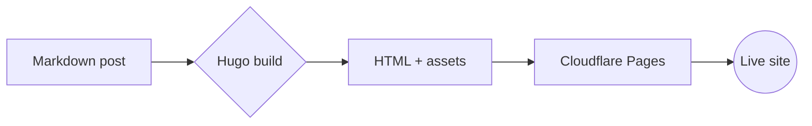

If you've ever spent a Saturday "just browsing" Hugo themes, you already know the trap. Every one of them looks gorgeous on a landing page. Half of them haven't been touched in two years. The other half are tied to a styling system you'll spend a month fighting before you can change a button color.

I gave myself one weekend to pick a theme for this site. I ended up on [HugoPlate](https://github.com/zeon-studio/hugoplate), and I'm still on it. This post is the long version of why — what's actually inside it, what I changed, and the parts that bit me along the way.

---

## What HugoPlate actually is

HugoPlate is a free, open-source Hugo theme from [Zeon Studio](https://zeon.studio). The headline feature is that it's built on **Tailwind CSS** — which sounds like a small detail and is actually the whole reason I picked it.

Most Hugo themes rely on their own bespoke CSS, often layered on Bootstrap or a custom SCSS pipeline. Tweaking them means learning that one theme's specific conventions. With HugoPlate, if you know any Tailwind, you already know how to restyle 90% of the site. Want a tighter card? Change `p-8` to `p-6`. Want a different accent color? Edit a config file. No theme-specific dialect to learn.

The other thing worth knowing up front: it's a **starter**, not a finished product you drop in. The README literally tells you to fork or clone it as the base of your project. That framing matters — it means you should expect to live inside the theme's code, not sit on top of a black box.

---

## What you get out of the box

This is the part the screenshots don't fully convey. When you spin up HugoPlate, you immediately have:

- A working homepage with hero, features, services, testimonial, and call-to-action sections
- A blog with listing pages, single posts, categories, tags, and pagination
- About, Contact, Pricing, Authors, FAQ, and Elements pages already wired up
- Dark mode with a clean toggle
- A search page that actually works (Fuse.js under the hood)
- Multi-language support — content lives under `content/<lang>/`
- Multi-author support with author pages and post attribution
- Pre-configured SEO: Open Graph tags, Twitter cards, sitemap, robots, JSON-LD
- A contact form ready to point at Netlify, Formspree, or whatever you use
- Image processing with WebP support
- Disqus comments support if you want them
- Google Analytics 4 hooks
- A `params.toml` for sitewide content so non-devs can edit text without touching layouts

That's a lot of "I don't have to build that from scratch" packed into a free theme.

---

## The Tailwind v4 piece

The version of HugoPlate I'm on ships with **Tailwind CSS v4**. If you've only used v3, the headline change is that there's no more `tailwind.config.js` — configuration moved into your CSS with `@theme` blocks.

In practice that means your colors, fonts, and spacing tokens live in plain CSS:

```css
@theme {
  --color-primary: #2563eb;
  --font-primary: "Inter", sans-serif;
}
```

Change a token here, and it propagates everywhere in the theme that uses it. For a personal site this is genuinely fun — you can rebrand the whole thing in fifteen minutes without touching a single layout file.

The build pipeline is fast too. Tailwind v4 uses an Oxide engine written in Rust, so even on a slow laptop the rebuilds feel instant.

---

## The folder layout I actually care about

After living in it for a while, these are the folders I open most often:

- **`content/english/`** — every post, every page. This is 95% of my day-to-day.
- **`layouts/`** — when I need to change the structure of a page (not just colors), this is where I go. HugoPlate's templates are well-named: `_default/single.html`, `partials/header.html`, etc.
- **`assets/css/`** — Tailwind tokens and base styles. The `@theme` block lives here.
- **`config/_default/params.toml`** — site-wide text (footer copy, contact email, social links). Editable without touching code.
- **`config/_default/menus.en.toml`** — header and footer navigation.
- **`assets/images/`** — every image referenced by the theme, optimized at build time.

The thing I appreciate is that HugoPlate respects Hugo's conventions. Nothing's hidden in weird custom locations. If you've ever used Hugo before, you can find your way around in about ten minutes.

---

## Shortcodes worth knowing

This is where HugoPlate quietly punches above its weight. Most themes give you `youtube` and call it a day. HugoPlate (via [`gethugothemes/hugo-modules`](https://github.com/gethugothemes/hugo-modules)) hands you a small content design system: callouts, buttons, tabs, accordions, image galleries, video, diagrams, and more — all loaded as Hugo Modules so they live outside your theme folder and stay easy to update. I've added a few of my own (`spotify`, `youtube_time`) on top of that.

Here's the full set this site renders, with live output for each so you can see exactly what they do.

### Callouts and CTAs

#### `notice`

Styled callouts in nine flavors. The first parameter is the type — `note`, `tip`, `info`, `warning`, `success`, `question`, `danger`, `failure`, `quote`. Inner content is full Markdown.


This is a `note` — neutral context, side commentary, footnotes that are actually useful.



This is a `tip` — the helpful little nudge you wish someone had given you on day one.



This is an `info` — additional context that's worth surfacing but not strictly required reading.



This is a `warning` — the bit you'll regret skipping. Pin `HUGO_VERSION` and `NODE_VERSION`.



This is a `success` — confirmation that something went right. Build passed, deploy is green.



This is a `danger` — destructive operations live here. Force-pushes, drop-tables, `rm -rf`.


```

This is a `tip` — the helpful little nudge you wish someone had given you on day one.

```

#### `button`

In-content CTA. `style="solid"` (default) or `style="outline"`. External links open in a new tab automatically.

 &nbsp; 

```


```

### Disclosure and structure

#### `accordion`

Collapsible disclosure. Useful for FAQs, optional detail, or anything that would otherwise bloat the page.


Nothing. It's free and open source under the MIT license. The only money you'd spend is on a domain (optional) and any paid services you wire it up to.



Helpful but not required. If you're only editing content, you'll never touch Tailwind. The moment you want to restyle anything — colors, spacing, components — knowing Tailwind makes it five-minute work instead of a half-day.


```

Nothing. It's free and open source under the MIT license.

```

#### `tabs` / `tab`

Tabbed content. Wrap one or more `tab` shortcodes inside a `tabs` block. The first tab is active by default.



**Static site generator.** Written in Go. Famously fast — builds the whole site in milliseconds. The thing that makes editing a 200-post blog feel like editing a 5-post blog.


**Utility-first CSS.** v4 is what HugoPlate ships with now — config moved into CSS via `@theme` blocks, so there's no `tailwind.config.js` anymore.


**Hosting.** Connect your Git repo, set `HUGO_VERSION` and `NODE_VERSION`, and every push to `main` ships. Generous free tier.



```


**Static site generator.** Written in Go. Famously fast.


**Utility-first CSS.** v4 is what HugoPlate ships with now.


```

#### `toc`

Drops a Table of Contents anywhere in the post, generated from your headings. Wrapped in a `<details>` so it's collapsible. Most useful at the top of long posts.



```

```

### Media

#### `image`

A captioned image with Hugo's full image-processing pipeline behind it: resize, fit, fill, WebP, quality, and a `zoomable` lightbox. Looks in `assets/images/`, your page bundle, `static/`, or any external URL.



```

```

#### `gallery`

Grid of images from a folder. Lightbox-enabled by default. Point `dir` at any subfolder under `assets/`, `static/`, or your page bundle.



```

```

#### `slider`

Same input as `gallery`, but rendered as a Swiper carousel instead of a grid.



```

```

#### `video`

Native HTML5 video. Use it for self-hosted MP4s or any direct video URL — the kind of thing you don't want to round-trip through YouTube.



```

```

#### `youtube`

A privacy-respecting wrapper around Hugo's built-in YouTube shortcode. Renders a 16:9 responsive iframe via `youtube-nocookie.com` when privacy mode is on.



```

```

#### `youtube_time`

Same idea as `youtube`, but lets you set start and end timestamps in seconds. Useful when a song or sermon you're linking to has the bit you actually care about buried halfway in.



```

```

#### `spotify_iframe_track`

Modern Spotify track embed — rounded corners, the official `?utm_source=generator` iframe, and lazy loading. Just pass the track ID.



```

```

#### `spotify_iframe_artist`

Same idea, but for artist pages.



```

```

### Diagrams

#### `mermaid` (via fenced code block)

Mermaid diagrams render automatically from any ` ```mermaid ` code block — no shortcode tags required, just the language hint.



````

````

That's the full kit. The bundled `blog-template.md` (kept as a draft) covers a few extras like `modal` if you ever need them — but for 95% of writing, the dozen above are everything.

---

## What I actually changed

Honest list, in roughly the order I did them:

**Site identity.** Logo, favicon, meta defaults, OG image. Five minutes if you have the assets ready. The light/dark logo split (`logo.png` and `logo-darkmode.png`) is a small touch that makes the site feel less like a template.

**Colors.** Two values in the `@theme` block — primary and an accent — and the whole site moves with you. The default palette is fine; it's just not *mine*.

**Typography.** I prefer slightly tighter line-heights than the defaults and a different display font. Twenty lines of CSS, done.

**Removed pages I didn't need.** The default install ships with a Pricing page and an Elements page. Lovely, not useful for a personal blog. Deleting them is just removing files from `content/english/` and the menu config.

**Reworked the homepage.** This was the biggest change. HugoPlate's default homepage is geared toward a SaaS-ish layout (hero, features, pricing). I rebuilt it to be more "personal site" — short intro, latest posts, recent things I've made. That's a layout-file edit, not a config tweak.

**Related posts.** The default related-posts indexing leans on tags and date. I tweaked it (you can see this in the `[related]` block in `hugo.toml`) so posts with empty tag fields still surface relevant siblings.

**Renamed the theme folder.** I forked HugoPlate into the repo as a real folder (not a submodule) and renamed it to match the project. This is one of those moves you either love or regret — see the next section.

---

## The rough edges

I'd be lying if I said this was all smooth.

**Theme name case-sensitivity.** I mentioned this in the [setup post](/blog/how-i-built-joraps-world). `theme = 'HugoPlate'` in `hugo.toml` will break your site in production because the folder is `hugoplate`. Lowercase, every time.

**Submodule vs. fork.** The README tells you to use `git submodule add` to install the theme. That's fine if you never want to touch the theme code. The moment you start customizing layouts (and you will), submodules become friction — every change has to be committed in the theme's repo, then bumped in your project. I eventually pulled the theme into my repo as a regular folder. The upgrade story gets harder; the day-to-day gets easier. Pick your trade.

**Search needs an index file.** HugoPlate's search is great, but it's powered by a JSON index that Hugo generates at build time. If your search page is suddenly empty, regenerate the site. A stale `public/` folder is usually the cause.

**Image shortcode quirks.** The `image` shortcode is powerful but has a lot of parameters (`webp`, `command`, `option`, `position`, etc.). I forget the order constantly. I keep the `blog-template.md` file open in another tab whenever I'm using it.

**Tailwind v4 migration.** If you start from an older HugoPlate version (or an old tutorial), expect the CSS variables to live in a different place than the article says. v4 moved configuration into CSS. Most "how to change colors in HugoPlate" posts online are still showing the v3 way.

**Cloudflare Pages and Node version.** HugoPlate uses Node for its asset pipeline. When Cloudflare's default Node version drifted, builds started failing for no obvious reason. Pin `NODE_VERSION` as an environment variable in your Pages project. (Same lesson as pinning `HUGO_VERSION`.)

---

## Who I'd recommend it to

**Good fit:** anyone building a personal site, blog, portfolio, small docs site, or a marketing landing page who's comfortable editing config files and Markdown. If you know any Tailwind, you'll feel at home in about an hour.

**Bad fit:** anyone who wants a no-code admin panel. HugoPlate is content-via-Markdown — that's the deal. A non-technical team is not going to be happy editing TOML and pushing to Git. For that case, pick something with a CMS layer (or pair HugoPlate with a headless CMS like Tina or Decap, which is doable but a bigger lift).

**Also probably not great** if you want something with strong opinions about an exotic visual style — HugoPlate is intentionally clean and modern. It's a great canvas, not a statement.

---

## What I wish I'd known on day one

A few things that would have saved me time:

- **Don't delete the demo content right away.** Use it as a living reference. Strip it out once you've published your own equivalents.
- **The `blog-template.md` file is the docs.** Keep it as a draft in your blog folder. It's faster than searching the GitHub repo when you forget a shortcode.
- **Pin every version.** Hugo, Node, Go modules. Future-you will be confused enough already.
- **Customize content first, code second.** The default styling is fine. You'll waste less time if you publish a few posts before you start fiddling with colors.
- **Read the layout files before you fork them.** HugoPlate's templates are commented and short. Five minutes of reading saves an hour of guessing.

---

## A year and change later

I haven't seriously considered switching. The site you're reading right now is HugoPlate underneath — tweaked, renamed, with a custom homepage and a few re-styled bits, but unmistakably the same bones.

The thing I'd say about HugoPlate that I can't really say about most free themes: it stays out of the way. It gives you a complete starting point and then lets you make it yours without fighting the framework. For a personal site you actually plan to write on, that's the whole game.

If you want to try it: [HugoPlate on GitHub](https://github.com/zeon-studio/hugoplate). Pair it with the [JoRap's World setup guide](/blog/how-i-built-joraps-world) if you want the full Hugo + GitHub + Cloudflare Pages flow. Total cost to be online: a domain name, if you want one. Otherwise, $0.

Hard to argue with that.
